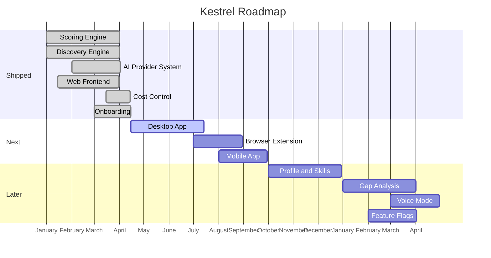
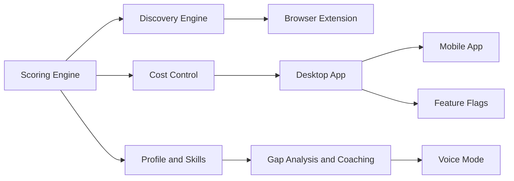

<objective>
Add two Mermaid diagrams to the Timeline section of ROADMAP.md: a gantt chart for milestone ordering and a flowchart for milestone dependencies. Then verify both render correctly on GitHub.

Purpose: ROAD-07 requires a Mermaid timeline diagram that visualizes the milestone structure at a glance. D-16 specifies two diagrams. This is the primary technical risk of Phase 2 (GitHub Mermaid rendering failures are documented from PR #266/#267).

Output: Updated ROADMAP.md with two rendering-verified Mermaid diagrams.
</objective>

<execution_context>
@$HOME/.claude/get-shit-done/workflows/execute-plan.md
@$HOME/.claude/get-shit-done/templates/summary.md
</execution_context>

<context>
@.planning/PROJECT.md
@.planning/ROADMAP.md
@.planning/STATE.md
@.planning/phases/02-roadmap-foundation/02-CONTEXT.md
@.planning/phases/02-roadmap-foundation/02-RESEARCH.md
@.planning/phases/02-roadmap-foundation/02-PATTERNS.md
@.planning/phases/02-roadmap-foundation/02-01-SUMMARY.md

<interfaces>
<!-- Mermaid GitHub compatibility rules (verified from PR #266/#267 failures): -->
<!-- SAFE: gantt, flowchart LR, flowchart TD -->
<!-- SAFE: plain text node labels, individual edges, -->|label| edge labels -->
<!-- UNSAFE: quadrantChart, & join syntax, HTML tags in labels, style directives, -->
<!--         color:#fff, subgraph-to-subgraph edges, direction TB inside subgraphs -->
<!-- todayMarker off: ASSUMED safe but must verify -->
<!-- axisFormat %B: ASSUMED safe but must verify -->

<!-- Working Mermaid from codebase (merged and live on GitHub): -->
<!-- docs/guides/how-scoring-works.md uses flowchart TD with plain text nodes -->

<!-- Gantt chart example from RESEARCH.md: -->
gantt
    title Kestrel Roadmap
    dateFormat YYYY-MM-DD
    axisFormat %B
    todayMarker off
    section Shipped
    Scoring Engine           :done, score, 2026-01-01, 90d
    ...

<!-- Flowchart example from RESEARCH.md: -->
flowchart LR
    A[Scoring Engine] --> B[Cost Control]
    A --> C[Discovery Engine]
    ...
</interfaces>
</context>

<tasks>

<task type="auto">
  <name>Task 1: Add Mermaid diagrams to ROADMAP.md Timeline section</name>
  <files>ROADMAP.md</files>
  <read_first>
    - ROADMAP.md (current state from Plan 01 -- especially the Timeline section placeholder and the What's Next milestone names)
    - .planning/phases/02-roadmap-foundation/02-RESEARCH.md (Mermaid code examples, pitfalls, assumptions)
    - .planning/phases/02-roadmap-foundation/02-PATTERNS.md (Mermaid diagram safety rules from Analog 2)
  </read_first>
  <action>
Replace the Timeline section placeholder in ROADMAP.md with two Mermaid diagrams (per D-16):

**Diagram 1: Gantt Chart (milestone ordering by quarter)** (per D-17, D-18)

Use this exact structure (adapt milestone names to match What's Next section):



CRITICAL constraints:
- Dates are FAKE positioning dates. `axisFormat %B` hides the year, showing only month names. This achieves "relative ordering without date commitment" per D-17
- `todayMarker off` prevents a misleading today line
- Use ONLY `done` and `active` status markers. Do not use `crit` or custom styles
- Do NOT use `&` join syntax (e.g., NOT `A & B --> C`)
- Do NOT use HTML in labels
- Do NOT use style directives
- Task IDs must be simple alphanumeric (no spaces, no special chars)

**Diagram 2: Flowchart (milestone dependencies)** (per D-18)

Use this exact structure:



CRITICAL constraints:
- Plain text node labels ONLY (no HTML, no backticks)
- Individual edges ONLY (no `&` joins)
- No subgraph-to-subgraph edges
- No style directives or color attributes
- Use `flowchart LR` (left-to-right), not `graph LR`
- Every node referenced in edges must have a label defined on first use

**Section structure:**
Keep the intro sentence from the placeholder ("Two diagrams show where Kestrel has been and where it is going.") and add a brief label before each diagram:
- "### Milestone Timeline" before the gantt
- "### How Milestones Connect" before the flowchart

Ensure milestone names in the diagrams match the milestone names used in the What's Next section of ROADMAP.md. If What's Next says "Desktop App" the diagram must say "Desktop App" (not "Desktop App Packaging" or "Packaging").
  </action>
  <verify>
    <automated>grep -c '```mermaid' ROADMAP.md</automated>
  </verify>
  <done>
    - ROADMAP.md contains exactly 2 Mermaid code blocks
    - Gantt chart has sections for Shipped, Next, and Later
    - Gantt chart uses `dateFormat YYYY-MM-DD` and `axisFormat %B`
    - Gantt chart has `todayMarker off`
    - Flowchart uses `flowchart LR`
    - No `&` join syntax in either diagram
    - No HTML tags in either diagram
    - No `style` or `color:` directives in either diagram
    - Milestone names in diagrams match What's Next section names
    - ROAD-07 requirement satisfied
  </done>
</task>

<task type="checkpoint:human-verify" gate="blocking">
  <name>Task 2: Verify ROADMAP.md renders correctly on GitHub</name>
  <what-built>
Complete ROADMAP.md with all 7 prose sections, CHANGELOG cross-references, and 2 Mermaid diagrams. This is the master public roadmap for Kestrel.
  </what-built>
  <how-to-verify>
1. The branch has been pushed with the completed ROADMAP.md
2. Visit the branch on GitHub and open ROADMAP.md
3. Verify these items:

**Prose rendering:**
- [ ] Hero pitch paragraph renders cleanly (no broken markdown)
- [ ] What's Shipped section has bold feature names with CHANGELOG links
- [ ] Click 2-3 CHANGELOG cross-reference links -- they should jump to the correct version heading in CHANGELOG.md
- [ ] What's Next section has Now/Next/Later sub-sections with emoji status badges visible
- [ ] Known Limitations section has 3 items with bold lead-ins
- [ ] About This Project section is present at the bottom

**Mermaid diagrams:**
- [ ] Gantt chart renders as a visual diagram (not raw code)
- [ ] Gantt chart shows month names on the axis (not dates)
- [ ] Gantt chart shows "Shipped" items as completed (filled bars)
- [ ] Flowchart renders as a visual diagram with connected nodes
- [ ] No "Could not find a suitable point" or blank box errors

**Content quality:**
- [ ] No file paths (src/, api/) visible anywhere
- [ ] No ticket IDs (G-XXX) visible anywhere
- [ ] Tone feels warm and user-facing, not engineering documentation
  </how-to-verify>
  <resume-signal>Type "approved" if everything renders correctly, or describe any rendering issues (especially Mermaid failures)</resume-signal>
</task>

</tasks>

<threat_model>
## Trust Boundaries

| Boundary | Description |
|----------|-------------|
| Mermaid code execution | GitHub renders Mermaid in sandboxed iframe; no security risk from diagram content |
| Public document | ROADMAP.md visible to all; diagrams must not reference private information |

## STRIDE Threat Register

| Threat ID | Category | Component | Disposition | Mitigation Plan |
|-----------|----------|-----------|-------------|-----------------|
| T-02-04 | Denial of Service | Mermaid rendering | accept | If diagram fails to render on GitHub, it shows as code block (graceful degradation). Checkpoint catches this before merge |
| T-02-05 | Information Disclosure | Mermaid diagram labels | mitigate | Use only public milestone names. No internal project references, ticket IDs, or private terminology in diagram labels |
</threat_model>

<verification>
After Plan 02 completion:
1. ROADMAP.md has exactly 2 Mermaid code blocks
2. Both diagrams use GitHub-compatible syntax only
3. Human has verified rendering on GitHub (checkpoint approved)
4. Milestone names match between diagrams and prose sections
5. No GitHub Mermaid rendering errors
</verification>

<success_criteria>
- Both Mermaid diagrams render correctly on GitHub (verified by human)
- CHANGELOG cross-reference links navigate to correct sections (verified by human)
- ROAD-07 requirement fully satisfied
- ROADMAP.md is complete and ready for Phase 3 to extend
</success_criteria>

<output>
After completion, create `.planning/phases/02-roadmap-foundation/02-02-SUMMARY.md`
</output>
