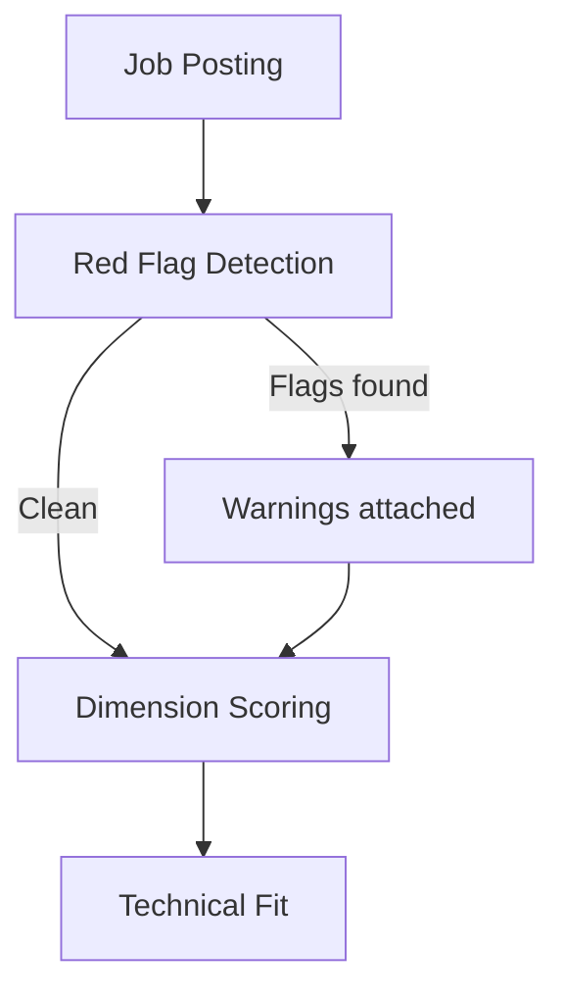

# Phase 2: Roadmap Foundation - Pattern Map

**Mapped:** 2026-04-24
**Files analyzed:** 1 (ROADMAP.md — new file)
**Analogs found:** 4 / 1

## File Classification

| New/Modified File | Role | Data Flow | Closest Analog | Match Quality |
|-------------------|------|-----------|----------------|---------------|
| `ROADMAP.md` | documentation (user-facing, repo-root) | static / read-only | `README.md` | exact |

This phase produces a single markdown file. No code, no services, no tests. The classification is straightforward: a public-facing, GitHub-rendered document at the repo root aimed at product evaluators.

## Pattern Assignments

### `ROADMAP.md` (documentation, static)

Four analog files were examined. Each contributes a different pattern dimension to the new file.

---

#### Analog 1: `README.md` (primary — structure, tone, formatting)

**Match quality:** Exact. Same audience (product evaluator hitting repo cold), same location (repo root), same rendering target (GitHub).

**Hero pitch pattern** (lines 1-25):
```markdown
<p align="center">
  
</p>

<h1 align="center">Kestrel</h1>

<p align="center">
  <strong>A job search system that runs on your computer.</strong><br>
  Finds jobs. Scores them. Tracks your pipeline. Your data stays yours.
</p>
```
**Adaptation for ROADMAP.md:** ROADMAP.md should NOT duplicate the hero image/badges block — it is a separate document, not a landing page. Use a plain `# Kestrel Roadmap` heading with a 3-4 sentence privacy-led pitch paragraph (per D-03). No centered HTML, no badge images.

**Section heading pattern** (lines 29, 123, 139, 165, 183, 369):
```markdown
## From unemployed to multiple offers
## Your data stays yours
## What it does
## What's coming
## Install
## How we build
```
Headings are short, action-oriented, first-person perspective. ROADMAP.md should follow the same style: "What's Shipped", "What's Next", "Known Limitations" — not "Section 3: Forward-Looking Milestones".

**Table pattern** (lines 143-161):
```markdown
| Core | What it does |
|------|-------------|
| **Job discovery** | Scans Indeed, LinkedIn, Glassdoor, Arbeitsagentur — AI-scores every result against your profile |
| **Pipeline tracking** | Kanban board from Discovered to Offer — drag applications between stages |
```
Bold first column as feature name, plain-language description as second column. ROADMAP.md shipped section can use this pattern for domain highlights.

**"What's coming" pattern** (lines 165-179):
```markdown
## What's coming

Kestrel is under active development. Here's what's next:

| Feature | What it will do |
|---------|----------------|
| **Writing style flywheel** | Kestrel learns your voice from your past writing... |
```
ROADMAP.md replaces this section with the structured Now/Next/Later horizons, but the table format and tone transfer directly.

**Cross-reference link pattern** (lines 240-267):
```markdown
| [Quickstart](docs/guides/QUICKSTART.md) | First-time setup, step by step — zero assumptions |
| [How Scoring Works](docs/guides/how-scoring-works.md) | What "fit score" actually means... |
```
Relative links from repo root to `docs/` subdirectories. ROADMAP.md will use the same pattern for `docs/roadmap/inventory.md` and CHANGELOG anchors.

---

#### Analog 2: `docs/guides/how-scoring-works.md` (warm teaching tone + Mermaid)

**Match quality:** Role-match. Different subject (scoring vs roadmap) but identical audience and tone requirements.

**Opening paragraph tone** (lines 8-9):
```markdown
Job descriptions are marketing copy. "Fast-paced environment" could mean exciting growth
or chronic understaffing. "Competitive salary" could mean anything from generous to
"we'd rather not say." Reading 50 postings and hoping your gut gets it right is exhausting
and unreliable.
```
Conversational, direct, uses "you". Explains complex concepts through relatable scenarios. ROADMAP.md hero pitch and philosophy paragraph should match this tone.

**Mermaid flowchart pattern** (lines 54-77):
```markdown

```
Plain text node labels. Individual edges only (no `&` joins). Edge labels with `-->|label|` syntax. No style directives, no HTML. This exact pattern is confirmed to render on GitHub (it's already merged and live). ROADMAP.md dependency flowchart should copy this syntax exactly.

---

#### Analog 3: `docs/guides/COMPARISON.md` (confident acknowledgment of limitations)

**Match quality:** Role-match. Same honest-about-gaps tone needed for ROADMAP.md "Known Limitations" section.

**Limitations tone pattern** (lines 196-209):
```markdown
## Where Kestrel Is Weaker

Being honest about the gaps:

**No Chrome extension.** Huntr and Simplify can auto-fill application forms on 1000+
ATS sites with one click. This is their killer feature and Kestrel has nothing comparable.

**Setup is harder than SaaS.** Huntr and Teal take 2 minutes to start using. Kestrel
requires Docker, environment configuration, and comfort with a terminal.
```
States limitations as facts, not apologies. Uses bold lead-in for each item. Explains the tradeoff or plan. ROADMAP.md "Known Limitations" section should match this pattern exactly — per D-13 "confident acknowledgment tone."

---

#### Analog 4: `CHANGELOG.md` (cross-reference anchors)

**Match quality:** Data source. Not a structural analog, but the file ROADMAP.md must cross-reference.

**Heading format** (lines 1-3, 40, 60, 75):
```markdown
## [0.11.0](https://github.com/pleasedodisturb/kestrel/compare/v0.10.0...v0.11.0) (2026-04-21)
## [0.5.2](https://github.com/pleasedodisturb/kestrel/compare/v0.5.1...v0.5.2) (2026-04-19)
## [0.4.0](https://github.com/pleasedodisturb/kestrel/compare/v0.3.1...v0.4.0) (2026-04-16)
## [0.3.0](https://github.com/pleasedodisturb/kestrel/compare/v0.2.0...v0.3.0) (2026-04-13)
```

**Cross-reference pattern** (from RESEARCH.md, verified):
```markdown
[v0.11.0](CHANGELOG.md#0110-2026-04-21)
[v0.4.0](CHANGELOG.md#040-2026-04-16)
[v0.3.0](CHANGELOG.md#030-2026-04-13)
```
GitHub strips markdown links from heading text, removes dots/parentheses, lowercases. The heading `## [0.4.0](url) (2026-04-16)` generates anchor `#040-2026-04-16`. These MUST be verified by pushing to a branch and clicking.

**CHANGELOG gap warning:** v0.6.0 through v0.10.0 have git tags but NO CHANGELOG entries. Cross-references should use versions with entries (v0.3.0, v0.4.0, v0.5.x, v0.11.0, v0.12.0) or link to GitHub release pages for missing versions.

---

## Shared Patterns

### Warm Teaching Tone
**Source:** `README.md` (lines 29-120), `docs/guides/how-scoring-works.md` (lines 8-50), `docs/guides/FAQ.md` (lines 11-59)
**Apply to:** All sections of ROADMAP.md

Convention across all user-facing docs:
- Second person ("you", "your")
- Short sentences, conversational paragraph rhythm
- Analogies and relatable comparisons (scoring = "panel of judges at a talent show")
- No file paths, API routes, or internal architecture details
- No jargon — "SQLite database" is fine, "WAL mode with PRAGMA journal_mode" is not

### No-Apology Limitations
**Source:** `docs/guides/COMPARISON.md` (lines 196-209)
**Apply to:** "Known Limitations" section of ROADMAP.md

Convention:
- Bold feature name lead-in
- State the gap as fact
- Explain the tradeoff or resolution path (e.g., "Desktop App milestone fixes this")
- Never use "unfortunately", "sadly", "we're sorry"

### GitHub Markdown Conventions
**Source:** `README.md`, `CONTRIBUTING.md`, all `docs/guides/*.md`
**Apply to:** ROADMAP.md formatting

Convention:
- Jekyll front matter (`---` block) is used in `docs/` files but NOT in repo-root files (README.md has no front matter). ROADMAP.md should have NO front matter
- Repo-root files use `---` horizontal rules as section separators
- Tables use standard GFM pipe syntax
- Links use relative paths from repo root (e.g., `docs/roadmap/inventory.md`)
- No custom CSS, no HTML rendering dependencies beyond `<p align="center">` for images (which ROADMAP.md likely won't need)

### Mermaid Diagram Safety
**Source:** `docs/guides/how-scoring-works.md` (lines 54-77), project feedback memory
**Apply to:** Both Mermaid diagrams in ROADMAP.md

Hard constraints (verified from PR #266/#267 failures):
- Use ONLY `gantt` and `flowchart LR` or `flowchart TD`
- Plain text node labels only (no HTML, no backticks in labels)
- Individual edges only (NO `&` join syntax)
- No `style` directives, no `color:` attributes
- No subgraph-to-subgraph edges
- No `quadrantChart`
- Test by pushing to branch and viewing on GitHub — Mermaid Live Editor is NOT a reliable proxy

## No Analog Found

| File | Role | Data Flow | Reason |
|------|------|-----------|--------|
| — | — | — | All patterns have strong analogs. No gaps. |

This phase creates a single markdown document for which 4 strong analogs exist in the same repo. Every pattern dimension (structure, tone, formatting, Mermaid, cross-references, limitation disclosure) is covered by at least one existing file.

## Metadata

**Analog search scope:** Repo root (`*.md`), `docs/guides/`, `docs/research/`
**Files scanned:** 8 candidates examined, 4 selected as analogs
**Pattern extraction date:** 2026-04-24
