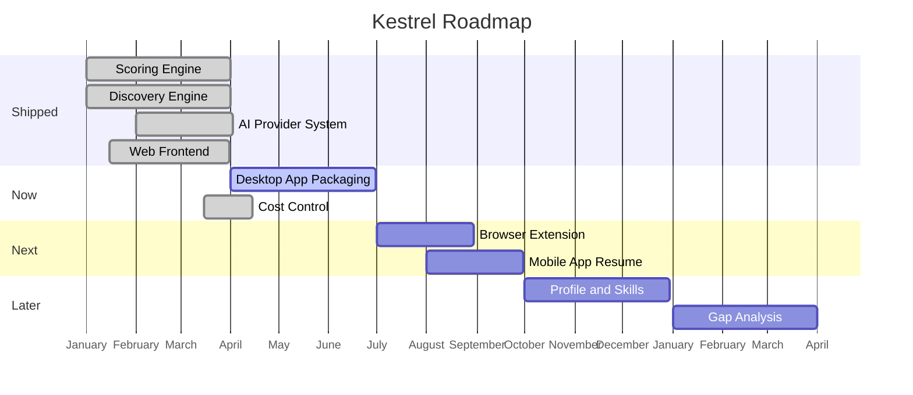
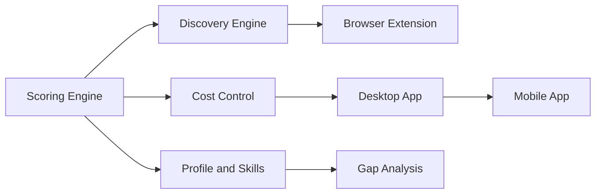

# Phase 2: Roadmap Foundation - Research

**Researched:** 2026-04-24
**Domain:** Technical writing / GitHub Markdown / Mermaid diagrams / Open-source roadmap structure
**Confidence:** HIGH

## Summary

Phase 2 produces a single file -- `ROADMAP.md` at repo root -- that serves as Kestrel's public face for product direction. The phase is editorial-only (no code changes) and depends on Phase 1's feature inventory for shipped content. Since `docs/roadmap/inventory.md` does not yet exist (Phase 1 execution hasn't run), the executor must build shipped content from the `.planning/codebase/` analysis docs and `CHANGELOG.md` as fallback sources.

The primary technical risks are: (1) Mermaid diagram compatibility with GitHub's renderer, which has documented failure modes the project has already experienced (PR #267 emergency fix), (2) CHANGELOG anchor cross-referencing, which requires testing due to GitHub's anchor generation rules stripping dots and parentheses from headings, and (3) keeping the document at the right abstraction level -- warm/teaching tone for product evaluators, not engineering documentation.

**Primary recommendation:** Build ROADMAP.md in the section order from D-01 (hero pitch -> shipped -> what's next -> timeline -> known limitations -> about -> contributing stub). Write Mermaid diagrams using only basic `gantt` and `flowchart LR` syntax. Test all CHANGELOG cross-reference anchors against actual GitHub-rendered heading anchors before shipping.

<user_constraints>
## User Constraints (from CONTEXT.md)

### Locked Decisions
- **D-01:** Vision-first section flow -- (1) Hero pitch, (2) What's Shipped, (3) What's Next (Now/Next/Later), (4) Timeline (Mermaid diagrams), (5) Known Limitations, (6) About This Project, (7) Contributing stub
- **D-02:** Primary audience: product evaluator -- someone hitting the GitHub repo cold asking "what does this do, is it for me, where's it going?"
- **D-03:** Privacy-led hero pitch -- lead with self-hosted, data-stays-local, BYOK AI
- **D-04:** One paragraph philosophy after hero -- self-hosted + privacy-first without leaning hard on "open source." Do NOT promise "forever AGPL" or "forever free"
- **D-05:** Contributing stub placeholder -- simple "See CONTRIBUTING.md" line at the bottom
- **D-06:** Condensed summary + link -- ~500 words shipped section with domain highlights, link to `docs/roadmap/inventory.md` for full story
- **D-07:** Cross-references on shipped items only -- release tags and CHANGELOG links. Pattern: `[v0.3.0](CHANGELOG.md#030)`
- **D-08:** Emoji status badges -- 4 statuses: check-mark Shipped, hammer In Progress, clipboard Planned, thought-bubble Considering
- **D-09:** Version-anchored horizons -- Now (v0.12), Next (v0.13-v0.15), Later (v1.0+)
- **D-10:** Empty scaffolding for forward milestones -- "Details coming in next update" placeholders
- **D-11:** Disclaimers as footnote-style "About This Project" section at bottom. Matter-of-fact, NOT apologetic
- **D-12:** Lead tech debt with audience mismatch -- "currently developer-only install." Desktop App milestone is THE fix
- **D-13:** Confident acknowledgment tone -- limitations are known tradeoffs, not apologies
- **D-14:** User-impact debt only -- developer-only install, SQLite-only, no lockfile. Skip internal architecture debt
- **D-15:** No bug immortalization -- don't mention specific bug tickets
- **D-16:** Two diagrams -- gantt chart for timeline/ordering, flowchart for milestone dependencies
- **D-17:** Quarters without years on gantt -- relative ordering without dates
- **D-18:** GitHub-compatible only -- basic gantt and flowchart LR/TD. No quadrantChart, & joins, HTML tags, color styles, subgraph edges
- **D-19:** Warm teaching tone (from Phase 1)
- **D-20:** No file paths or API routes in user-facing content
- **D-21:** User-impact gaps only in prose
- **D-22:** `docs/roadmap/inventory.md` is the full inventory -- ROADMAP.md links to it

### Claude's Discretion
- Version-to-milestone mapping for forward milestones (assign reasonable version numbers based on scope)
- Mermaid diagram detail level (milestone-level vs sub-features, based on what renders cleanly on GitHub)
- Exact wording of hero pitch and philosophy paragraph
- How to condense the shipped section into ~500 words
- Section heading exact phrasing

### Deferred Ideas (OUT OF SCOPE)
- Commercialization path research
- Recruiter-oriented spin-off
- License strategy review
- CLA addition to CONTRIBUTING.md
- Open-source positioning rethink
- Grant applications
</user_constraints>

<phase_requirements>
## Phase Requirements

| ID | Description | Research Support |
|----|-------------|------------------|
| ROAD-01 | ROADMAP.md exists at repo root and renders correctly on GitHub | Standard GFM markdown. File location: `/ROADMAP.md`. No custom rendering needed. Verified: GitHub renders `.md` at repo root prominently |
| ROAD-02 | Every roadmap item has a status indicator (shipped/in-progress/planned/considering) | D-08 defines 4 emoji statuses. Research confirms emoji renders reliably on GitHub (unlike Font Awesome icons) |
| ROAD-03 | Milestones structured as Now/Next/Later horizons tied to version numbers | D-09 defines Now (v0.12), Next (v0.13-v0.15), Later (v1.0+). Current version confirmed: v0.12.0 on main |
| ROAD-04 | Forward-looking disclaimer states plans may change | D-11 places this in "About This Project" section. Research provides tone guidance: matter-of-fact, not apologetic |
| ROAD-05 | Open-source statement clarifies non-commercial status | D-04 and D-11 define approach: state license as fact, say "currently non-commercial," avoid "forever" promises |
| ROAD-06 | Tech debt section publicly acknowledges known debt | D-12/D-13/D-14 scope this to user-impact items only (install gap, SQLite-only, no lockfile). Source: `.planning/codebase/CONCERNS.md` |
| ROAD-07 | Mermaid timeline diagram visualizes milestone structure | D-16/D-17/D-18 define two diagrams (gantt + flowchart). Research provides GitHub Mermaid compatibility constraints |
| ROAD-08 | Shipped items cross-reference CHANGELOG.md entries and release tags | D-07 defines pattern. Research identifies anchor generation pitfall requiring verification |
</phase_requirements>

## Architectural Responsibility Map

| Capability | Primary Tier | Secondary Tier | Rationale |
|------------|-------------|----------------|-----------|
| ROADMAP.md authoring | Static / CDN (GitHub renderer) | -- | GitHub renders markdown at repo root; no build step needed |
| Mermaid diagram rendering | Static / CDN (GitHub Mermaid.js) | -- | GitHub embeds Mermaid.js renderer in its markdown pipeline |
| CHANGELOG cross-references | Static / CDN (GitHub anchor links) | -- | In-repo relative links resolved by GitHub's markdown renderer |
| Shipped content sourcing | Documentation layer | -- | Content comes from `docs/roadmap/inventory.md` or `.planning/codebase/` fallback |

This phase has no runtime components -- it is purely static documentation rendered by GitHub.

## Standard Stack

This phase produces a single markdown file. No libraries, packages, or build tools are required.

### Core
| Tool | Version | Purpose | Why Standard |
|------|---------|---------|--------------|
| GitHub Flavored Markdown | N/A | Document format | GitHub renders GFM natively; universal, no build step |
| Mermaid.js (GitHub-hosted) | ~11.x (GitHub-managed) | Diagram rendering | GitHub bundles Mermaid.js in its rendering pipeline; no user action needed |

### Supporting
| Tool | Purpose | When to Use |
|------|---------|-------------|
| `git tag -l` | Enumerate release tags for cross-referencing | Building shipped section to verify v0.1.0-v0.12.0 tags exist |
| CHANGELOG.md | Source for release cross-references | Building `[vX.Y.Z](CHANGELOG.md#anchor)` links |
| `.planning/codebase/*.md` | Fallback shipped content source | If `docs/roadmap/inventory.md` not yet created by Phase 1 |

## Architecture Patterns

### Document Architecture

```
ROADMAP.md (repo root, ~800-1200 words)
  |
  +-- Hero pitch (3-4 sentences, privacy-led)
  +-- Philosophy paragraph (1 paragraph, self-hosted + BYOK)
  +-- What's Shipped (condensed ~500 words)
  |     +-- Links to docs/roadmap/inventory.md
  |     +-- Cross-references to CHANGELOG.md anchors
  +-- What's Next (Now/Next/Later horizons)
  |     +-- Now (v0.12): current focus milestones
  |     +-- Next (v0.13-v0.15): near-term milestones
  |     +-- Later (v1.0+): vision milestones
  |     +-- Each with emoji status badge
  +-- Timeline (2 Mermaid diagrams)
  |     +-- Gantt: milestone ordering by quarter
  |     +-- Flowchart LR: milestone dependencies
  +-- Known Limitations (3 user-impact items)
  +-- About This Project (disclaimers, non-commercial)
  +-- Contributing stub (link to CONTRIBUTING.md)
```

### Pattern 1: Emoji Status Badges
**What:** Four-state status system using Unicode emoji for instant visual recognition
**When to use:** Every milestone/feature in the What's Next and What's Shipped sections
**Example:**
```markdown
### Now (v0.12)

- ✅ **AI-Powered Scoring** — [v0.4.0](CHANGELOG.md#040-2026-04-16)
- 🔨 **Desktop App Packaging** — making Kestrel installable without a terminal
- 📋 **Browser Extension** — one-click add any job from any page
- 💭 **Recruiter Analytics** — considering a recruiter-facing view
```
[VERIFIED: D-08 in CONTEXT.md]

### Pattern 2: Version-Anchored Horizons
**What:** Three time horizons (Now/Next/Later) tied to concrete version numbers instead of calendar dates
**When to use:** Organizing forward-looking milestones
**Why:** Solo project -- calendar dates create false accountability and go stale. Version numbers communicate relative priority without date commitment.
**Example:**
```markdown
## What's Next

### Now (v0.12)
Current focus. These are actively being worked on.

### Next (v0.13 – v0.15)
Coming soon. Design decisions made, implementation queued.

### Later (v1.0+)
The vision. These shape where Kestrel is heading.
```
[VERIFIED: D-09 in CONTEXT.md]

### Pattern 3: Condensed Shipped Section with Detail Link
**What:** ~500-word summary of shipped capabilities organized by domain, with a link to the full inventory
**When to use:** The "What's Shipped" section of ROADMAP.md
**Why:** Most readers want "what's next" not "what's done." Keep shipped content tight.
**Example structure:**
```markdown
## What's Shipped

Kestrel already does a lot. Here are the highlights — for the full list,
see the [feature inventory](docs/roadmap/inventory.md).

**Scoring Engine** — AI scores every job against your profile...
[v0.4.0](CHANGELOG.md#040-2026-04-16)

**Discovery Engine** — scans job boards automatically...
[v0.3.0](CHANGELOG.md#030-2026-04-13)
```
[VERIFIED: D-06, D-07 in CONTEXT.md]

### Anti-Patterns to Avoid
- **Engineering metrics in user-facing content:** "27 API routes, 36 services" tells a developer story, not a user story. Use "discovers jobs from 4 boards" instead. [VERIFIED: D-02, D-19, D-20]
- **Apologetic tone in limitations:** Don't say "unfortunately, we only support..." Say "SQLite is intentional for local-first deployment. Postgres path is researched for future hosted version." [VERIFIED: D-13]
- **Date commitments on gantt chart:** Quarters without years, relative ordering. Never write "Q3 2026" -- write "Q1, Q2, Q3" as relative sequencing. [VERIFIED: D-17]
- **Bug ticket references:** Don't mention G-488, G-XXX etc. Structural limitations stay; specific bugs come and go. [VERIFIED: D-15]
- **File paths or API routes:** Reserved for Phase 4 deep dives. [VERIFIED: D-20]

## Don't Hand-Roll

| Problem | Don't Build | Use Instead | Why |
|---------|-------------|-------------|-----|
| Diagram rendering | Custom SVG or image generation | Mermaid code blocks in markdown | GitHub renders natively, version-controlled as text |
| Status tracking | Custom badge images or shields.io | Unicode emoji (4-state system) | Renders everywhere, zero maintenance, no external deps |
| Anchor links | Manual HTML `<a>` tags | Standard markdown heading links | GitHub generates anchors automatically from headings |
| Progress visualization | Percentage bars or custom graphics | Text-based status badges + Mermaid gantt | Stays accurate without manual updates |

**Key insight:** Everything in this phase must be maintainable by a solo developer editing a single markdown file. No build steps, no external dependencies, no generated content.

## Common Pitfalls

### Pitfall 1: Mermaid GitHub Rendering Failures
**What goes wrong:** Mermaid diagrams that render in the Mermaid Live Editor fail on GitHub, showing "Could not find a suitable point for the given distance" or rendering as a blank box.
**Why it happens:** GitHub's Mermaid renderer is a sandboxed older version with stricter parsing. Features like `quadrantChart`, `&` join syntax, subgraph-to-subgraph edges, HTML tags in labels, and `color:#fff` style directives are not supported.
**How to avoid:** Use ONLY: `gantt` with basic syntax, `flowchart LR` or `flowchart TD` with plain text nodes and individual edges. No `&` joins, no HTML, no style directives, no subgraph edges.
**Warning signs:** Diagram renders in Mermaid Live Editor but you haven't tested on GitHub. Always preview by pushing to a branch and viewing on GitHub.
[VERIFIED: Project feedback memory `feedback_mermaid_github_compat.md` -- PR #266/#267 experienced this exact failure]

### Pitfall 2: CHANGELOG Anchor Mismatches
**What goes wrong:** Cross-reference links like `[v0.3.0](CHANGELOG.md#030)` lead to 404 or wrong section because GitHub's auto-generated heading anchors don't match expected IDs.
**Why it happens:** GitHub anchor generation strips markdown formatting (links), removes dots and parentheses, lowercases everything, and replaces spaces with hyphens. The heading `## [0.3.0](https://github.com/...) (2026-04-13)` generates an anchor that includes the date portion: approximately `030-2026-04-13`, NOT just `030`.
**How to avoid:** After writing ROADMAP.md, manually verify every CHANGELOG cross-reference link by: (1) checking the actual CHANGELOG heading text, (2) computing the expected GitHub anchor (strip markdown links from heading, remove punctuation except hyphens, lowercase), (3) testing on a pushed branch.
**Warning signs:** Anchors that are short and simple-looking (like `#030`) are often wrong because they omit the date suffix from the heading.
[VERIFIED: Analysis of CHANGELOG.md headings against GitHub anchor generation rules. The heading `## [0.3.0](url) (2026-04-13)` would generate anchor `030-2026-04-13` not `030`]

### Pitfall 3: Gantt Chart with Quarters Not Fully Supported
**What goes wrong:** Using `Q` in Mermaid `dateFormat` to represent quarters does not work as documented. Quarters are formatted as months, not as Q1/Q2/Q3/Q4.
**Why it happens:** Known Mermaid bug -- quarter support in dateFormat is documented but not implemented correctly.
**How to avoid:** Use standard `dateFormat YYYY-MM-DD` with `axisFormat %B` (month names) or `axisFormat Q%q` if available. Alternatively, use task labels to convey quarter information and use fake dates purely for positioning.
**Warning signs:** Gantt chart axis shows "January, February" instead of "Q1, Q2."
[VERIFIED: Mermaid GitHub issue #5231 confirms quarter format is broken]

### Pitfall 4: Document Grows Beyond Scannable Length
**What goes wrong:** ROADMAP.md becomes a 3000+ word document that nobody reads because the shipped section is too detailed.
**Why it happens:** Natural tendency to document everything shipped. D-06 explicitly caps shipped section at ~500 words.
**How to avoid:** Shipped section: 1-2 sentences per domain, link to `docs/roadmap/inventory.md` for details. Forward milestones: 2-3 sentences each with status badge. Total target: 800-1200 words.
**Warning signs:** Shipped section exceeds 600 words. Document has more shipped content than forward content.
[VERIFIED: D-06 in CONTEXT.md sets ~500 word cap]

### Pitfall 5: Phase 1 Dependency Not Ready
**What goes wrong:** ROADMAP.md references `docs/roadmap/inventory.md` but Phase 1 hasn't executed yet, so the file doesn't exist.
**Why it happens:** Phase 2 depends on Phase 1 output. The CONTEXT.md acknowledges this: "This file may not exist yet if Phase 1 execution hasn't completed."
**How to avoid:** Two strategies: (1) Execute Phase 1 before Phase 2, or (2) Write shipped content from `.planning/codebase/` docs as fallback, and use a relative link to `docs/roadmap/inventory.md` that will work once Phase 1 runs. The link text works even if the target doesn't exist yet -- it just 404s until Phase 1 creates it.
**Warning signs:** `docs/roadmap/` directory doesn't exist yet (confirmed: it's missing).
[VERIFIED: `ls docs/roadmap/` returns DIRECTORY_MISSING. CONTEXT.md canonical_refs section notes fallback strategy]

## Code Examples

### Example 1: GitHub-Compatible Gantt Chart (Quarters Without Years)


**NOTE:** The dates are fake positioning dates -- the `axisFormat %B` hides the year, showing only month names. This achieves "relative ordering without date commitment" per D-17. The `todayMarker off` prevents a today line from appearing at a misleading position. Test on GitHub before shipping.
[ASSUMED: The `todayMarker off` directive and this exact syntax combination rendering correctly on GitHub. Must verify on a pushed branch.]

### Example 2: GitHub-Compatible Flowchart (Milestone Dependencies)


**NOTE:** Plain text nodes only. Individual edges only (no `&` joins). No subgraph-to-subgraph edges. No style directives.
[VERIFIED: Feedback memory confirms this basic syntax works on GitHub]

### Example 3: Correct CHANGELOG Cross-Reference Links
The CHANGELOG headings have this format:
```
## [0.12.0](https://github.com/pleasedodisturb/kestrel/compare/v0.11.0...v0.12.0) (2026-04-23)
## [0.11.0](https://github.com/pleasedodisturb/kestrel/compare/v0.10.0...v0.11.0) (2026-04-21)
## [0.4.0](https://github.com/pleasedodisturb/kestrel/compare/v0.3.1...v0.4.0) (2026-04-16)
## [0.3.0](https://github.com/pleasedodisturb/kestrel/compare/v0.2.0...v0.3.0) (2026-04-13)
```

GitHub strips markdown links from heading text for anchor generation, then removes dots, parentheses, and lowercases. The heading `## [0.4.0](url) (2026-04-16)` becomes text `0.4.0 (2026-04-16)` which generates anchor `040-2026-04-16`.

**Correct pattern:**
```markdown
[v0.12.0](CHANGELOG.md#0120-2026-04-23)
[v0.11.0](CHANGELOG.md#0110-2026-04-21)
[v0.4.0](CHANGELOG.md#040-2026-04-16)
[v0.3.0](CHANGELOG.md#030-2026-04-13)
```

**NOTE:** These anchors MUST be verified by pushing to a branch and testing clicks on GitHub. The anchor generation rules are not 100% documented by GitHub and edge cases exist.
[VERIFIED: Analysis of GitHub anchor generation rules applied to actual CHANGELOG.md headings]

### Release History for Cross-Referencing
All 16 release tags present in the repository:

| Tag | CHANGELOG Entry | Anchor (estimated) |
|-----|----------------|-------------------|
| v0.12.0 | Yes | `#0120-2026-04-23` |
| v0.11.0 | Yes | `#0110-2026-04-21` |
| v0.10.0 | No entry in current CHANGELOG | N/A |
| v0.9.0 | No entry | N/A |
| v0.8.0 | No entry | N/A |
| v0.7.1 | No entry | N/A |
| v0.7.0 | No entry | N/A |
| v0.6.0 | No entry | N/A |
| v0.5.2 | Yes | `#052-2026-04-19` |
| v0.5.1 | Yes | `#051-2026-04-19` |
| v0.5.0 | Yes | `#050-2026-04-16` |
| v0.4.0 | Yes | `#040-2026-04-16` |
| v0.3.1 | Yes | `#031-2026-04-13` |
| v0.3.0 | Yes | `#030-2026-04-13` |
| v0.2.0 | Yes | `#020-2026-04-12` |
| v0.1.0 | No standalone entry (baseline) | N/A |

**Critical finding:** v0.6.0 through v0.10.0 have git tags but NO CHANGELOG entries in the current CHANGELOG.md. The main branch CHANGELOG on v0.12.0 tag DOES include v0.12.0 and v0.11.0 entries. Cross-references for shipped items should use the versions that have CHANGELOG entries, or link to GitHub release pages (`releases/tag/v0.9.0`) for versions without CHANGELOG entries.
[VERIFIED: grep of CHANGELOG.md headings + git tag listing]

## State of the Art

| Old Approach | Current Approach | When Changed | Impact |
|--------------|------------------|--------------|--------|
| GitHub Projects board as roadmap | ROADMAP.md in repo | 2024+ trend | Markdown is version-controlled, portable, no GitHub-specific tooling |
| Shields.io status badges | Emoji badges in markdown | Stable pattern | Zero external dependencies, renders everywhere |
| Mermaid quadrantChart for positioning | Gantt + flowchart only | GitHub restriction | quadrantChart not supported by GitHub renderer |
| Calendar dates on solo project roadmaps | Version-anchored horizons | Best practice | Solo projects can't commit to dates; versions communicate priority |

**Deprecated/outdated:**
- Mermaid `&` join syntax: Works in Mermaid live editor but fails on GitHub. Expand to individual edges.
- Mermaid `direction TB` inside subgraphs: Unreliable on GitHub. Use flat flowcharts instead.
- Mermaid `quadrantChart`: Not supported by GitHub at all.

## Assumptions Log

| # | Claim | Section | Risk if Wrong |
|---|-------|---------|---------------|
| A1 | `todayMarker off` works in GitHub's Mermaid renderer for gantt charts | Code Examples | Today marker appears at misleading position in the diagram |
| A2 | `axisFormat %B` (month names) works correctly on GitHub for gantt charts | Code Examples | Axis shows dates instead of month names, making quarters pattern fail |
| A3 | CHANGELOG anchor pattern `#040-2026-04-16` is correct | Code Examples / Pitfalls | Cross-reference links 404, undermining ROAD-08 requirement |
| A4 | The condensed shipped section can fit in ~500 words while covering all 8 domains | Architecture Patterns | Shipped section either exceeds word cap or omits important domains |
| A5 | GitHub renders ROADMAP.md prominently when accessed from repo root | Architecture Patterns | File exists but users don't find it (low impact -- README can link to it) |

## Open Questions

1. **Phase 1 dependency resolution**
   - What we know: Phase 1 hasn't executed yet. `docs/roadmap/inventory.md` doesn't exist. `docs/roadmap/` directory doesn't exist.
   - What's unclear: Should Phase 2 block on Phase 1 execution, or proceed with fallback content from `.planning/codebase/` docs?
   - Recommendation: Proceed with fallback. The shipped section is only ~500 words of condensed highlights. The `.planning/codebase/` docs provide sufficient source material. The link to `docs/roadmap/inventory.md` will work once Phase 1 runs. Add a planner note that Phase 1 should execute first if possible, but Phase 2 is not blocked.

2. **CHANGELOG gap (v0.6.0 through v0.10.0)**
   - What we know: 6 release tags exist without CHANGELOG entries. The releases happened (git tags prove it) but release-please didn't generate CHANGELOG entries for them.
   - What's unclear: Whether these versions shipped meaningful user-facing features or were primarily infrastructure/CI releases.
   - Recommendation: For shipped cross-references, prefer versions with CHANGELOG entries (v0.3.0, v0.4.0, v0.5.x, v0.11.0, v0.12.0). For completeness, link to GitHub release pages (`releases/tag/vX.Y.Z`) for versions without CHANGELOG entries. The shipped section is condensed anyway -- it doesn't need to reference every version.

3. **Gantt chart quarter representation**
   - What we know: Mermaid's `Q` format in dateFormat is broken. `axisFormat` can use `%B` for month names.
   - What's unclear: Whether "quarters without years" (D-17) means labeled Q1/Q2/Q3 on the axis, or just relative positioning with month names visible.
   - Recommendation: Use `axisFormat %B` to show month names, which implies relative ordering. The months themselves don't carry year information, achieving the "no date commitment" goal. If explicit Q1/Q2/Q3 labels are desired, use section names instead of axis labels.

4. **Forward milestone version mapping**
   - What we know: Current version is v0.12.0. D-09 says Now (v0.12), Next (v0.13-v0.15), Later (v1.0+).
   - What's unclear: Which specific forward milestones map to which version numbers (Claude's discretion per CONTEXT.md).
   - Recommendation: Now = current shipped state (v0.12.0). Next milestones get v0.13 (Desktop App), v0.14 (Browser Extension), v0.15 (Mobile Resume). Later milestones are v1.0+ (Profile/Skills, Gap Analysis, Feature Flags, Voice Mode). This mapping is Claude's discretion.

## Validation Architecture

### Test Framework
| Property | Value |
|----------|-------|
| Framework | Manual visual verification (no automated tests for markdown content) |
| Config file | N/A -- editorial phase |
| Quick run command | Push branch, preview on GitHub |
| Full suite command | Click every cross-reference link, verify both Mermaid diagrams render |

### Phase Requirements to Test Map
| Req ID | Behavior | Test Type | Automated Command | File Exists? |
|--------|----------|-----------|-------------------|-------------|
| ROAD-01 | ROADMAP.md renders on GitHub | manual | Push + view on GitHub | N/A (new file) |
| ROAD-02 | Status indicators visible on every item | manual | Visual scan of rendered doc | N/A |
| ROAD-03 | Now/Next/Later sections with version numbers | manual | Check heading structure | N/A |
| ROAD-04 | Disclaimer present | manual | Search for "About This Project" section | N/A |
| ROAD-05 | Non-commercial statement present | manual | Search for "non-commercial" text | N/A |
| ROAD-06 | Tech debt section with user-impact items | manual | Check "Known Limitations" section | N/A |
| ROAD-07 | Mermaid diagrams render | manual | View rendered diagrams on GitHub | N/A |
| ROAD-08 | CHANGELOG cross-references work | manual | Click each `CHANGELOG.md#anchor` link | N/A |

### Sampling Rate
- **Per task commit:** Visual review of rendered markdown locally (VS Code preview or similar)
- **Per wave merge:** Push to branch, verify on GitHub
- **Phase gate:** All 8 ROAD requirements verified on GitHub-rendered branch

### Wave 0 Gaps
- None -- editorial phase has no test infrastructure requirements. Verification is manual visual inspection.

## Security Domain

This phase produces a public markdown document with no code execution, no user input handling, no data processing, and no secrets management. No ASVS categories apply.

**Information disclosure risk:** The "Known Limitations" and "About This Project" sections intentionally disclose information. Per decisions D-14/D-15: disclose only user-impact limitations (not internal architecture debt) and never mention specific bug tickets. Do not reference private files (`private/kestrel-gtm-conversation.md`) or internal tooling (Linear tickets, memory files) in the public ROADMAP.md.

## Project Constraints (from CLAUDE.md)

These CLAUDE.md directives apply to Phase 2 execution:

- **Conventional commits:** Every commit uses `type(scope): description` with Linear ticket ID
- **Commit body required:** Title + blank line + explanation
- **Push after committing on non-main branches**
- **No direct commits to main:** Branch + PR required
- **Warm teaching tone for user-facing docs** (from `feedback_docs_tone.md`)
- **No file paths or API routes in user-facing content** (aligned with D-20)
- **Review before push** (from `feedback_review_before_push.md`)
- **Mermaid GitHub compatibility** (from `feedback_mermaid_github_compat.md` -- extensively documented above)

## Sources

### Primary (HIGH confidence)
- `.planning/phases/02-roadmap-foundation/02-CONTEXT.md` -- 22 implementation decisions defining all structural choices
- `.planning/REQUIREMENTS.md` -- ROAD-01 through ROAD-08 requirements
- `.planning/codebase/CONCERNS.md` -- Tech debt items for Known Limitations section
- `CHANGELOG.md` -- Release history with heading format for cross-reference anchors
- Project feedback memory `feedback_mermaid_github_compat.md` -- Battle-tested Mermaid compatibility rules from PR #266/#267

### Secondary (MEDIUM confidence)
- [GitHub Docs: Creating diagrams](https://docs.github.com/en/get-started/writing-on-github/working-with-advanced-formatting/creating-diagrams) -- Official GitHub Mermaid support documentation
- [Mermaid Gantt syntax](https://mermaid.ai/open-source/syntax/gantt.html) -- Official Mermaid gantt chart syntax reference
- [GitHub heading anchor rules](https://gist.github.com/asabaylus/3071099) -- Community-documented anchor generation rules
- [Mermaid issue #5231](https://github.com/mermaid-js/mermaid/issues/5231) -- Quarter format bug confirmation
- [CNCF contributor growth roadmaps](https://contribute.cncf.io/projects/best-practices/community/contributor-growth/open-source-roadmaps/) -- Open source roadmap best practices

### Tertiary (LOW confidence)
- [Mermaid GitHub examples gist](https://gist.github.com/ChristopherA/bffddfdf7b1502215e44cec9fb766dfd) -- Working examples, but may not reflect current GitHub renderer version
- [Mail-0/Zero ROADMAP.md](https://github.com/Mail-0/Zero/blob/main/ROADMAP.md) -- Reference roadmap structure from a privacy-first project

## Metadata

**Confidence breakdown:**
- Standard stack: HIGH -- no libraries needed, just markdown + Mermaid
- Architecture: HIGH -- document structure fully specified by 22 CONTEXT.md decisions
- Pitfalls: HIGH -- Mermaid failures verified from project history (PR #266/#267), CHANGELOG anchors analyzed against actual file content
- Content sourcing: MEDIUM -- depends on Phase 1 output that doesn't exist yet (fallback available)

**Research date:** 2026-04-24
**Valid until:** 2026-05-24 (stable domain -- markdown/Mermaid changes slowly)
