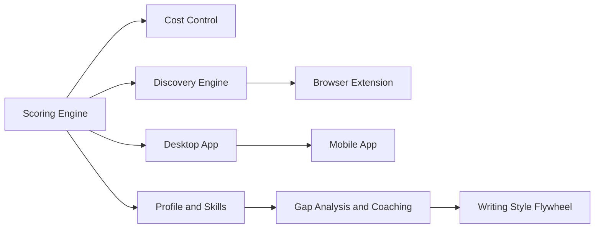
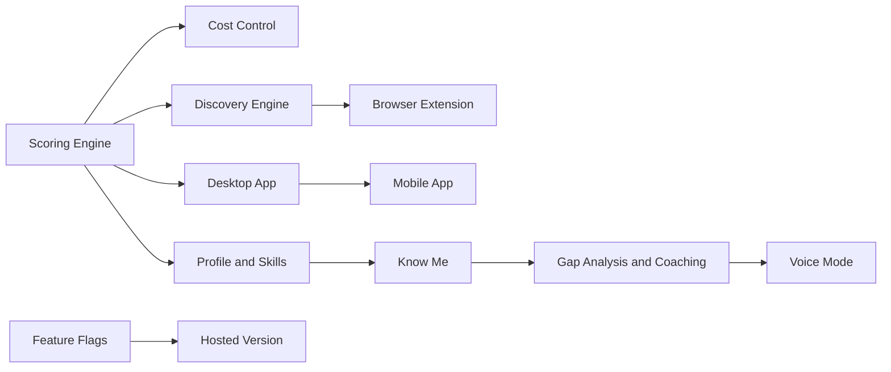

<objective>
Write all 9 planned/infrastructure deep-dive documents (8 planned milestones + Feature Flags), add inline "Deep dive" links to ROADMAP.md for all planned milestones, fix both Mermaid diagrams, and complete the inventory.md index with Planned and Internal tables.

Purpose: Completes the full set of 19 deep dives. Planned milestones use the adapted template (Design Considerations, Open Questions, Research Needed). Mermaid diagrams are brought into sync with Phase 3 prose. The index page becomes a complete directory of all deep dives.

Output: 9 new deep-dive .md files, updated inventory.md with all tables complete, ROADMAP.md with 9 more inline links and fixed Mermaid diagrams.
</objective>

<execution_context>
@$HOME/.claude/get-shit-done/workflows/execute-plan.md
@$HOME/.claude/get-shit-done/templates/summary.md
</execution_context>

<context>
@.planning/PROJECT.md
@.planning/ROADMAP.md
@.planning/STATE.md
@.planning/phases/04-milestone-deep-dives/04-CONTEXT.md
@.planning/phases/04-milestone-deep-dives/04-RESEARCH.md
@.planning/phases/04-milestone-deep-dives/04-PATTERNS.md
@.planning/phases/04-milestone-deep-dives/04-01-SUMMARY.md

<interfaces>
<!-- Plan 01 created these files that this plan references: -->
<!-- docs/roadmap/inventory.md (index page with How Planning Works, Shipped table, placeholder Planned/Internal) -->
<!-- docs/roadmap/scoring-engine.md through pii-safety-boundary.md (10 shipped deep dives) -->
<!-- ROADMAP.md (now has 10 "Deep dive" links on shipped status lines) -->

<!-- Planned milestone sources: -->
<!-- ROADMAP.md prose descriptions for each planned milestone -->
<!-- Phase 3 CONTEXT.md decisions: D-11 through D-30 for milestone content -->

<!-- Relative path patterns from docs/roadmap/ -->
<!-- ROADMAP.md: ../../ROADMAP.md -->
<!-- CHANGELOG.md: ../../CHANGELOG.md -->
<!-- docs/research/*.md: ../research/filename.md -->
<!-- docs/reference/*.md: ../reference/filename.md -->
<!-- docs/guides/*.md: ../guides/filename.md -->
<!-- Other deep dives: filename.md (same directory) -->
<!-- .planning/codebase/*.md: NEVER link (gitignored). Reference by description only -->

<!-- Mermaid fix targets in ROADMAP.md: -->
<!-- Gantt: rename Writing Style Flywheel to Voice Mode, add Know Me, reorder Later -->
<!-- Flowchart: rename Writing Style Flywheel to Voice Mode, add Know Me node, add Feature Flags edge -->
<!-- HTML comments to remove: both "Phase 2 milestone names" comments -->
</interfaces>
</context>

<tasks>

<task type="auto">
  <name>Task 1: Write all 9 planned/infrastructure deep-dive documents and complete inventory.md</name>
  <files>
    docs/roadmap/public-roadmap.md,
    docs/roadmap/desktop-app.md,
    docs/roadmap/browser-extension.md,
    docs/roadmap/mobile-app.md,
    docs/roadmap/profile-and-skills.md,
    docs/roadmap/know-me.md,
    docs/roadmap/gap-analysis-coaching.md,
    docs/roadmap/voice-mode.md,
    docs/roadmap/hosted-version.md,
    docs/roadmap/feature-flags.md,
    docs/roadmap/inventory.md
  </files>
  <read_first>
    docs/roadmap/inventory.md,
    ROADMAP.md,
    docs/guides/cost-optimization.md,
    .planning/phases/04-milestone-deep-dives/04-CONTEXT.md,
    .planning/phases/04-milestone-deep-dives/04-RESEARCH.md,
    .planning/phases/04-milestone-deep-dives/04-PATTERNS.md,
    .planning/phases/03-forward-vision/03-CONTEXT.md,
    docs/roadmap/scoring-engine.md
  </read_first>
  <action>
**Template consistency check (addresses review concern: Volume vs. Quality):**

Before writing all 9 docs, read `docs/roadmap/scoring-engine.md` (the Plan 01 pilot doc) as the concrete voice and structure reference. Match its tone, paragraph density, and formatting patterns. Planned docs will be shorter (500-800 words vs 800-1200) but the voice should be indistinguishable.

**Step 1: Write 8 planned milestone deep dives.**

Create each file in `docs/roadmap/` using the planned template from 04-PATTERNS.md. Each document follows this exact section structure:

```markdown
# [Milestone Name]

*Part of the [Kestrel roadmap](../../ROADMAP.md).*

## Goal
[1-2 sentences: what problem this will solve]

## What This Delivers
[1-2 paragraphs: future-oriented user benefit description. Warm second-person.]

## Design Considerations
[1-2 paragraphs: key decisions, tradeoffs. Replaces "How It Works".]

## Current Status
*Status: Planned/In Progress/Considering -- not yet started*
[Brief note on readiness, prerequisites]

## Related Milestones
[2-4 entries]

---

*For Contributors*

## Open Questions
[Bullet list of unresolved technical and design questions. Replaces "Architecture".]

## Research Needed
[What research should happen. Links to existing relevant docs with annotations.]

## BMAD Integration
**PRD Status:** Not started
[One paragraph unique to this milestone]
To start a PRD: `/bmad-create-prd` in Claude Code.
See the [planning hierarchy](inventory.md#how-planning-works) for how PRDs connect to implementation.
```

**Per-document specifics (including mandatory unique BMAD content per doc):**

**public-roadmap.md (In Progress):**
- Goal: Make the project's direction visible so users can evaluate it and contributors can find work
- What This Delivers: ROADMAP.md at repo root, deep-dive docs per milestone, planning hierarchy
- Design Considerations: balancing user-facing simplicity with contributor-facing detail, keeping docs current
- Status: `*Status: In Progress*` (this IS the current milestone)
- Research Needed: self-referential, link to ROADMAP.md itself
- BMAD unique content: "A PRD would define documentation standards, content freshness monitoring cadence, and the criteria for promoting a milestone from Considering to Planned."
- Related: Infrastructure (docs tooling), Desktop App (roadmap drives priority)

**desktop-app.md (Planned -- HIGHEST VALUE planned doc per D-17):**
- Goal: Make Kestrel installable without a terminal, the most important step from dev tool to real product
- What This Delivers: download, double-click, use. Signed installers for macOS and Windows. Local data like today. PWA as interim step, then native with Electron or Tauri (mention both PWA interim and native end-state per the deep-dive scope -- this is where the PWA-to-native progressive path lives, unlike ROADMAP.md which shows end-state only per Phase 3 D-11)
- Design Considerations: PWA vs Electron vs Tauri tradeoffs, auto-update mechanism, embedded backend, code signing (Apple dev cert), data migration from CLI install
- Status: `*Status: Planned -- not yet started*`
- Open Questions: Which native framework (Electron for ecosystem, Tauri for size), auto-update UX, how to embed the Python backend, Apple code signing logistics, installer size targets
- Research Needed: link to ux-persona-testing.md (persona friction with install), DEPLOY.md (current deployment paths). Note: BMAD PRD was planned but not yet started (BMAD v6.3.0 installed, output dir configured at `_bmad-output/planning-artifacts/` but empty). Reference per D-17
- BMAD unique content: "PRD Status: Not started (BMAD installed, ready to begin). A PRD would specify the installation experience from download to first launch, the auto-update mechanism, platform support matrix, embedded backend packaging strategy, and code signing requirements. This is the highest-priority PRD to create."
- Related: Web Frontend (desktop wraps it), Hosted Version (alternative deployment), Mobile App (another form factor)

**browser-extension.md (Planned):**
- Goal: Add any job from any website to your scoring queue with one click
- What This Delivers: Chrome and Firefox extension, one-click save from any job board page
- Design Considerations: manifest v3 requirements, content script parsing across different job board HTML structures, communication with local Kestrel instance
- Status: `*Status: Planned -- not yet started*`
- Open Questions: how to detect job posting content on arbitrary pages, authentication between extension and local backend, offline queuing
- Research Needed: link to job-search-tools.md (how discovery currently works)
- BMAD unique content: "A PRD would define the supported site list and content extraction rules, the extension-to-backend communication protocol, Chrome Web Store and Firefox Add-ons submission requirements, and the offline job queuing strategy."
- Related: Discovery Engine (extends job discovery), Desktop App (extension communicates with local instance)

**mobile-app.md (Planned):**
- Goal: Check your pipeline and scores from your phone
- What This Delivers: iOS and Android apps, pipeline view, score review, push notifications for follow-ups
- Design Considerations: web experience comes first (per Phase 3 D-18), React Native with Expo, shared API backend, offline support
- Status: `*Status: Planned -- not yet started*`. Note that a React Native/Expo scaffold exists but was paused for web-first priority
- Open Questions: Expo managed vs bare workflow, push notification infrastructure, offline data sync, App Store submission process
- Research Needed: link to mobile-ux-findings.md (UX findings from exploration)
- BMAD unique content: "A PRD would specify the screen inventory and navigation patterns, offline data synchronization behavior, push notification trigger rules, and the App Store submission checklist for iOS and Google Play."
- Related: Web Frontend (same API, mobile version), Desktop App (another form factor)

**profile-and-skills.md (Considering):**
- Goal: Give you an honest, visual map of where you stand professionally
- What This Delivers: skills mapping, gap identification, multiple visualization styles (RPG sheet, baseball card, LinkedIn stats, spiderweb, scorecard per Phase 3 D-19/D-20)
- Design Considerations: skill taxonomy (how to represent and normalize skills), visualization flexibility, integration with scoring (profile shapes what counts as a good score)
- Status: `*Status: Considering -- not yet started*`
- Open Questions: skill ontology (standard taxonomy vs freeform), proficiency level scale, how to keep skills current, integration points with scoring rubric
- Research Needed: link to validation-contract-m2-skills.md (validation contract for skills intelligence)
- BMAD unique content: "A PRD would define the skill data model and taxonomy, proficiency assessment methodology, visualization component specifications for each display style, and the integration rules connecting profile data to scoring weights."
- Related: Know Me (skills feed into deeper understanding), Gap Analysis and Coaching (skills baseline enables gap identification), Scoring Engine (profile improves scoring)

**know-me.md (Considering):**
- Goal: Have Kestrel understand who you are as a person, not just your resume
- What This Delivers: values, motivations, professional identity understanding. Pipeline tunes to personal preferences. Scoring reflects what matters to you. Generated text sounds like you. Opportunities clashing with values stop appearing. (Per Phase 3 D-21 through D-24)
- Design Considerations: reflective essay prompts (existential, value-oriented, work questions), how to extract and represent personal values computationally, privacy of deeply personal data, incremental learning from everyday choices
- Status: `*Status: Considering -- not yet started*`
- Open Questions: how to represent values/motivations computationally, how to ensure privacy for deeply personal reflections, how to validate that the system "understands" correctly, feedback loop for corrections
- Research Needed: no existing research docs (new concept). Note research areas: computational personality modeling, value alignment in AI systems, reflective journaling UX
- BMAD unique content: "A PRD would define the reflective essay prompt library, the value and motivation extraction methodology, pipeline integration points where personal understanding influences scoring and text generation, and the privacy model for deeply personal reflections."
- Related: Profile and Skills (builds on skills to understand values), Gap Analysis and Coaching (personal context shapes recommendations), Voice Mode (understanding you makes voice interaction more personal)

**gap-analysis-coaching.md (Considering):**
- Goal: Show exactly what is missing between where you are and where you want to be, then help you close the gap
- What This Delivers: target role selection, gap identification, concrete improvement steps from free resources to structured learning. (Per Phase 3 D-25/D-26)
- Design Considerations: how to define "target role" in a way that captures nuance, progressive coaching depth (skill maps, free resources, MOOCs, AI-assisted learning), measuring progress over time
- Status: `*Status: Considering -- not yet started*`
- Open Questions: role taxonomy (same as job family presets or separate), how to source and curate learning resources, how to measure skill improvement, coaching tone/voice
- Research Needed: link to validation-contract-m2-skills.md (gap analysis validation assertions)
- BMAD unique content: "A PRD would specify the role-gap calculation algorithm, learning resource curation and ranking criteria, progress tracking metrics and visualization, and the coaching interaction model including tone and escalation depth."
- Related: Profile and Skills (gap analysis requires skills baseline), Know Me (personal context shapes learning recommendations)

**voice-mode.md (Considering):**
- Goal: Talk to Kestrel instead of typing for pipeline updates, interview rehearsal, and career thinking
- What This Delivers: speech input for all existing features, dictation, voice interaction. (Per Phase 3 D-27/D-28, separate from Know Me)
- Design Considerations: speech-to-text integration (local vs cloud), latency requirements, voice as input (dictation) vs voice as conversation, existing code exists (api/voice.py registered but untested)
- Status: `*Status: Considering -- not yet started*`. Note: an API endpoint and frontend route exist in the codebase but are untested
- Open Questions: which speech-to-text service (local Whisper vs cloud APIs), real-time vs batch processing, how voice interacts with existing UI, privacy of voice recordings
- Research Needed: link to validation-contract-m5-integrations.md (voice integration validation, draft)
- BMAD unique content: "A PRD would define the voice interaction model and supported commands, speech-to-text provider selection criteria and fallback chain, UI integration patterns for voice-alongside-keyboard workflows, and privacy controls for voice recording storage and processing."
- Related: Know Me (understanding you makes voice more personal), Gap Analysis and Coaching (voice for coaching conversations)

**hosted-version.md (Considering):**
- Goal: Let users who do not want to install anything use Kestrel from any browser
- What This Delivers: zero-setup subscription option, same features as self-hosted, encrypted data, deletable anytime. (Per Phase 3 D-30, user benefit only, no business model)
- Design Considerations: multi-tenant vs isolated instances, data encryption at rest, GDPR compliance, what changes from SQLite to Postgres, pricing (deferred to BMAD PRD)
- Status: `*Status: Considering -- not yet started*`
- Open Questions: deployment infrastructure (Supabase, Railway, self-managed), multi-tenant data isolation, pricing model, EU data residency
- Research Needed: link to llms-tokens-privacy.md (privacy implications of hosted deployment)
- BMAD unique content: "A PRD would define the infrastructure architecture and hosting provider selection, data isolation model between tenants, encryption-at-rest and deletion guarantee requirements, and the pricing tier structure tied to feature flag configurations."
- Related: Desktop App (alternative deployment path), Feature Flags (flags enable different hosted editions)

**Step 2: Write Feature Flags deep dive (19th document, per D-10).**

Create `docs/roadmap/feature-flags.md` using a hybrid template. Short user-facing half, longer contributor section. This satisfies ROAD-15 which was excluded from ROADMAP.md prose per Phase 3 D-29.

```markdown
# Feature Flags

*Part of the [Kestrel roadmap](../../ROADMAP.md).*

## Goal
[1-2 sentences: let different deployments of Kestrel show different features]

## What This Delivers
[1 short paragraph: different app editions, hide incomplete features, adjust capabilities per deployment. Brief, not narrative.]

## Design Considerations
[1-2 paragraphs: runtime vs build-time flags, flag storage, UI for toggling, integration with hosted version tiers]

## Current Status
*Status: Planned -- not yet started*
[Brief note: no implementation exists, design phase]

## Related Milestones
- **[Hosted Version](hosted-version.md)** -- Feature flags enable different hosted editions and pricing tiers

---

*For Contributors*

## Open Questions
[Longer bullet list than typical planned docs: flag granularity, flag storage, runtime vs compile-time, admin UI, default values, flag categories (feature, experiment, ops)]

## Research Needed
[No existing research docs. Note areas: feature flag libraries, LaunchDarkly/Unleash/Flagsmith patterns, build-time elimination for tree shaking]

## BMAD Integration
**PRD Status:** Not started
[Unique: PRD would cover flag taxonomy and lifecycle, admin interface design, integration with hosted version tier management, and build-time flag elimination strategy for the open-source edition.]
To start a PRD: `/bmad-create-prd` in Claude Code.
See the [planning hierarchy](inventory.md#how-planning-works) for how PRDs connect to implementation.
```

**Step 3: Update inventory.md with complete Planned and Internal tables.**

Read the current inventory.md (written by Plan 04-01). Replace the placeholder rows in the Planned and Internal sections with complete entries. Verify that the Plan 01 placeholder rows ("Plan 04-02 will add...") are completely removed (addresses review concern: coordination/placeholder handoff).

**Planned table (replace placeholder row):**
```markdown
## Planned

| Milestone | Version | Description |
|-----------|---------|-------------|
| [Public Roadmap](public-roadmap.md) | v0.12 | Making the project's direction visible |
| [Desktop App](desktop-app.md) | v0.13 | Download, double-click, and start scoring |
| [Browser Extension](browser-extension.md) | v0.14 | One-click job save from any site |
| [Mobile App](mobile-app.md) | v0.15 | Pipeline and scores from your phone |
| [Profile and Skills](profile-and-skills.md) | v1.0 | Honest visual map of where you stand |
| [Know Me](know-me.md) | v1.0 | Deep personal understanding beyond resume |
| [Gap Analysis and Coaching](gap-analysis-coaching.md) | v1.0 | What is missing and how to close it |
| [Voice Mode](voice-mode.md) | v1.0 | Talk to Kestrel instead of typing |
| [Hosted Version](hosted-version.md) | v1.0 | Zero-setup subscription from any browser |
```

**Internal table (replace placeholder row):**
```markdown
## Internal

| Document | Description |
|----------|-------------|
| [Feature Flags](feature-flags.md) | Different editions, hidden features, per-deployment capabilities |
```

**Tone rules (apply to ALL planned documents, same as Plan 01):**
- Warm second-person throughout user-facing half
- No file paths in user-facing content. File paths ONLY in Open Questions section
- No em dashes anywhere. Use periods, commas, or restructure
- No AI slop: never use "seamlessly," "leverage," "revolutionize," "cutting-edge," "game-changer," "delve," "robust," "streamline," "harness"
- Planned docs use future-oriented tense (per Phase 4 D-22)
- No Mermaid diagrams inside deep dives (per D-04)
- Private docs inform framing, never cited (per D-25)
- Link to reference docs, do not duplicate content (per D-26)
- No clickable links to .planning/codebase/ (gitignored)
- Natural variation in openers (per Phase 3 D-06)
- Related Milestones names must match ROADMAP.md heading names exactly (addresses review concern: naming consistency)

**Word count targets:** 500-800 words per planned deep dive. Feature Flags may be shorter (infrastructure, not user-facing milestone).

**Related Milestones entries:** Use 2-4 entries per document. Same format as Plan 01 shipped docs.
  </action>
  <verify>
    <automated>cd /Users/pleasedodisturb/Projects/kestrel && echo "=== Total file count ===" && find docs/roadmap/ -name "*.md" | wc -l && echo "=== All 9 planned/infra files exist ===" && for f in public-roadmap desktop-app browser-extension mobile-app profile-and-skills know-me gap-analysis-coaching voice-mode hosted-version feature-flags; do test -f "docs/roadmap/$f.md" && echo "OK: $f" || echo "MISSING: $f"; done && echo "=== BMAD in all 19 deep dives ===" && grep -l "BMAD Integration" docs/roadmap/*.md | grep -v inventory | wc -l && echo "=== Inventory Planned table ===" && grep -c "Desktop App\|Browser Extension\|Mobile App\|Voice Mode\|Hosted Version" docs/roadmap/inventory.md && echo "=== Inventory Internal table ===" && grep -c "Feature Flags" docs/roadmap/inventory.md && echo "=== No AI slop ===" && grep -i "seamlessly\|leverage\|revolutionize\|cutting-edge\|game-changer\|delve\|robust\|streamline\|harness" docs/roadmap/public-roadmap.md docs/roadmap/desktop-app.md docs/roadmap/browser-extension.md docs/roadmap/mobile-app.md docs/roadmap/profile-and-skills.md docs/roadmap/know-me.md docs/roadmap/gap-analysis-coaching.md docs/roadmap/voice-mode.md docs/roadmap/hosted-version.md docs/roadmap/feature-flags.md | head -5 || echo "CLEAN: no AI slop" && echo "=== No .planning/ links ===" && grep -rn "\\.planning/" docs/roadmap/public-roadmap.md docs/roadmap/desktop-app.md docs/roadmap/browser-extension.md docs/roadmap/mobile-app.md docs/roadmap/profile-and-skills.md docs/roadmap/know-me.md docs/roadmap/gap-analysis-coaching.md docs/roadmap/voice-mode.md docs/roadmap/hosted-version.md docs/roadmap/feature-flags.md | head -5 || echo "CLEAN: no .planning/ links" && echo "=== BMAD uniqueness check (first 80 chars of PRD-would-cover line) ===" && for f in docs/roadmap/public-roadmap.md docs/roadmap/desktop-app.md docs/roadmap/browser-extension.md docs/roadmap/mobile-app.md docs/roadmap/profile-and-skills.md docs/roadmap/know-me.md docs/roadmap/gap-analysis-coaching.md docs/roadmap/voice-mode.md docs/roadmap/hosted-version.md docs/roadmap/feature-flags.md; do echo "--- $(basename $f) ---"; grep -A1 "PRD Status" "$f" | tail -1 | cut -c1-80; done && echo "=== Placeholder removal check ===" && grep -c "Plan 04-02" docs/roadmap/inventory.md && echo "(should be 0 — all placeholders replaced)" && echo "=== Link validation: verify research/reference targets exist ===" && for link in $(grep -roh '\.\./research/[a-z0-9_-]*\.md\|\.\./reference/[a-z0-9_-]*\.md\|\.\./guides/[a-z0-9_-]*\.md' docs/roadmap/public-roadmap.md docs/roadmap/desktop-app.md docs/roadmap/browser-extension.md docs/roadmap/mobile-app.md docs/roadmap/profile-and-skills.md docs/roadmap/know-me.md docs/roadmap/gap-analysis-coaching.md docs/roadmap/voice-mode.md docs/roadmap/hosted-version.md docs/roadmap/feature-flags.md | sort -u); do target="docs/roadmap/$link"; realpath "$target" 2>/dev/null | xargs test -f 2>/dev/null && echo "OK: $link" || echo "BROKEN: $link"; done && echo "=== Inter-deep-dive link validation ===" && for link in $(grep -roh '[a-z-]*\.md)' docs/roadmap/public-roadmap.md docs/roadmap/desktop-app.md docs/roadmap/browser-extension.md docs/roadmap/mobile-app.md docs/roadmap/profile-and-skills.md docs/roadmap/know-me.md docs/roadmap/gap-analysis-coaching.md docs/roadmap/voice-mode.md docs/roadmap/hosted-version.md docs/roadmap/feature-flags.md | sed 's/)$//' | sort -u); do test -f "docs/roadmap/$link" && echo "OK: $link" || echo "BROKEN: $link (deep dive not found)"; done</automated>
  </verify>
  <acceptance_criteria>
    - `find docs/roadmap/ -name "*.md" | wc -l` returns 20 (19 deep dives + 1 index)
    - All 10 planned/infra filenames exist: public-roadmap.md, desktop-app.md, browser-extension.md, mobile-app.md, profile-and-skills.md, know-me.md, gap-analysis-coaching.md, voice-mode.md, hosted-version.md, feature-flags.md
    - `grep -l "BMAD Integration" docs/roadmap/*.md | grep -v inventory | wc -l` returns 19
    - inventory.md contains "Desktop App" and "Browser Extension" and "Mobile App" in the Planned table
    - inventory.md contains "Feature Flags" in the Internal table
    - `grep -c "Plan 04-02" docs/roadmap/inventory.md` returns 0 (all placeholder rows replaced)
    - No AI slop words in any new document
    - No clickable links to .planning/ paths in any new document
    - Each file contains the breadcrumb `*Part of the [Kestrel roadmap](../../ROADMAP.md).*`
    - Each planned doc has `## Design Considerations` (not "How It Works")
    - Each planned doc has `## Open Questions` (not "Architecture")
    - Each planned doc has `## Research Needed` (not "Research & Decisions")
    - desktop-app.md mentions PWA and native (both phases of progressive path, per deep-dive scope)
    - desktop-app.md mentions BMAD and _bmad-output (per D-17)
    - feature-flags.md has "Hosted Version" in Related Milestones
    - BMAD uniqueness: the line following "PRD Status" differs across all 10 files (no two identical)
    - Link validation: all `../research/`, `../reference/`, and `../guides/` links resolve to existing files
    - Inter-deep-dive links (e.g., `hosted-version.md` in Related Milestones) resolve to existing files
    - Related Milestones names match ROADMAP.md heading names exactly
  </acceptance_criteria>
  <done>9 planned/infrastructure deep-dive documents exist in docs/roadmap/ following the adapted template. inventory.md has complete Shipped, Planned, and Internal tables with zero placeholder rows remaining. Feature Flags satisfies ROAD-15. All cross-document links validated.</done>
</task>

<task type="auto">
  <name>Task 2: Add planned milestone "Deep dive" links and fix Mermaid diagrams in ROADMAP.md</name>
  <files>ROADMAP.md</files>
  <read_first>
    ROADMAP.md,
    .planning/phases/04-milestone-deep-dives/04-CONTEXT.md,
    .planning/phases/04-milestone-deep-dives/04-RESEARCH.md,
    .planning/phases/04-milestone-deep-dives/04-PATTERNS.md
  </read_first>
  <action>
Edit ROADMAP.md to add "Deep dive" links on planned milestone status lines and fix both Mermaid diagrams. Three groups of changes:

**Group 1: Add "Deep dive" links to 9 planned/considering milestone status lines.**

Per D-06, same pattern as shipped milestones but with the planned/considering status text. Match on content (not line numbers, which may have shifted from Plan 01 edits):

Find `*Status: In Progress*` in the Public Roadmap section:
  TO: `*Status: In Progress* | [Deep dive](docs/roadmap/public-roadmap.md)`

Find `*Status: Planned*` in the Desktop App section:
  TO: `*Status: Planned* | [Deep dive](docs/roadmap/desktop-app.md)`

Find `*Status: Planned*` in the Browser Extension section:
  TO: `*Status: Planned* | [Deep dive](docs/roadmap/browser-extension.md)`

Find `*Status: Planned*` in the Mobile App section:
  TO: `*Status: Planned* | [Deep dive](docs/roadmap/mobile-app.md)`

Find `*Status: Considering*` in the Profile and Skills section:
  TO: `*Status: Considering* | [Deep dive](docs/roadmap/profile-and-skills.md)`

Find `*Status: Considering*` in the Know Me section:
  TO: `*Status: Considering* | [Deep dive](docs/roadmap/know-me.md)`

Find `*Status: Considering*` in the Gap Analysis and Coaching section:
  TO: `*Status: Considering* | [Deep dive](docs/roadmap/gap-analysis-coaching.md)`

Find `*Status: Considering*` in the Voice Mode section:
  TO: `*Status: Considering* | [Deep dive](docs/roadmap/voice-mode.md)`

Find `*Status: Considering*` in the Hosted Version section:
  TO: `*Status: Considering* | [Deep dive](docs/roadmap/hosted-version.md)`

Note: Feature Flags does NOT get a ROADMAP.md link (it is excluded from the user-facing roadmap per Phase 3 D-29). Its deep dive exists but is only reachable via the docs/roadmap/inventory.md index.

**Group 2: Fix the Mermaid gantt chart.**

Remove the HTML comment containing "Phase 2 milestone names" (per D-21).

Replace the Later section of the gantt chart with the fixed version per D-18 and D-19:

FROM:
```
    section Later
    Profile and Skills       :prof, 2026-10-01, 90d
    Gap Analysis             :gap,  2027-01-01, 90d
    Writing Style Flywheel   :voice, 2027-03-01, 60d
    Hosted Version           :hosted, 2027-02-01, 60d
```

TO:
```
    section Later
    Profile and Skills       :prof, 2026-10-01, 90d
    Know Me                  :know, 2027-01-01, 60d
    Gap Analysis             :gap,  2027-02-01, 90d
    Voice Mode               :voice, 2027-04-01, 60d
    Hosted Version           :hosted, 2027-05-01, 60d
```

Changes: (1) Add "Know Me" line, (2) rename "Writing Style Flywheel" to "Voice Mode", (3) reorder to match D-31 user journey ordering, (4) adjust dates for visual spacing with new milestone.

**Group 3: Fix the Mermaid flowchart.**

Remove the HTML comment containing "Phase 2 milestone names" (per D-21).

Replace the entire flowchart content with the fixed version per D-18 and D-20:

FROM:


TO:


Changes: (1) Add Know Me node (J) between Profile and Skills (G) and Gap Analysis (H), (2) rename "Writing Style Flywheel" (I) to "Voice Mode", (3) add Feature Flags (K) --> Hosted Version (L) edge per D-20.

**Post-edit link validation (addresses review concern: link accuracy):**

After all edits, verify every `docs/roadmap/*.md` link target in ROADMAP.md exists on disk. Also verify the Mermaid changes compiled correctly by checking for the exact strings "Know Me", "Voice Mode", "Feature Flags", and absence of "Writing Style Flywheel".
  </action>
  <verify>
    <automated>cd /Users/pleasedodisturb/Projects/kestrel && echo "=== Total Deep dive links ===" && grep -c "Deep dive" ROADMAP.md && echo "=== All 19 file links present ===" && for f in scoring-engine discovery-engine ai-provider-system cost-control application-pipeline web-frontend cli infrastructure onboarding-flow pii-safety-boundary public-roadmap desktop-app browser-extension mobile-app profile-and-skills know-me gap-analysis-coaching voice-mode hosted-version; do grep -q "docs/roadmap/$f.md" ROADMAP.md && echo "OK: $f" || echo "MISSING: $f"; done && echo "=== Writing Style Flywheel gone ===" && grep -c "Writing Style Flywheel" ROADMAP.md && echo "=== Know Me in document ===" && grep -c "Know Me" ROADMAP.md && echo "=== Voice Mode in document ===" && grep "Voice Mode" ROADMAP.md | head -3 && echo "=== Feature Flags in flowchart ===" && grep "Feature Flags" ROADMAP.md | head -3 && echo "=== Stale HTML comments gone ===" && grep -c "Phase 2 milestone names" ROADMAP.md && echo "=== Feature Flags NOT a Deep dive link ===" && grep "feature-flags" ROADMAP.md | head -3 || echo "CLEAN: no feature-flags link in ROADMAP.md" && echo "=== All link targets exist on disk ===" && for f in $(grep -oh 'docs/roadmap/[a-z-]*\.md' ROADMAP.md | sort -u); do test -f "$f" && echo "OK: $f" || echo "BROKEN: $f (file does not exist)"; done && echo "=== Gantt Later section order ===" && sed -n '/section Later/,/```/p' ROADMAP.md | head -7</automated>
  </verify>
  <acceptance_criteria>
    - `grep -c "Deep dive" ROADMAP.md` returns exactly 19
    - All 19 deep-dive file paths are present as links (scoring-engine through hosted-version, NOT feature-flags)
    - `grep -c "Writing Style Flywheel" ROADMAP.md` returns 0 (completely replaced)
    - `grep -c "Know Me" ROADMAP.md` returns at least 3 (heading, gantt, flowchart, plus prose mention)
    - `grep -c "Phase 2 milestone names" ROADMAP.md` returns 0 (both HTML comments removed)
    - Gantt Later section has 5 milestones: Profile and Skills, Know Me, Gap Analysis, Voice Mode, Hosted Version (in that order per D-31)
    - Flowchart contains "Feature Flags" node with edge to "Hosted Version"
    - Flowchart contains "Know Me" node between "Profile and Skills" and "Gap Analysis"
    - `grep "feature-flags" ROADMAP.md` returns no matches (Feature Flags deep dive is NOT linked from ROADMAP.md)
    - All `docs/roadmap/*.md` link targets in ROADMAP.md exist as files on disk
  </acceptance_criteria>
  <done>ROADMAP.md has all 19 "Deep dive" inline links, both Mermaid diagrams fixed with Know Me, Voice Mode, and Feature Flags edge, stale HTML comments removed, and all link targets verified on disk.</done>
</task>

</tasks>

<threat_model>
## Trust Boundaries

| Boundary | Description |
|----------|-------------|
| None | Documentation-only phase. No user input processing, no external service calls, no data handling |

## STRIDE Threat Register

| Threat ID | Category | Component | Disposition | Mitigation Plan |
|-----------|----------|-----------|-------------|-----------------|
| T-04-03 | Information Disclosure | docs/roadmap/*.md | accept | Deep dives are public documentation. No secrets, no PII. .planning/ is gitignored and never linked |
| T-04-04 | Tampering | ROADMAP.md Mermaid | accept | Public Markdown in git. Mermaid rendering verified by GitHub preview. No executable content |
</threat_model>

<verification>
- All 20 files exist in docs/roadmap/ (19 deep dives + 1 index)
- ROADMAP.md has exactly 19 "Deep dive" inline links (10 shipped + 9 planned, NOT Feature Flags)
- "Writing Style Flywheel" appears zero times in ROADMAP.md
- Both Mermaid diagrams contain "Know Me" and "Voice Mode"
- Flowchart contains Feature Flags --> Hosted Version edge
- No HTML comments referencing "Phase 2 milestone names" remain
- inventory.md has complete Shipped (10), Planned (9), and Internal (1) tables with zero placeholder rows
- All 19 deep dives have BMAD Integration section with unique content
- All cross-document links (research, reference, inter-deep-dive) resolve to existing files
</verification>

<success_criteria>
- 20 markdown files in docs/roadmap/ (19 deep dives + 1 index)
- All planned docs follow the adapted template: Goal, What This Delivers, Design Considerations, Current Status, Related Milestones, ---, Open Questions, Research Needed, BMAD Integration
- Feature Flags deep dive exists and satisfies ROAD-15
- ROADMAP.md is fully updated: 19 Deep dive links, fixed gantt, fixed flowchart, no stale comments
- inventory.md is a complete directory listing all 19 deep dives with no placeholder rows remaining
- All relative links verified against filesystem
</success_criteria>

<output>
After completion, create `.planning/phases/04-milestone-deep-dives/04-02-SUMMARY.md`
</output>
