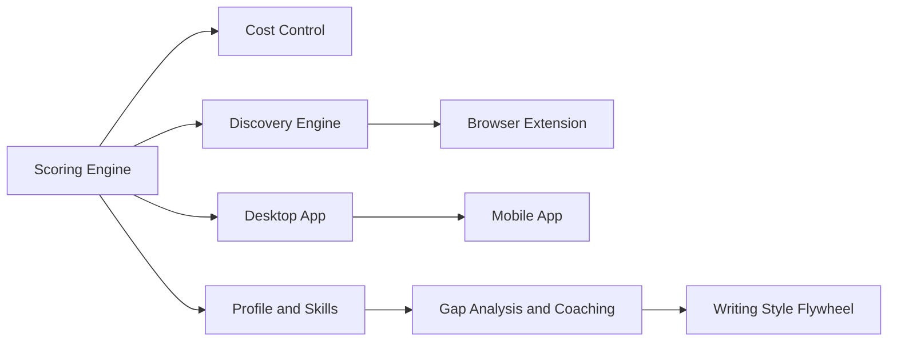
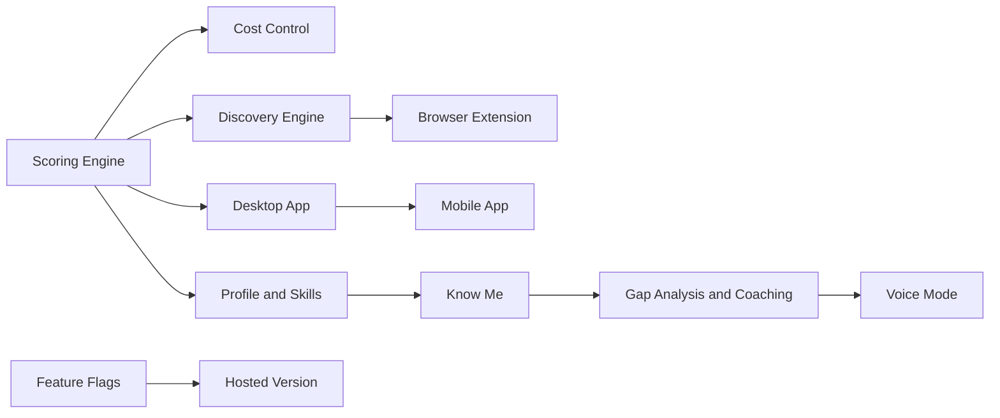

# Phase 4: Milestone Deep Dives - Research

**Researched:** 2026-04-27
**Domain:** Documentation — editorial milestone (no code changes)
**Confidence:** HIGH

## Summary

Phase 4 creates 19 deep-dive documents in `docs/roadmap/`, repurposes `inventory.md` as an index page, adds inline "Deep dive" links to ROADMAP.md milestone headings, and fixes two stale Mermaid diagrams. This is a pure editorial phase with no code changes. The primary challenge is not technical but editorial: each document must serve two audiences (users and contributors) with consistent quality across 19 files, drawing source material from 7 codebase analysis docs, 20 research docs, 11 reference docs, and the CHANGELOG.

The source material is abundant and well-organized. The `.planning/codebase/` docs (~1,693 lines across 7 files) provide architecture details for shipped milestone contributor sections. The `docs/research/` directory (20 files) and `docs/reference/` directory (11 files) provide annotated link targets. The CHANGELOG.md provides cross-reference anchors for all shipped releases. The key risk is not missing information but maintaining consistent tone, depth, and formatting across 19 documents in two separate plans.

**Primary recommendation:** Use a strict template with per-document checklists, write shipped deep dives first (richer source material), and verify every link against existing files before committing.

<user_constraints>
## User Constraints (from CONTEXT.md)

### Locked Decisions
- **D-01:** Dual-audience structure. Top half user-facing (warm tone), bottom half contributor-facing (file paths, architecture). `---` separator
- **D-02:** Narrative + technical template. Sections: Goal, What This Delivers, How It Works, Current Status, Related Milestones, then separator, then For Contributors: Architecture, Research & Decisions, BMAD Integration. ~800-1200 words shipped, ~500-800 planned
- **D-03:** Descriptive slug file naming (scoring-engine.md, desktop-app.md, etc.). No bird codenames in filenames
- **D-04:** Text-only in user-facing half. No Mermaid diagrams inside deep dives. Contributor section can reference `.planning/codebase/` diagrams
- **D-05:** Related Milestones section at bottom of user-facing half, before contributor separator
- **D-06:** Inline deep-dive links on ROADMAP.md milestone headings. "Deep dive" link on status line
- **D-07:** Repurpose inventory.md as index page. Grouped by Shipped/Planned
- **D-08:** Planning hierarchy explained once in index ("How Planning Works" section). Deep dives link back to it
- **D-09:** All milestones covered: 10 shipped + 8 planned + Feature Flags = 19 documents
- **D-10:** Feature Flags as standalone deep dive (19th document). Satisfies ROAD-15
- **D-11:** Planned milestones use adapted template. "How It Works" -> "Design Considerations", "Architecture" -> "Open Questions", "Research & Decisions" -> "Research Needed"
- **D-12:** Source from codebase docs, not Phase 1 inventory. Source chain: ROADMAP.md -> .planning/codebase/ -> docs/research/ -> docs/reference/ -> CHANGELOG.md
- **D-13:** Writing order is Claude's discretion
- **D-14:** Two plans. Plan 04-01: 10 shipped deep dives + index + ROADMAP.md links (shipped). Plan 04-02: 9 planned deep dives (8 planned + Feature Flags) + ROADMAP.md links (planned) + Mermaid fixes + final index update
- **D-15:** BMAD Integration: status + hook pattern. PRD status, what a PRD would cover, call-to-action
- **D-16:** Planning hierarchy in index only, deep dives link back
- **D-17:** Desktop App references in-progress PRD. Note: `docs/prd-creation` branch and `_bmad-output/planning-artifacts/` directory do NOT currently exist. Reference the PRD concept but note it is not yet started (BMAD installed but no PRD output generated)
- **D-18:** Fix both Mermaid diagrams in Plan 2. Gantt: rename "Writing Style Flywheel" to "Voice Mode", add "Know Me". Flowchart: same rename, add Know Me node
- **D-19:** Gantt order matches D-31 from Phase 3: Profile and Skills, Know Me, Gap Analysis, Voice Mode, Hosted Version
- **D-20:** Add Feature Flags -> Hosted Version edge to flowchart
- **D-21:** Remove staleness HTML comments from both diagrams
- **D-22:** Same voice, natural tense. Warm second-person. Shipped = present/past. Planned = future-oriented
- **D-23:** No AI slop (avoid "seamlessly," "leverage," "revolutionize," etc.)
- **D-24:** Annotated research links. One-sentence annotation per link. 3-8 links per deep dive
- **D-25:** Private docs inform framing, never cited. No links to `private/` directory
- **D-26:** Link to reference docs, don't duplicate content

### Claude's Discretion
- Writing order for the 19 documents
- Exact wording of "How It Works" and "What This Delivers" sections
- Which research docs are relevant to which milestones (annotated link selection)
- Related Milestones connections (which milestones link to which)
- Exact architecture details in contributor sections
- How to frame open questions for planned milestones

### Deferred Ideas (OUT OF SCOPE)
- Phase 1 (Feature Inventory) may no longer be needed since deep dives supersede the inventory concept
- Hosted Version business model details (pricing, tiers, sustainability) deferred to BMAD PRD
</user_constraints>

<phase_requirements>
## Phase Requirements

| ID | Description | Research Support |
|----|-------------|------------------|
| DEEP-01 | docs/roadmap/ directory exists with a consistent template for milestone documents | Template defined in D-01/D-02/D-11. Research provides complete file-to-milestone mapping and template structure |
| DEEP-02 | Each shipped milestone has a deep dive document (goal, context, features, technical approach, status, related docs) | Research maps all 10 shipped milestones to source material from .planning/codebase/, docs/research/, docs/reference/, and CHANGELOG.md |
| DEEP-03 | Milestone documents link to relevant research and decision docs in docs/ and docs/research/ | Research provides complete milestone-to-research-doc mapping with 3-8 annotated links per deep dive |
| DEEP-04 | Milestone documents show where BMAD PRDs plug in (integration pattern defined, even if PRDs incomplete) | Research confirms BMAD is installed (v6.3.0, _bmad/), PRD output dir configured but empty, no PRDs started. Pattern: status line + hook |
</phase_requirements>

## Architectural Responsibility Map

| Capability | Primary Tier | Secondary Tier | Rationale |
|------------|-------------|----------------|-----------|
| Deep-dive document authoring | Static Docs | -- | Pure Markdown files rendered by GitHub |
| Index page (inventory.md) | Static Docs | -- | Markdown directory listing, no build step |
| ROADMAP.md inline links | Static Docs | -- | Editing existing Markdown file |
| Mermaid diagram fixes | Static Docs (GitHub) | -- | Mermaid rendered by GitHub's built-in renderer |
| BMAD integration references | Static Docs | -- | Text references to BMAD concepts, no code |

This is a documentation-only phase. All work happens in Markdown files rendered by GitHub. No build systems, no runtimes, no databases.

## Milestone Inventory

### Complete Milestone List (from ROADMAP.md)

This is the authoritative list of milestones with their exact names, codenames, versions, and statuses as they appear in the current ROADMAP.md. Deep-dive filenames are derived from these. [VERIFIED: ROADMAP.md on current branch]

#### Shipped Milestones (10 deep dives for Plan 04-01)

| # | Milestone Name | Version | Codename | Filename | CHANGELOG Anchor |
|---|---------------|---------|----------|----------|-----------------|
| 1 | Scoring Engine | v0.4 | Peregrine | `scoring-engine.md` | `#040-2026-04-16` |
| 2 | Discovery Engine | v0.3 | Osprey | `discovery-engine.md` | `#030-2026-04-13` |
| 3 | AI Provider System | v0.5 | Starling | `ai-provider-system.md` | `#050-2026-04-16` |
| 4 | Cost Control | v0.11 | Merlin | `cost-control.md` | `#0110-2026-04-21` |
| 5 | Application Pipeline | v0.2 | Swift | `application-pipeline.md` | `#020-2026-04-12` |
| 6 | Web Frontend | v0.11 | Wren | `web-frontend.md` | `#0110-2026-04-21` |
| 7 | CLI | v0.3 | Shrike | `cli.md` | `#030-2026-04-13` |
| 8 | Infrastructure | v0.12 | Raven | `infrastructure.md` | `#0120-2026-04-23` |
| 9 | Onboarding Flow | v0.11 | Finch | `onboarding-flow.md` | `#0110-2026-04-21` |
| 10 | PII Safety Boundary | v0.12 | Harrier | `pii-safety-boundary.md` | `#0120-2026-04-23` |

#### Planned Milestones (8 deep dives for Plan 04-02)

| # | Milestone Name | Version | Codename | Status | Filename |
|---|---------------|---------|----------|--------|----------|
| 11 | Public Roadmap | v0.12 | Wagtail | In Progress | `public-roadmap.md` |
| 12 | Desktop App | v0.13 | Falcon | Planned | `desktop-app.md` |
| 13 | Browser Extension | v0.14 | Kingfisher | Planned | `browser-extension.md` |
| 14 | Mobile App | v0.15 | Sparrowhawk | Planned | `mobile-app.md` |
| 15 | Profile and Skills | v1.0 | Nightjar | Considering | `profile-and-skills.md` |
| 16 | Know Me | v1.0 | Robin | Considering | `know-me.md` |
| 17 | Gap Analysis and Coaching | v1.0 | Woodpecker | Considering | `gap-analysis-coaching.md` |
| 18 | Voice Mode | v1.0 | Lark | Considering | `voice-mode.md` |
| 19 | Hosted Version | v1.0 | Albatross | Considering | `hosted-version.md` |

#### Infrastructure Document (19th deep dive, Plan 04-02)

| # | Document | Filename |
|---|----------|----------|
| 20 | Feature Flags | `feature-flags.md` |

**Note:** Feature Flags is the 19th document in total. It satisfies ROAD-15 (excluded from ROADMAP.md user-facing content per Phase 3 D-29).

## Source Material Mapping

### Shipped Milestone -> Source Documents

This mapping tells the planner exactly which source files to read for each shipped deep dive's content. [VERIFIED: all paths confirmed via filesystem inspection]

#### 1. Scoring Engine (scoring-engine.md)
**Architecture sources:**
- `.planning/codebase/ARCHITECTURE.md` -- Scoring service layer, AI provider integration
- `.planning/codebase/INTEGRATIONS.md` -- AI provider factory pattern, complexity routing
- `.planning/codebase/CONCERNS.md` -- Scoring monolith tech debt (4,262 lines)

**Research & Decisions links (annotated):**
- `docs/research/scoring-research.md` -- Core scoring philosophy: human-first scoring rubric design, multi-factor evaluation, and why "recommended" means balanced, not optimal
- `docs/research/scoring-raw-research.md` -- Raw research data behind scoring decisions, benchmark methodology, and model comparison
- `docs/research/batch-scoring-feasibility.md` -- Evidence that 10-25 jobs per prompt maintains quality while cutting costs 80%+
- `docs/research/preset-tier-validation.md` -- Benchmark validation that 5 quality tiers (Free/Budget/Quality/Privacy/Custom) reflect real model performance clusters
- `docs/reference/scoring-validation-report.md` -- Before/after validation data: variance dropped 15.7%, reject accuracy 100%, mediocre accuracy improved 63.6% to 75.0%

**CHANGELOG:** `[v0.4.0](CHANGELOG.md#040-2026-04-16)`

#### 2. Discovery Engine (discovery-engine.md)
**Architecture sources:**
- `.planning/codebase/ARCHITECTURE.md` -- Discovery service, adapter pattern, background scheduling
- `.planning/codebase/INTEGRATIONS.md` -- python-jobspy integration, job board adapters
- `.planning/codebase/STRUCTURE.md` -- `src/career_os/discovery/` module layout

**Research & Decisions links:**
- `docs/research/cost-optimization-strategy.md` -- The scoring funnel: 1,500 scraped -> 600 after pre-filter -> AI scored. Shows discovery's role in the cost pipeline
- `docs/research/job-search-tools.md` -- Tool matrix of scrapers, MCP servers, and Germany-specific sources used in discovery

**CHANGELOG:** `[v0.3.0](CHANGELOG.md#030-2026-04-13)`

#### 3. AI Provider System (ai-provider-system.md)
**Architecture sources:**
- `.planning/codebase/ARCHITECTURE.md` -- AI provider abstraction, factory pattern
- `.planning/codebase/INTEGRATIONS.md` -- All 11 providers listed with auth, endpoints, tier routing, caching, PII masking
- `.planning/codebase/CONCERNS.md` -- Mock provider maintenance burden (1,844 lines)

**Research & Decisions links:**
- `docs/research/llms-tokens-privacy.md` -- Comprehensive 2026 LLM API landscape: pricing drops, BYOK strategy, EU sovereignty, DeepSeek risk, prompt caching economics
- `docs/research/provider-privacy-audit.md` -- Per-provider privacy trust matrix: training policies, retention, ZDR, GDPR fines
- `docs/research/free-model-landscape-2026.md` -- Free tier comparison across 7 providers: rate limits, quality, and which ones actually work for structured scoring
- `docs/research/openrouter-rate-limits.md` -- Rate limit tiers at $0/$10/$50 balance thresholds and what changes at each level
- `docs/reference/AI-PROVIDERS.md` -- User-facing provider guide with setup instructions and recommendations

**CHANGELOG:** `[v0.5.0](CHANGELOG.md#050-2026-04-16)`

#### 4. Cost Control (cost-control.md)
**Architecture sources:**
- `.planning/codebase/ARCHITECTURE.md` -- Presets system, batch scoring, async batch API
- `.planning/codebase/INTEGRATIONS.md` -- Anthropic/OpenAI batch API integration, prompt caching

**Research & Decisions links:**
- `docs/research/cost-optimization-strategy.md` -- The complete cost optimization strategy: funnel math, $0.81/mo budget target, tier analysis
- `docs/research/batch-scoring-feasibility.md` -- Academic evidence (arXiv:2604.03684) supporting batch scoring at 10-25 jobs/prompt
- `docs/research/preset-tier-validation.md` -- Data-driven validation of 5 preset tiers against real benchmark results
- `docs/research/token-optimization-research.md` -- 10 strategies evaluated, shipped: compact JSON (30% savings), system prompt deduplication (90% cache hit rate)
- `docs/research/token-optimization-raw-research.md` -- Raw research data behind token optimization decisions
- `docs/guides/cost-optimization.md` -- User-facing guide to understanding and controlling costs

**CHANGELOG:** `[v0.11.0](CHANGELOG.md#0110-2026-04-21)`

#### 5. Application Pipeline (application-pipeline.md)
**Architecture sources:**
- `.planning/codebase/ARCHITECTURE.md` -- Application state machine, CRUD operations
- `.planning/codebase/STRUCTURE.md` -- `src/career_os/api/applications.py`, `src/career_os/services/applications.py`
- `.planning/codebase/CONVENTIONS.md` -- VALID_TRANSITIONS dict pattern in schemas

**Research & Decisions links:**
- `docs/reference/M1-validation-contract.md` -- Milestone 1 validation contract covering core platform, pipeline management, Kanban UI, follow-up engine
- `docs/research/ux-persona-testing.md` -- Persona-based journey analysis identifying friction points in pipeline workflows

**CHANGELOG:** `[v0.2.0](CHANGELOG.md#020-2026-04-12)`

#### 6. Web Frontend (web-frontend.md)
**Architecture sources:**
- `.planning/codebase/ARCHITECTURE.md` -- SPA architecture, React Router, TanStack Query
- `.planning/codebase/STRUCTURE.md` -- `frontend/` module layout, 11 pages
- `.planning/codebase/STACK.md` -- React 19, Vite 8, Tailwind CSS 4, component libraries

**Research & Decisions links:**
- `docs/research/ux-persona-testing.md` -- Persona-based UX testing: identifies friction points across all 11 pages for non-technical users
- `docs/research/mobile-ux-findings.md` -- UX findings from mobile exploration that inform responsive web design decisions
- `docs/reference/M1-validation-contract.md` -- Validation contract covering Kanban UI, analytics dashboard, frontend components

**CHANGELOG:** `[v0.11.0](CHANGELOG.md#0110-2026-04-21)`

#### 7. CLI (cli.md)
**Architecture sources:**
- `.planning/codebase/ARCHITECTURE.md` -- CLI entry points, Typer framework
- `.planning/codebase/STRUCTURE.md` -- `src/career_os/cli/` module layout
- `.planning/codebase/STACK.md` -- Typer, Rich output formatting

**Research & Decisions links:**
- `docs/reference/M1-validation-contract.md` -- CLI validation assertions for pipeline commands
- `docs/reference/REFERENCE.md` -- Technical reference including CLI command documentation

**CHANGELOG:** `[v0.3.0](CHANGELOG.md#030-2026-04-13)`

#### 8. Infrastructure (infrastructure.md)
**Architecture sources:**
- `.planning/codebase/TESTING.md` -- Test infrastructure (pytest, Vitest, CI pipeline)
- `.planning/codebase/CONCERNS.md` -- CI/CD tech debt, test maintenance

**Research & Decisions links:**
- `docs/research/cicd-research.md` -- CI/CD research: from tested code to production reality, 4-phase roadmap
- `docs/research/cicd-dev-review.md` -- CI/CD implementation review and dev-focused synthesis
- `docs/research/cicd-raw-research.md` -- Raw CI/CD research data
- `docs/research/testing-research.md` -- Testing research: strategies, tools, what level of testing a solo project needs
- `docs/research/testing-raw-research.md` -- Raw testing research data
- `docs/reference/TESTING.md` -- Machine-readable testing standards (rules, mocking boundaries, test structure)
- `docs/reference/testing-strategy.md` -- What shipped, what was trimmed, and the rationale for stopping before enterprise-grade
- `docs/reference/release-pipeline.md` -- Release pipeline: commit to release flow, two-tier status system, workflow descriptions

**CHANGELOG:** `[v0.12.0](CHANGELOG.md#0120-2026-04-23)`

#### 9. Onboarding Flow (onboarding-flow.md)
**Architecture sources:**
- `.planning/codebase/ARCHITECTURE.md` -- Onboarding service, six-step flow
- `.planning/codebase/STRUCTURE.md` -- Onboarding-related files

**Research & Decisions links:**
- `docs/research/ux-persona-testing.md` -- Persona testing of the onboarding experience for non-technical users
- `docs/reference/M1-validation-contract.md` -- Validation contract covering first-run experience

**CHANGELOG:** `[v0.11.0](CHANGELOG.md#0110-2026-04-21)`

#### 10. PII Safety Boundary (pii-safety-boundary.md)
**Architecture sources:**
- `.planning/codebase/INTEGRATIONS.md` -- PII masking layer, privacy registry, per-provider privacy metadata
- `.planning/codebase/ARCHITECTURE.md` -- CachedAIProvider, PII masking in AI pipeline

**Research & Decisions links:**
- `docs/research/provider-privacy-audit.md` -- Trust matrix: per-provider training policies, retention, ZDR, GDPR fines
- `docs/research/llms-tokens-privacy.md` -- 2026 LLM privacy landscape, EU sovereignty, data handling policies
- `docs/reference/AI-PROVIDERS.md` -- Provider guide with privacy tier indicators

**CHANGELOG:** `[v0.12.0](CHANGELOG.md#0120-2026-04-23)`

### Planned Milestone -> Source Context

Planned deep dives have lighter source material. The main sources are the ROADMAP.md prose descriptions and prior phase CONTEXT.md decisions.

| Milestone | Primary Sources | Research Links (if any) |
|-----------|----------------|------------------------|
| Public Roadmap | This planning milestone itself. Self-referential. Link to ROADMAP.md | None (this IS the research) |
| Desktop App | Phase 3 D-11 through D-16 (end-state framing), .planning/PROJECT.md (deployment vision) | `docs/research/ux-persona-testing.md` (persona friction with current install), `docs/reference/DEPLOY.md` (current deployment paths) |
| Browser Extension | Phase 3 D-17 (one-click save core value), ROADMAP.md description | `docs/research/job-search-tools.md` (tool matrix, how discovery currently works) |
| Mobile App | Phase 3 D-18 (future-focused framing), MEMORY parked mobile notes | `docs/research/mobile-ux-findings.md` (UX findings from React Native/Expo exploration) |
| Profile and Skills | Phase 3 D-19/D-20 (visualization styles), ROADMAP.md description | `docs/reference/validation-contract-m2-skills.md` (validation contract for skills intelligence) |
| Know Me | Phase 3 D-21 through D-24 (deep personal understanding, reflective essays) | None currently (new concept, no prior research docs) |
| Gap Analysis and Coaching | Phase 3 D-25/D-26 (end benefit framing), ROADMAP.md description | `docs/reference/validation-contract-m2-skills.md` (gap analysis validation assertions) |
| Voice Mode | Phase 3 D-27/D-28 (separate from Know Me), ROADMAP.md description | `docs/reference/validation-contract-m5-integrations.md` (voice integration validation, though draft) |
| Hosted Version | Phase 3 D-30 (user benefit framing only), ROADMAP.md description | `docs/research/llms-tokens-privacy.md` (privacy implications of hosted deployment) |
| Feature Flags | Phase 3 D-29 (excluded from ROADMAP.md), ROAD-15 requirement | None (internal infrastructure, no prior research docs) |

## Current State of docs/roadmap/

**Existing files:** [VERIFIED: filesystem inspection]
- `docs/roadmap/inventory.md` -- 7-line placeholder file. Content: title, description, and "Coming soon" notice linking to ROADMAP.md. This file gets completely rewritten as the index page

**No other files exist in `docs/roadmap/`.** All 19 deep-dive documents will be new files.

## BMAD Integration Context

**Current state:** [VERIFIED: filesystem inspection]
- BMAD v6.3.0 is installed (`_bmad/` directory with `bmm/config.yaml`, `core/`, `_config/`)
- Output directory configured as `_bmad-output/planning-artifacts/` but this directory does **not exist** (no files found)
- No PRD branch exists (`docs/prd-creation` branch mentioned in MEMORY.md does not exist on local or remote)
- No PRDs have been started or generated

**Implication for D-15 and D-17:**
- The BMAD Integration section in each deep dive should state PRD status as "Not started" for all milestones except Desktop App
- Desktop App should state "Not started (BMAD installed, ready to begin)" -- the "5/13 steps" referenced in D-17 appears to be outdated information from MEMORY.md that does not match actual filesystem state
- The call-to-action pattern should reference BMAD commands (`/bmad-create-prd`) and the output path (`_bmad-output/planning-artifacts/`)

**Planning hierarchy for index page (D-08):**
```
ROADMAP.md (what and why)
  --> docs/roadmap/ deep dives (depth per milestone)
       --> BMAD PRDs (detailed product requirements)
            --> Milestones (scoped deliverables)
                 --> Epics (feature groupings)
                      --> Linear tickets (granular tasks)
```

## Mermaid Diagram Fixes

### Current Gantt Chart (lines 164-189 of ROADMAP.md)

**Issues to fix:** [VERIFIED: ROADMAP.md line-by-line inspection]

1. **"Writing Style Flywheel"** on line 187 must become **"Voice Mode"** (Phase 3 renamed this milestone)
2. **"Know Me"** milestone is missing entirely -- must be added between "Profile and Skills" and "Gap Analysis"
3. **Ordering** must match D-31 from Phase 3: Profile and Skills, Know Me, Gap Analysis, Voice Mode, Hosted Version
4. **HTML comment** on line 162 says "Diagram reflects Phase 2 milestone names" -- remove after fixes (D-21)
5. Current "Gap Analysis" label should be "Gap Analysis and Coaching" to match ROADMAP.md heading (or stay abbreviated for Gantt readability -- Claude's discretion)

**Current Later section in Gantt:**
```
    section Later
    Profile and Skills       :prof, 2026-10-01, 90d
    Gap Analysis             :gap,  2027-01-01, 90d
    Writing Style Flywheel   :voice, 2027-03-01, 60d
    Hosted Version           :hosted, 2027-02-01, 60d
```

**Required fix (D-19 ordering):**
```
    section Later
    Profile and Skills       :prof, 2026-10-01, 90d
    Know Me                  :know, 2027-01-01, 60d
    Gap Analysis             :gap,  2027-02-01, 90d
    Voice Mode               :voice, 2027-04-01, 60d
    Hosted Version           :hosted, 2027-05-01, 60d
```

Note: Dates are positioning only (not commitments). Adjusted to maintain visual spacing with the new Know Me milestone inserted.

### Current Flowchart (lines 196-205 of ROADMAP.md)

**Issues to fix:** [VERIFIED: ROADMAP.md line-by-line inspection]

1. **"Writing Style Flywheel"** on line 204 must become **"Voice Mode"**
2. **"Know Me"** node missing -- must be added with edges: Profile and Skills --> Know Me --> Gap Analysis and Coaching --> Voice Mode (D-18)
3. **Feature Flags --> Hosted Version** edge must be added (D-20)
4. **HTML comment** on line 194 says "Diagram reflects Phase 2 milestone names" -- remove after fixes (D-21)

**Current flowchart:**


**Required fix:**


**GitHub compatibility notes (from Phase 2 D-18):**
- Use `flowchart LR` (not `graph LR`) [VERIFIED: current ROADMAP.md uses flowchart LR]
- No `&` joins, no HTML tags, no `color:#fff`, no subgraph edges
- No quadrantChart
- Test by previewing on GitHub, not Mermaid live editor

## ROADMAP.md Inline Link Pattern

Each milestone heading in ROADMAP.md currently has the format:
```markdown
#### Milestone Name (vX.Y Codename)

*Status: Shipped/Planned/Considering*

Description paragraph. [vX.Y.Z](CHANGELOG.md#anchor)
```

The deep-dive link should be added to the status line (D-06). Recommended pattern:
```markdown
*Status: Shipped* | [Deep dive](docs/roadmap/scoring-engine.md)
```

Or for planned milestones (no CHANGELOG link):
```markdown
*Status: Planned* | [Deep dive](docs/roadmap/desktop-app.md)
```

**Total edits to ROADMAP.md:**
- Plan 04-01: Add deep-dive links to 10 shipped milestone status lines
- Plan 04-02: Add deep-dive links to 9 planned/considering milestone status lines (including Public Roadmap) + Mermaid diagram fixes + remove stale HTML comments

**Note:** The "Public Roadmap" milestone (v0.12 Wagtail) is listed under "Now" with status "In Progress". It gets a deep-dive link in Plan 04-02 since it is a planned/in-progress milestone, not shipped.

## CHANGELOG Anchor Pattern

**Verified pattern** used in current ROADMAP.md: [VERIFIED: grep of ROADMAP.md]

| Version | Anchor Pattern | Example |
|---------|---------------|---------|
| v0.2.0 | `#020-2026-04-12` | `[v0.2.0](CHANGELOG.md#020-2026-04-12)` |
| v0.3.0 | `#030-2026-04-13` | `[v0.3.0](CHANGELOG.md#030-2026-04-13)` |
| v0.4.0 | `#040-2026-04-16` | `[v0.4.0](CHANGELOG.md#040-2026-04-16)` |
| v0.5.0 | `#050-2026-04-16` | `[v0.5.0](CHANGELOG.md#050-2026-04-16)` |
| v0.11.0 | `#0110-2026-04-21` | `[v0.11.0](CHANGELOG.md#0110-2026-04-21)` |
| v0.12.0 | `#0120-2026-04-23` | `[v0.12.0](CHANGELOG.md#0120-2026-04-23)` |

GitHub auto-generates heading anchors by: lowercasing, stripping dots/parentheses, replacing spaces with hyphens. So `## [0.12.0](...) (2026-04-23)` becomes `#0120-2026-04-23`.

Deep dives should use the same pattern when cross-referencing CHANGELOG entries.

## Template Structure

### Shipped Milestone Template (~800-1200 words)

```markdown
# [Milestone Name]

*Part of the [Kestrel roadmap](../../ROADMAP.md).*

## Goal

[1-2 sentences: what problem this solves for the user]

## What This Delivers

[2-3 paragraphs: user-facing description of capabilities. Warm second-person tone.
Present tense for current features. No file paths, no API routes.]

## How It Works

[1-2 paragraphs: simplified explanation of the approach without implementation details.
User-accessible language. "Under the hood" framing if needed.]

## Current Status

*Shipped in [vX.Y.0](../../CHANGELOG.md#anchor)*

[Brief status note: what's done, any known limitations worth mentioning]

## Related Milestones

- **[Related Milestone](related-file.md)** -- one-line relationship description
- **[Related Milestone](related-file.md)** -- one-line relationship description

---

*For Contributors*

## Architecture

[File paths, module structure, key abstractions. Can reference
`.planning/codebase/` docs for detailed diagrams.]

## Research & Decisions

Annotated links to research and reference documents:

- [Title](../../docs/research/file.md) -- one-sentence annotation
- [Title](../../docs/reference/file.md) -- one-sentence annotation

## BMAD Integration

**PRD Status:** Not started

[What a PRD would cover for this milestone. One paragraph.]

To start a PRD: `/bmad-create-prd` in Claude Code.
See the [planning hierarchy](inventory.md#how-planning-works) for how PRDs connect to implementation.
```

### Planned Milestone Template (~500-800 words)

```markdown
# [Milestone Name]

*Part of the [Kestrel roadmap](../../ROADMAP.md).*

## Goal

[1-2 sentences: what problem this will solve]

## What This Delivers

[1-2 paragraphs: future-oriented user benefit description.
"You will be able to..." or natural variation.]

## Design Considerations

[1-2 paragraphs: key decisions that need to be made, tradeoffs to consider.
Replaces "How It Works" since nothing is built yet.]

## Current Status

*Status: Planned/Considering -- not yet started*

[Brief note on readiness, prerequisites, or dependencies]

## Related Milestones

- **[Related Milestone](related-file.md)** -- one-line relationship description

---

*For Contributors*

## Open Questions

[Bullet list of unresolved technical and design questions.
Replaces "Architecture" since nothing is built yet.]

## Research Needed

[What research should happen before building. Links to any existing
docs that are relevant, with annotations.]

## BMAD Integration

**PRD Status:** Not started

[What a PRD would cover for this milestone. One paragraph.]

To start a PRD: `/bmad-create-prd` in Claude Code.
See the [planning hierarchy](inventory.md#how-planning-works) for how PRDs connect to implementation.
```

### Feature Flags Template (hybrid)

Feature Flags is unique: it was excluded from ROADMAP.md prose (D-29) but needs to satisfy ROAD-15. It should have a short user-facing section ("different app editions, hide incomplete features") and a longer contributor section with design considerations. Uses the planned template but with more detail in the contributor section since it is infrastructure.

### Index Page Template (inventory.md)

```markdown
# Kestrel Milestone Deep Dives

> Detailed companion documents for each milestone in the [Kestrel roadmap](../../ROADMAP.md).

## How Planning Works

[Explain the full hierarchy chain: ROADMAP.md -> deep dives -> BMAD PRDs -> epics -> Linear tickets.
Individual deep dives link back to this section rather than repeating it.]

## Shipped

| Milestone | Version | Description |
|-----------|---------|-------------|
| [Scoring Engine](scoring-engine.md) | v0.4 | [one-liner] |
| ... | ... | ... |

## Planned

| Milestone | Version | Description |
|-----------|---------|-------------|
| [Desktop App](desktop-app.md) | v0.13 | [one-liner] |
| ... | ... | ... |

## Internal

| Document | Description |
|----------|-------------|
| [Feature Flags](feature-flags.md) | [one-liner] |
```

## Tone & Style Reference

### Carrying Forward from All Prior Phases

| Source | Rule | Example |
|--------|------|---------|
| Phase 1 D-05 | Warm teaching tone | "The scoring engine learns what kinds of jobs you actually want" not "multi-factor rubric with 288 presets" |
| Phase 1 D-08 | No file paths in user-facing content | Reserve for contributor sections below `---` separator |
| Phase 2 D-02 | Primary audience: product evaluator | Someone visiting GitHub asking "what does this, is it for me?" |
| Phase 2 D-03 | Privacy-led | Self-hosted, data-stays-local, BYOK AI as differentiator |
| Phase 2 D-19 | Same warm tone throughout | "What it does for you" not "what's under the hood" |
| Phase 3 D-06 | Natural variation in openers | No consistent "You will be able to..." template |
| Phase 3 D-07 | Same voice shipped and planned | Only tense differs |
| Phase 3 D-08 | No em dashes anywhere | Use periods, commas, or restructure |
| Phase 3 D-09 | No AI slop | Ban: "seamlessly," "leverage," "revolutionize," "cutting-edge," "game-changer," "delve," "robust," "streamline," "harness" |
| Phase 4 D-22 | Natural tense | Shipped = present/past. Planned = future-oriented |
| Phase 4 D-23 | Every word earns its place | Same slop ban, reinforced |

## Related Milestones Cross-Link Map

Recommended connections between milestones for the Related Milestones section in each deep dive. [ASSUMED -- based on logical milestone dependencies and ROADMAP.md flowchart]

| Milestone | Related To | Relationship |
|-----------|-----------|--------------|
| Scoring Engine | Discovery Engine | Discovery feeds jobs into the scoring queue |
| Scoring Engine | Cost Control | Cost presets configure how scoring uses AI providers |
| Scoring Engine | AI Provider System | Providers execute the scoring prompts |
| Scoring Engine | Profile and Skills | Profile data shapes what makes a good score |
| Discovery Engine | Scoring Engine | Discovered jobs flow into scoring |
| Discovery Engine | Browser Extension | Extension adds jobs that discovery cannot reach |
| AI Provider System | Scoring Engine | Providers are the execution layer for scoring |
| AI Provider System | Cost Control | Presets select which provider tier to use |
| AI Provider System | PII Safety Boundary | Privacy layer controls what data reaches providers |
| Cost Control | Scoring Engine | Presets configure scoring cost behavior |
| Cost Control | AI Provider System | Presets select provider and model |
| Application Pipeline | Scoring Engine | Scored jobs become pipeline applications |
| Application Pipeline | Web Frontend | Kanban board is the primary pipeline interface |
| Web Frontend | Application Pipeline | Kanban board visualizes the pipeline |
| Web Frontend | Desktop App | Desktop app packages the web frontend |
| Web Frontend | Mobile App | Mobile app provides the same interface on phones |
| CLI | Application Pipeline | Terminal access to pipeline operations |
| Infrastructure | All shipped milestones | CI/CD, testing, and release pipeline support everything |
| Onboarding Flow | Web Frontend | Onboarding is the first experience in the web interface |
| Onboarding Flow | AI Provider System | Onboarding includes provider setup |
| PII Safety Boundary | AI Provider System | Privacy layer wraps the provider abstraction |
| PII Safety Boundary | Cost Control | Privacy tier affects which presets are available |
| Desktop App | Web Frontend | Desktop app wraps the web frontend |
| Desktop App | Hosted Version | Alternative deployment paths for the same application |
| Browser Extension | Discovery Engine | Extends job discovery beyond built-in scrapers |
| Mobile App | Web Frontend | Mobile version of the web experience |
| Mobile App | Desktop App | Another form factor for the same application |
| Profile and Skills | Know Me | Skills map feeds into deeper personal understanding |
| Profile and Skills | Gap Analysis and Coaching | Skills baseline enables gap identification |
| Profile and Skills | Scoring Engine | Profile data improves scoring accuracy |
| Know Me | Profile and Skills | Builds on skills to understand values and motivations |
| Know Me | Gap Analysis and Coaching | Personal understanding shapes coaching recommendations |
| Know Me | Voice Mode | Understanding you makes voice interaction more personal |
| Gap Analysis and Coaching | Profile and Skills | Gap analysis requires skills baseline |
| Gap Analysis and Coaching | Know Me | Personal context shapes learning recommendations |
| Voice Mode | Know Me | Voice reflects your personal communication style |
| Hosted Version | Desktop App | Alternative deployment: cloud vs local |
| Hosted Version | Feature Flags | Feature flags enable different hosted editions |
| Feature Flags | Hosted Version | Flags control which features appear in hosted tiers |

**Planner note:** Each deep dive should include 2-4 Related Milestones entries (not the full list). Pick the most meaningful connections.

## Don't Hand-Roll

| Problem | Don't Build | Use Instead | Why |
|---------|-------------|-------------|-----|
| Markdown templating | Custom script to generate 19 files | Manual creation with template copy-paste | 19 files is not enough to justify automation. Manual ensures quality and voice consistency |
| Link validation | Custom link checker | `markdown-link-check` npm package (or manual review) | Deep dives reference many cross-links. Manual review catches semantic issues (wrong target) not just broken links |
| Mermaid rendering validation | Local Mermaid renderer | Push to GitHub and preview on a branch | GitHub's Mermaid renderer has specific quirks (Phase 2 D-18). Only real GitHub preview is reliable |

## Common Pitfalls

### Pitfall 1: Inconsistent Depth Across Documents
**What goes wrong:** First few deep dives get 1200 words of careful prose. Last few get rushed 400-word stubs.
**Why it happens:** 19 documents is a lot. Fatigue sets in around document 8-10.
**How to avoid:** Write to the template word count targets (800-1200 shipped, 500-800 planned). Plan 04-01 has the 10 harder shipped docs. Plan 04-02 has the 9 lighter planned docs. The split already accounts for this.
**Warning signs:** Deep dive word counts dropping below 600 for shipped milestones.

### Pitfall 2: Duplicating Reference Content
**What goes wrong:** Deep dives copy paragraphs from docs/reference/ or docs/research/ instead of linking.
**Why it happens:** It is easier to paste than to write "see X for details."
**How to avoid:** D-26 explicitly forbids this. Each Research & Decisions link gets a one-sentence annotation, not a summary paragraph. Link, annotate, move on.
**Warning signs:** Deep dive contributor sections exceeding 500 words. That means content duplication.

### Pitfall 3: Broken Cross-Links
**What goes wrong:** Links between deep dives, to ROADMAP.md, to research docs, or to CHANGELOG.md use wrong relative paths.
**Why it happens:** Deep dives live at `docs/roadmap/file.md`. Links to `docs/research/` need `../research/`. Links to ROADMAP.md need `../../ROADMAP.md`. Links to CHANGELOG.md need `../../CHANGELOG.md`.
**How to avoid:** Establish path pattern once and use consistently:

| Target | Relative Path from `docs/roadmap/` |
|--------|-------------------------------------|
| ROADMAP.md | `../../ROADMAP.md` |
| CHANGELOG.md | `../../CHANGELOG.md` |
| docs/research/*.md | `../research/filename.md` |
| docs/reference/*.md | `../reference/filename.md` |
| docs/guides/*.md | `../guides/filename.md` |
| Other deep dives | `filename.md` (same directory) |
| .planning/codebase/*.md | Not linked (gitignored). Reference by name only |

**Warning signs:** Any link starting with `/` (absolute paths don't work on GitHub) or links to `.planning/` (gitignored directory).

### Pitfall 4: BMAD Integration as Boilerplate
**What goes wrong:** All 19 BMAD Integration sections say the same generic thing.
**Why it happens:** No PRDs exist yet, so there is nothing specific to say.
**How to avoid:** Each BMAD section should state what a PRD *would* cover for that specific milestone. Scoring Engine PRD would cover rubric design, scoring dimensions, quality metrics. Desktop App PRD would cover installation flow, update mechanism, platform support. The "what a PRD would cover" content is unique per milestone even though the status is the same.
**Warning signs:** BMAD sections that are copy-paste identical.

### Pitfall 5: Stale Mermaid After Fixes
**What goes wrong:** Gantt and flowchart are fixed but introduce new rendering issues on GitHub.
**Why it happens:** Mermaid rendering on GitHub is different from the live Mermaid editor. Edge cases: long labels, too many nodes, specific syntax GitHub does not support.
**How to avoid:** After fixing, verify on GitHub by pushing to a branch and previewing. Check both desktop and mobile rendering.
**Warning signs:** Labels that are longer than current ones ("Gap Analysis and Coaching" is the longest).

### Pitfall 6: Linking to .planning/ (Gitignored)
**What goes wrong:** Deep dive contributor sections link to `.planning/codebase/ARCHITECTURE.md` which does not exist for readers cloning the repo.
**Why it happens:** `.planning/` is gitignored. It exists locally for the maintainer but not for contributors.
**How to avoid:** Reference `.planning/codebase/` docs by name only ("see the architecture analysis in the planning directory") or extract key details inline. Never create clickable links to gitignored paths.
**Warning signs:** Any `href` or markdown link pointing to `.planning/`.

## Validation Architecture

### Test Framework

This is a documentation-only phase. There are no automated tests for Markdown content.

| Property | Value |
|----------|-------|
| Framework | Manual review |
| Config file | None |
| Quick run command | `find docs/roadmap/ -name "*.md" \| wc -l` (file count) |
| Full suite command | Manual: verify all links, check word counts, preview on GitHub |

### Phase Requirements -> Test Map

| Req ID | Behavior | Test Type | Automated Command | File Exists? |
|--------|----------|-----------|-------------------|-------------|
| DEEP-01 | docs/roadmap/ directory has consistent template | manual | `ls docs/roadmap/*.md \| wc -l` (should be 20: 19 deep dives + index) | N/A |
| DEEP-02 | Each shipped milestone has a deep dive | manual | `for f in scoring-engine discovery-engine ai-provider-system cost-control application-pipeline web-frontend cli infrastructure onboarding-flow pii-safety-boundary; do test -f "docs/roadmap/$f.md" && echo "OK: $f" \| echo "MISSING: $f"; done` | Wave 0 |
| DEEP-03 | Milestone docs link to research/decision docs | manual | `grep -c "docs/research\|docs/reference" docs/roadmap/*.md` (should show 3-8 per file in contributor sections) | N/A |
| DEEP-04 | BMAD integration pattern defined in each doc | manual | `grep -l "BMAD Integration\|PRD Status" docs/roadmap/*.md \| wc -l` (should be 19) | N/A |

### Sampling Rate
- **Per task commit:** `ls docs/roadmap/*.md | wc -l` to verify file count
- **Per wave merge:** Manual review of 2-3 randomly selected deep dives for template compliance
- **Phase gate:** All 19 deep dives exist, index updated, ROADMAP.md links working, Mermaid diagrams fixed

### Wave 0 Gaps
None -- this phase creates documentation files, not code. No test infrastructure needed.

## Assumptions Log

| # | Claim | Section | Risk if Wrong |
|---|-------|---------|---------------|
| A1 | Desktop App PRD was never started (no branch, no output files) despite MEMORY.md referencing "5/13 steps" | BMAD Integration Context | Low -- D-17 wording in deep dive may need adjustment if PRD artifacts exist elsewhere |
| A2 | Related Milestones cross-links accurately represent logical dependencies | Cross-Link Map | Low -- these are editorial suggestions, not technical constraints. Planner can adjust |
| A3 | Mermaid date adjustments in Gantt maintain visual spacing without rendering issues | Mermaid Diagram Fixes | Medium -- GitHub Gantt rendering should be verified on a branch before merging |

## Open Questions

1. **How should .planning/codebase/ content be referenced in contributor sections?**
   - What we know: `.planning/` is gitignored so links would be dead for external contributors
   - What's unclear: Should we extract key architectural details inline, or just note "see the project's planning directory for detailed architecture analysis"?
   - Recommendation: Reference by description, not link. "The scoring engine is a 4,262-line service module organized around..." rather than "See .planning/codebase/ARCHITECTURE.md"

2. **Should the "Public Roadmap" milestone get a deep dive?**
   - What we know: It is listed as "In Progress" in ROADMAP.md under "Now". D-09 says "all milestones covered" and the total count is 19 (10 shipped + 8 planned + Feature Flags = 19). Public Roadmap is one of the 8 planned.
   - What's unclear: It is self-referential -- the deep dive would describe the work that is creating the deep dive
   - Recommendation: Write it. Short planned-template document explaining the roadmap milestone. Self-referential is fine -- it shows completeness

3. **Gantt label for "Gap Analysis and Coaching" -- abbreviated or full?**
   - What we know: Current Gantt uses "Gap Analysis" (abbreviated). ROADMAP.md heading uses "Gap Analysis and Coaching" (full)
   - What's unclear: Whether long Gantt labels cause rendering issues on GitHub
   - Recommendation: Use "Gap Analysis" in Gantt (matches current pattern, avoids width issues), "Gap Analysis and Coaching" everywhere else

## Sources

### Primary (HIGH confidence)
- `ROADMAP.md` at repo root -- all milestone names, codenames, versions, statuses, Mermaid diagrams
- `CHANGELOG.md` -- all release anchors verified by pattern matching
- `docs/roadmap/inventory.md` -- current placeholder content verified
- `.planning/codebase/*.md` (7 files) -- architecture source material confirmed present
- `docs/research/*.md` (20 files) -- research doc titles and topics verified via first 15 lines each
- `docs/reference/*.md` (11 files) -- reference doc titles verified

### Secondary (MEDIUM confidence)
- `.planning/phases/01-feature-inventory/01-CONTEXT.md` -- Phase 1 tone decisions
- `.planning/phases/02-roadmap-foundation/02-CONTEXT.md` -- Phase 2 structure decisions
- `.planning/phases/03-forward-vision/03-CONTEXT.md` -- Phase 3 milestone and prose decisions
- `_bmad/bmm/config.yaml` -- BMAD configuration confirmed

### Tertiary (LOW confidence)
- MEMORY.md reference to PRD being "5/13 steps done" -- contradicted by filesystem state (no PRD artifacts found). Flagged as A1 assumption

## Metadata

**Confidence breakdown:**
- Standard stack: HIGH -- no libraries or packages needed, pure Markdown
- Architecture: HIGH -- all source files verified, all paths confirmed, template structure defined
- Pitfalls: HIGH -- based on direct analysis of the 19-document scope and cross-linking complexity

**Research date:** 2026-04-27
**Valid until:** 2026-05-27 (stable -- documentation structure unlikely to change)
