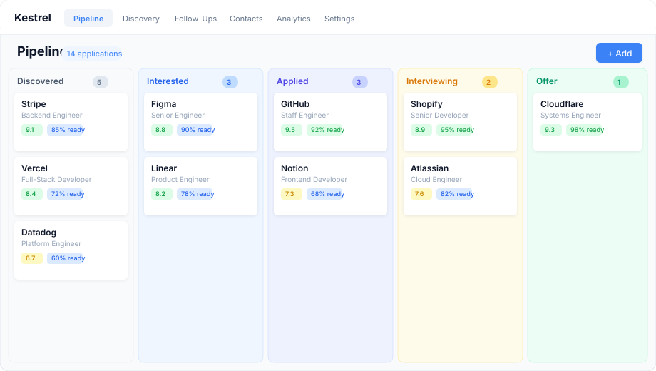
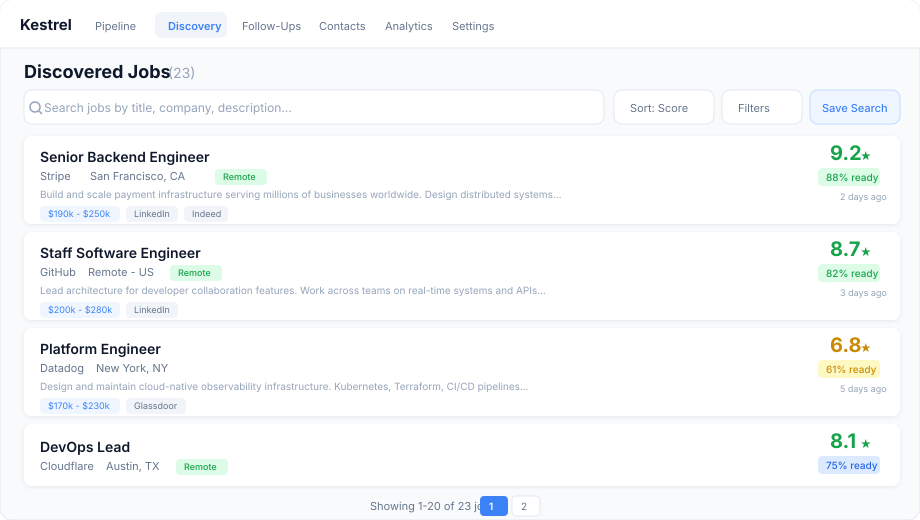
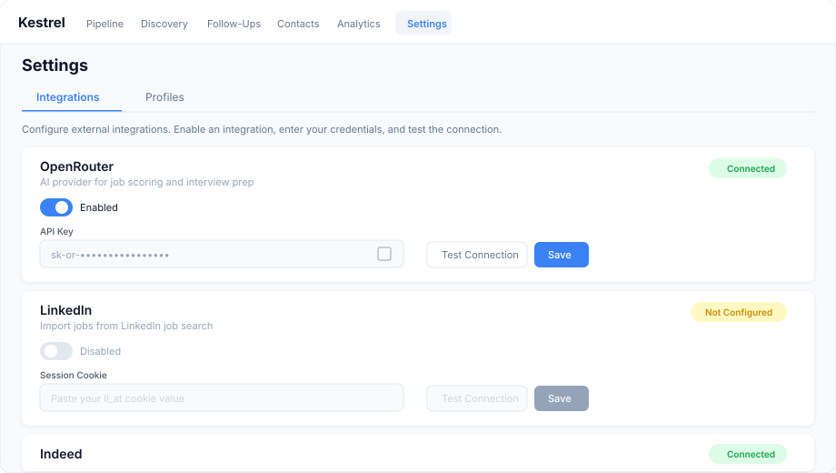

<h1 align="center">Kestrel</h1>

<p align="center">
  <strong>A job search system that runs on your computer.</strong><br>
  Finds jobs. Scores them. Tracks your pipeline. Your data stays yours.
</p>

<p align="center">
  <a href="https://pypi.org/project/kestrel-app/"></a>
  
  
  
</p>

<p align="center">
  <a href="https://codespaces.new/pleasedodisturb/kestrel"></a>
</p>

---

## Install

Pick whichever feels right. They all give you the same app.

### Quick install (one command)

```bash
curl -fsSL https://raw.githubusercontent.com/pleasedodisturb/kestrel/main/install.sh | bash
```

Detects your OS, checks for Python 3.13+, installs Kestrel, and opens it in your browser.

Or if you have Node.js:
```bash
npx kestrel-app
```

Or with Homebrew (macOS):
```bash
brew install pleasedodisturb/kestrel/kestrel
kestrel start
```

### Option 1: pip install (simplest)

```bash
pip install kestrel-app
kestrel start
```

Opens your browser automatically. Data stored in `~/.kestrel/`.

Requires Python 3.13+. Don't have Python? Install it from [python.org/downloads](https://www.python.org/downloads/) (Mac/Windows installer, takes 2 minutes). Or use Option 2 or 3 below instead.

### Option 2: Docker (isolated, nothing touches your system)

```bash
git clone https://github.com/pleasedodisturb/kestrel.git && cd kestrel
bash setup.sh
```

Requires [Docker Desktop](https://www.docker.com/products/docker-desktop/) (free). Don't know what Docker is? The [step-by-step guide](docs/QUICKSTART.md) explains everything.

### Option 3: Try in your browser (zero install)

[](https://codespaces.new/pleasedodisturb/kestrel)

Free with a GitHub account. Your own instance in 2 minutes. Nothing installed on your computer.

**Lost?** [Step-by-step guide](docs/QUICKSTART.md) or [FAQ](docs/FAQ.md).

---

## Preview

<p align="center">
  <strong>Pipeline — drag applications across stages</strong><br><br>
  
</p>

<p align="center">
  <strong>Discovery — AI-scored job matches</strong><br><br>
  
</p>

<p align="center">
  <strong>Settings — connect your integrations</strong><br><br>
  
</p>

---

## What it does

- **Discovers jobs** from multiple boards automatically (Indeed, LinkedIn, Glassdoor, Arbeitsagentur)
- **Scores them** against your profile with AI - stop guessing which jobs are worth applying to
- **Tracks your pipeline** on a Kanban board - drag applications between stages
- **Prepares you for interviews** - company research, mock questions, STAR story library
- **Runs daily scans** via GitHub Actions - wake up to a scored digest of new matches
- **Works offline** - Demo Mode included, zero cost to start. Add real AI when ready.

Everything runs on your machine. No account needed. No data leaves your computer (unless you connect an AI provider).

---

## Docs

| Guide | For |
|-------|-----|
| [Quickstart](docs/QUICKSTART.md) | First-time setup, step by step |
| [FAQ](docs/FAQ.md) | Common questions answered |
| [Help](docs/HELP.md) | Troubleshooting when something breaks |
| [AI Provider Guide](docs/AI-PROVIDERS.md) | Choosing and configuring an AI provider |
| [Comparison](docs/COMPARISON.md) | How Kestrel compares to other tools |
| [Features & API Reference](docs/REFERENCE.md) | Full feature list, architecture, CLI, API endpoints |
| [Deployment](DEPLOY.md) | Railway, Fly.io, VPS hosting |
| [Contributing](CONTRIBUTING.md) | Development setup and pull request guidelines |

---

## Add real AI (optional)

Kestrel works out of the box in Demo Mode (free, offline). To get real AI-powered scoring:

1. Sign up at [openrouter.ai](https://openrouter.ai) and copy your API key
2. Open the settings file (`.env`) in your Kestrel folder:
   - **pip users:** it's at `~/.kestrel/.env` - open with any text editor
   - **Docker users:** it's in the Kestrel folder - on Mac type `open .env` in Terminal
   - Hidden file? [How to see it](docs/FAQ.md)
3. Change these two lines:
   ```
   AI_PROVIDER=openrouter
   OPENROUTER_API_KEY=sk-or-paste-your-key-here
   ```
4. Restart:
   - **pip:** stop with Ctrl+C, run `kestrel start` again
   - **Docker:** `docker compose restart`

Costs about $1-3/month. Full guide: [AI Provider Guide](docs/AI-PROVIDERS.md)

---

## License

[MIT](LICENSE) - free forever, do whatever you want with it.
