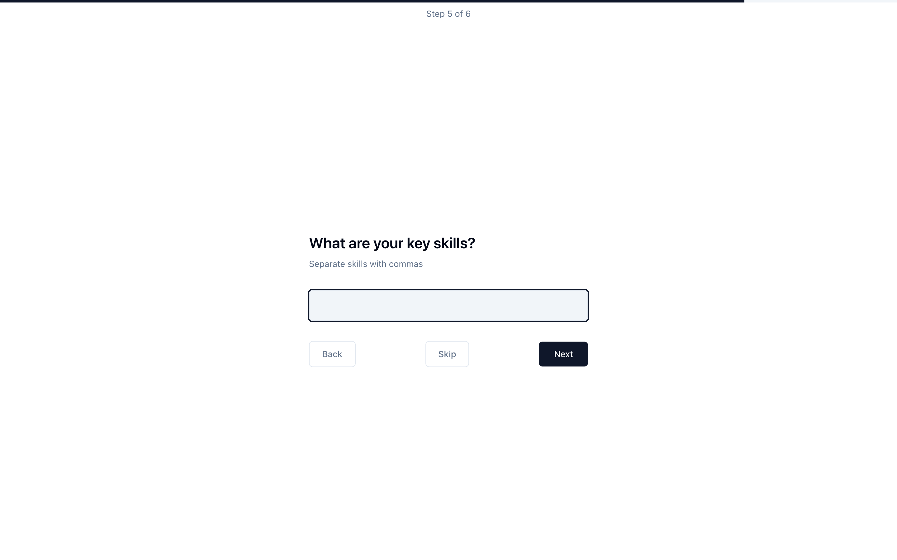
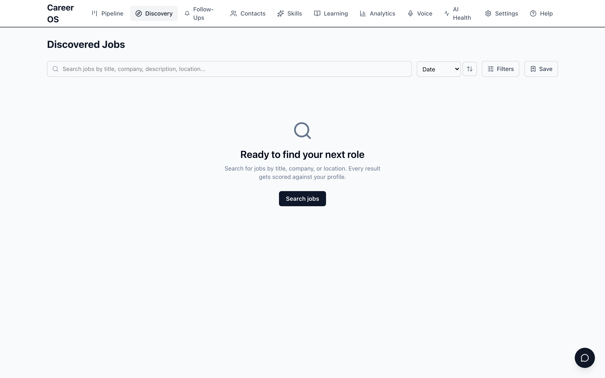
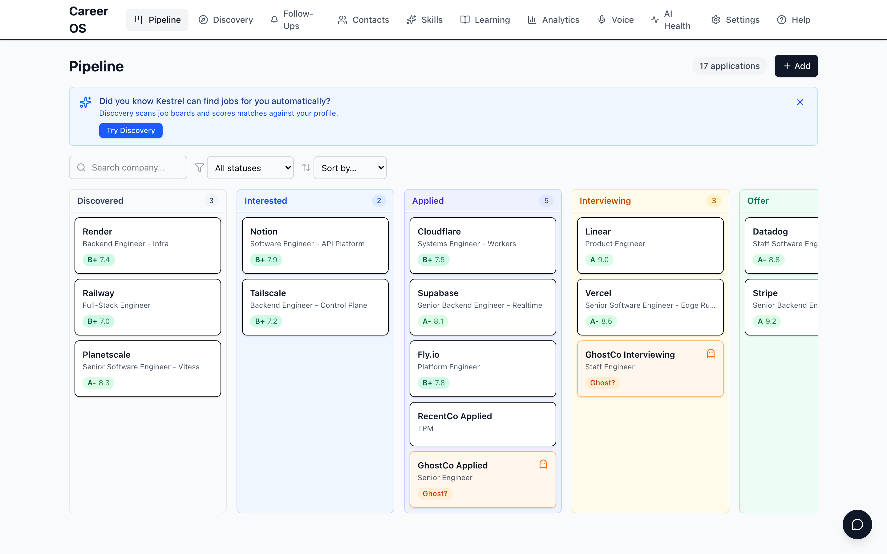
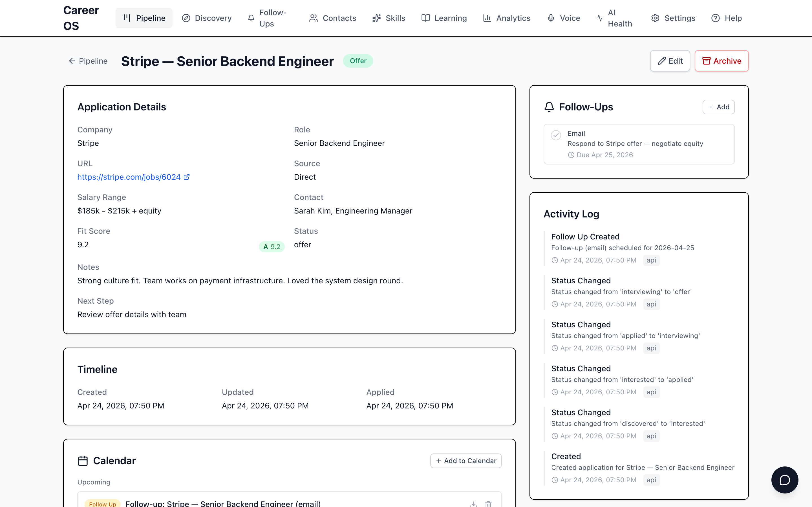
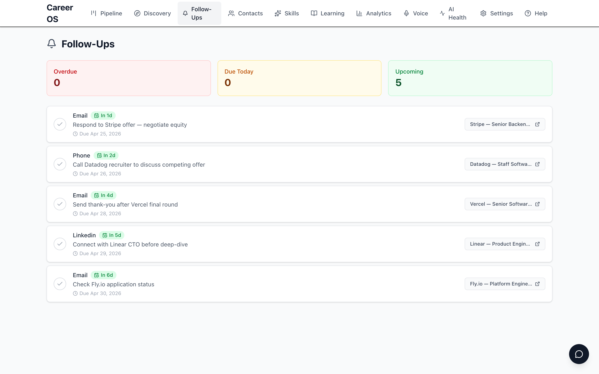
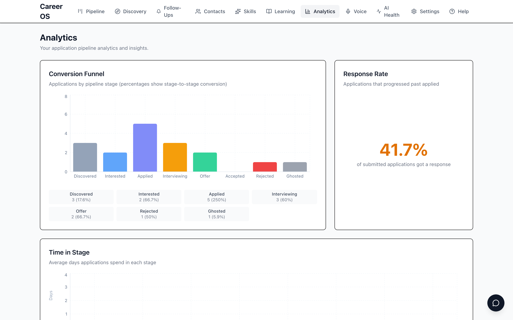
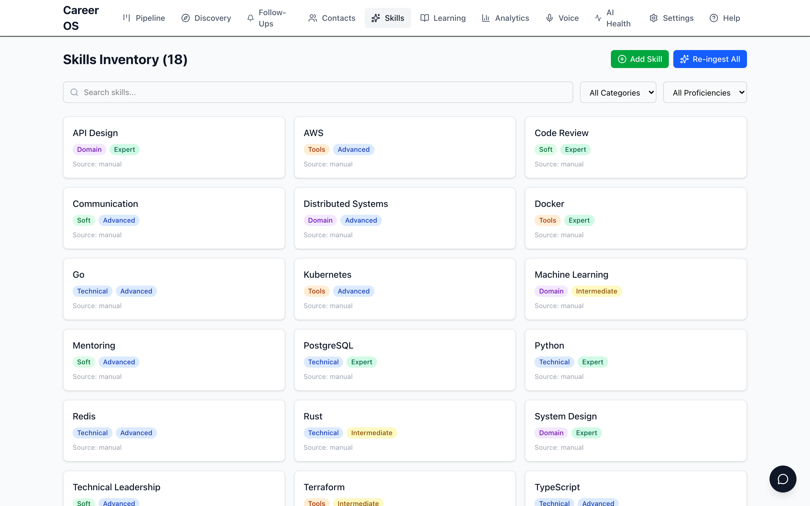
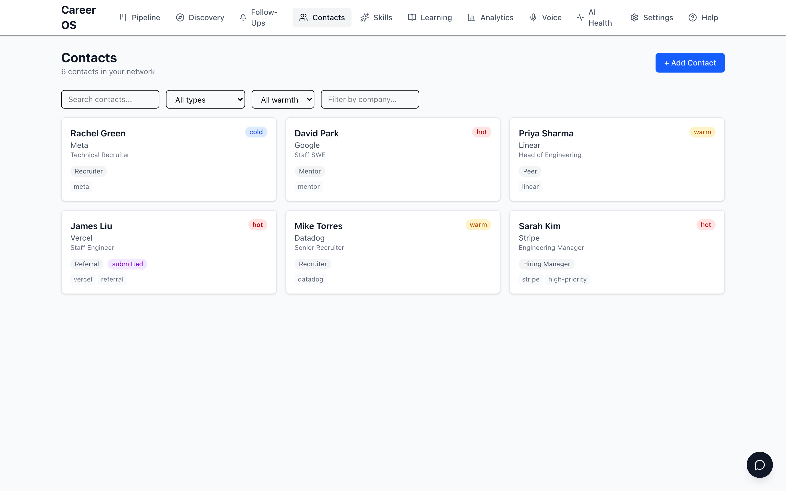
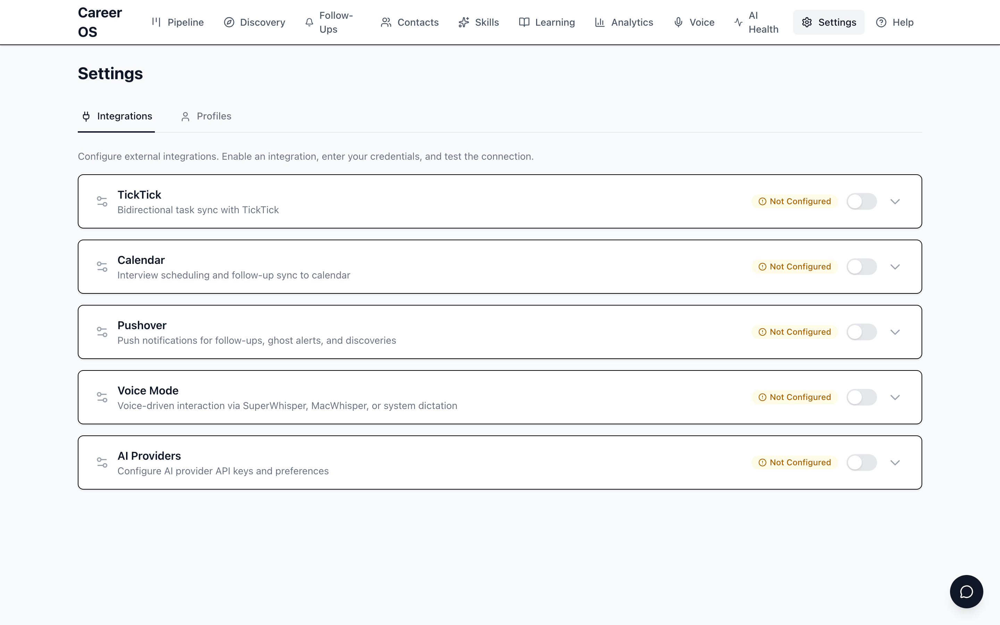

<p align="center">
  
</p>

<h1 align="center">Kestrel</h1>

<p align="center">
  <strong>A job search system that runs on your computer.</strong><br>
  Finds jobs. Scores them. Tracks your pipeline. Your data stays yours.
</p>

<p align="center">
  <a href="https://github.com/pleasedodisturb/kestrel/actions/workflows/ci.yml"></a>
  <a href="https://github.com/pleasedodisturb/kestrel/actions/workflows/smoke.yml"></a>
  <a href="https://github.com/pleasedodisturb/kestrel/actions/workflows/nightly.yml"></a>
  <a href="https://github.com/pleasedodisturb/kestrel/releases/latest"></a>
  <a href="https://pypi.org/project/kestrel-app/"></a>
  <a href="https://github.com/pleasedodisturb/kestrel/issues?q=is%3Aissue+is%3Aopen+label%3Abug"></a>
  
</p>

<p align="center">
  <a href="https://codespaces.new/pleasedodisturb/kestrel"></a>
  &nbsp;&nbsp;
  <a href="https://railway.com/deploy/loMUk4?referralCode=SVkZXi&utm_medium=integration&utm_source=template&utm_campaign=generic"></a>
</p>

---

**[See it in action](#from-unemployed-to-multiple-offers)** · **[Install](#install)** · **[Features](#what-it-does)** · **[Privacy](#your-data-stays-yours)** · **[Roadmap](#whats-coming)** · **[Docs](#docs)** · **[AI providers](#add-real-ai-optional)**

---

## From unemployed to multiple offers

A job search is chaos. Dozens of tabs. Spreadsheets that go stale. Applications you forget about. Kestrel replaces all of that with a single system that runs on your computer and gets smarter as you use it.

Here's what that looks like in practice:

### 1. Tell Kestrel about yourself (2 minutes)

Answer six questions — name, location, target role, salary range, skills, experience level. That's your profile. Kestrel uses it to score every job it finds against what you actually want.

<p align="center">
  
</p>

### 2. Discover jobs automatically

Kestrel scans Indeed, LinkedIn, Glassdoor, and Arbeitsagentur. Every result gets an AI fit score — A+ means "apply today", C means "probably not worth your time". Stop scrolling job boards. Let the jobs come to you.

<p align="center">
  
</p>

### 3. Track your entire pipeline

Every application lives on a Kanban board. Drag cards between stages as you progress — from Discovered to Interested to Applied to Interviewing to Offer. At a glance, you know exactly where everything stands.

<p align="center">
  
</p>

### 4. Go deep on any application

Click into any application and you get everything: fit score breakdown, salary range, follow-up reminders, full activity log, interview prep materials, and a timeline of every interaction. No more "wait, where did I leave off with Stripe?"

<p align="center">
  
</p>

### 5. Never drop the ball

Follow-ups with due dates, organized by urgency. "Respond to Stripe offer." "Call Datadog recruiter about competing offer." "Send thank-you after Vercel final round." Nothing slips through the cracks.

<p align="center">
  
</p>

### 6. See your progress in real numbers

A 41.7% response rate. A conversion funnel showing where applications advance or stall. Time-in-stage metrics so you know if a company is ghosting you or just slow. Data replaces anxiety.

<p align="center">
  
</p>

### 7. Know your strengths (and gaps)

Your entire skill inventory, categorized and rated. Technical skills, tools, domain expertise, soft skills — each with a proficiency level from Beginner to Expert. When Kestrel scores a job, it matches against this.

<p align="center">
  
</p>

### 8. Build your network, not a spreadsheet

Every recruiter, referral, mentor, and hiring manager in one place. Warmth indicators (cold/warm/hot), relationship types, referral status, tags. Your network is an asset — treat it like one.

<p align="center">
  
</p>

### 9. Prepare for every interview

STAR story library — your best professional moments, tagged by skill. When you apply to a role that needs "system design leadership", Kestrel surfaces the story where you led the migration to microservices. Gap analysis tells you which required skills don't have a story yet, so you can prepare before the behavioral round starts.

### 10. Brainstorm cover letters out loud

Voice mode turns your messy thoughts into structured cover letter drafts. Pick an application, start talking about why you want the role, and Kestrel shapes your stream-of-consciousness into something you'd actually send. Three modes: cover letter brainstorming, career coaching Q&A, and job evaluation — all conversational.

### 11. Track referrals from intro to offer

Your contacts aren't just names — they're referral pipelines. Track each one from "contacted" through "CV sent" to "submitted" to "feedback received." Log every interaction. Know exactly who to follow up with and when. The warm intro is often worth more than the perfect resume.

### 12. Connect your tools

TickTick for task sync. Calendar for interview scheduling. Pushover for mobile alerts when new matches arrive or follow-ups are due. AI providers for scoring intelligence. Everything plugs in through Settings.

<p align="center">
  
</p>

### The result

You started with an empty pipeline and a vague sense of dread. Six weeks later, you're negotiating between two offers, your follow-ups are on autopilot, and you have data showing exactly which companies are worth your time. That's Kestrel.

---

## Your data stays yours

This isn't a slogan — it's the architecture. Kestrel runs on your computer. Your database is a SQLite file in your home directory. Your resume, cover letters, STAR stories, salary expectations, networking notes — none of it touches a server unless you explicitly connect an AI provider.

### Snapshots and recovery

Months of job-search history sit in one SQLite file. Lose it and you've lost the search. Kestrel ships with a rotating-snapshot script so an accidental wipe is recoverable in under a minute:

```bash
python tools/snapshot_db.py                # daily snapshot, last 7 days retained
python tools/snapshot_db.py --keep 30      # 30-day window instead
python tools/snapshot_db.py --dry-run      # preview without writing
```

Snapshots land in `data/snapshots/career_os-YYYY-MM-DD.db`. The script uses SQLite's online backup API, not plain `cp`, so the file is consistent even if the live DB is mid-transaction under WAL.

**Wire it into your daily cron** (Linux/macOS):

```cron
0 3 * * * cd /path/to/kestrel && /path/to/kestrel/.venv/bin/python tools/snapshot_db.py
```

Or as a macOS launchd plist / systemd timer if you prefer. Recovery is a copy:

```bash
cp data/snapshots/career_os-2026-05-04.db data/career_os.db
rm -f data/career_os.db-shm data/career_os.db-wal
# restart the server
```


Even then, you control what goes where:

- **Ollama** — everything stays on your machine. Zero network calls. Free.
- **Anthropic** — 7-day data retention, shortest in the industry. SOC 2 certified.
- **Together AI** — one-click Zero Data Retention (ZDR). SOC 2 Type 2. Frankfurt data center for EU users.
- **OpenRouter** — routes to any model. Privacy depends on the underlying provider.

Job descriptions are public data — safe to send anywhere. Your personal information (resume, stories, contacts) should only go to providers you trust. Kestrel keeps these separate by design.

---

## What it does

| Core | What it does |
|------|-------------|
| **Job discovery** | Scans Indeed, LinkedIn, Glassdoor, Arbeitsagentur — AI-scores every result against your profile |
| **Pipeline tracking** | Kanban board from Discovered to Offer — drag applications between stages |
| **Deep application view** | Fit score, salary range, follow-ups, activity log, interview prep, timeline |
| **Analytics** | Conversion funnel, response rate, time-in-stage, score distribution |
| **Follow-up engine** | Due dates, urgency tracking, multiple channels (email, phone, LinkedIn) |
| **Skills inventory** | Technical, tools, domain, soft skills — proficiency tracking and gap analysis |
| **Networking CRM** | Contacts with warmth, referral tracking, interaction history, intro pipeline |
| **Daily auto-scans** | GitHub Actions runs discovery overnight — wake up to scored results |

| Also built | What it does |
|------------|-------------|
| **STAR story library** | Tag stories by skill, get recommendations per application, gap analysis for missing skills |
| **Voice mode** | Cover letter brainstorming, career coaching, job evaluation — all conversational |
| **Interview prep** | Company research, mock questions, behavioral round preparation |
| **Learning paths** | AI-generated recommendations for skill gaps |
| **Calendar sync** | Export interviews and follow-ups to .ics |
| **Mobile alerts** | Pushover notifications for new matches and due follow-ups |
| **TickTick sync** | Bidirectional task management |
| **AI Health Dashboard** | Monitor provider connectivity, quotas, and rate limits |

---

## What's coming

Kestrel is under active development. Here's what's next:

| Feature | What it will do |
|---------|----------------|
| **Writing style flywheel** | Kestrel learns your voice from your past writing. Cover letters and messages start sounding like *you*, not a template. The more you write, the better it gets. |
| **CV + cover letter generation** | One click: tailored resume and cover letter for any application, matched to the job description and your STAR stories. Export as PDF. |
| **Cover letter review** | Paste a draft, get structural and tone feedback. "This paragraph buries the lede." "Your closer is generic — reference the team's recent launch." |
| **LinkedIn network scanner** | Connect via browser tool and surface mutual connections at target companies. "You have 3 second-degree connections at Stripe — here's who to ask for an intro." |
| **Intro message drafts** | For each warm contact, Kestrel drafts the ask: referral request, informational interview, or reconnection — in your voice, not a template. |
| **Browser extension** | See a job posting anywhere? One click saves it to your local Kestrel database with full details. No copy-paste, no tab-switching. |
| **Hosted version** | Don't want to run anything? A subscription-hosted Kestrel instance — same features, zero setup. Your data encrypted at rest, deletable on demand. |

Everything above will follow the same principle: **your data, your machine, your choice.** The hosted version will be the only exception — and even there, you'll own your data with full export and delete.

For the full picture — every shipped milestone with deep dives, every planned milestone with open questions, and "Want to help?" callouts pointing to concrete contribution areas — see [ROADMAP.md](ROADMAP.md).

---

## Install

Six ways in, ranked from "I don't want to think" to "I'll run it myself."

| # | Method | Effort | Data persists? | Limitations |
|---|--------|--------|----------------|-------------|
| 1 | [Codespaces](#1-try-in-your-browser) | Zero — click a button | No (ephemeral) | 60 free hours/month, sleeps after 30 min idle |
| 2 | [Railway](#2-deploy-to-railway) | Zero — click a button | Yes | Free tier: 500h/month, 512MB RAM |
| 3 | [One-liner](#3-one-command-install) | One command | Yes | Needs Python 3.11+ on your machine |
| 4 | [pip](#4-pip-install) | Two commands | Yes | Needs Python 3.11+ |
| 5 | [Docker](#5-docker) | Two commands | Yes | Needs Docker installed |
| 6 | [From source](#contributing) | Clone + setup | Yes | For contributors |

### 1. Try in your browser

[](https://codespaces.new/pleasedodisturb/kestrel)

Nothing installed. Nothing configured. Free with a GitHub account — your own instance in 2 minutes. Data resets when the codespace stops.

### 2. Deploy to Railway

[](https://railway.com/new/template?template=https://github.com/pleasedodisturb/kestrel)

Your own Kestrel instance with a permanent URL. Free tier, no credit card. Data persists across restarts. See [deployment guide](DEPLOY.md#railway) for volume setup.

### 3. One-command install

```bash
curl -fsSL https://raw.githubusercontent.com/pleasedodisturb/kestrel/main/install.sh | bash
```

Detects your OS, checks for Python 3.11+, installs Kestrel, opens it in your browser. Also available as `npx kestrel-app` (Node.js) or `brew install pleasedodisturb/kestrel/kestrel` (macOS).

### 4. pip install

```bash
pip install kestrel-app
kestrel start
```

Opens your browser automatically. Data stored in `~/.kestrel/`. Requires Python 3.11+ — [install it here](https://www.python.org/downloads/) if you don't have it (2 minutes).

### 5. Docker

```bash
git clone https://github.com/pleasedodisturb/kestrel.git && cd kestrel
bash setup.sh
```

Fully isolated — nothing touches your system Python. Requires [OrbStack](https://orbstack.dev) (Mac, recommended) or [Docker Desktop](https://www.docker.com/products/docker-desktop/) (Mac/Windows).

**Lost?** [Step-by-step guide](docs/guides/QUICKSTART.md) or [FAQ](docs/guides/FAQ.md).

---

## Docs

**Getting started:**

| Guide | What you'll learn |
|-------|-------------------|
| [Quickstart](docs/guides/QUICKSTART.md) | First-time setup, step by step — zero assumptions |
| [FAQ](docs/guides/FAQ.md) | "Can I...?" "What if...?" "Why does...?" — all answered |
| [Help](docs/guides/HELP.md) | Something broke? Start here. We'll fix it together. |

**Understanding AI in Kestrel:**

| Guide | What you'll learn |
|-------|-------------------|
| [How Kestrel Uses AI](docs/guides/ai-providers-guide.md) | The electricity analogy — what AI providers are, what they cost, and which to pick |
| [AI Costs and Privacy](docs/guides/cost-optimization.md) | What it costs, the tiers, the optimizations — and how to order your provider fallback so a dry-quota day doesn't bill premium |
| [AI Provider Setup](docs/reference/AI-PROVIDERS.md) | Technical details — API keys, privacy policies, provider comparison tables |
| [LLM Landscape Research](docs/research/llms-tokens-privacy.md) | Deep dive — 2026 pricing, privacy audits, GDPR, EU sovereignty (for the curious) |

**How it works under the hood:**

| Guide | What you'll learn |
|-------|-------------------|
| [How Scoring Works](docs/guides/how-scoring-works.md) | What "fit score" actually means, and how Kestrel decides which jobs match you |
| [How Testing Works](docs/guides/how-testing-works.md) | 2,800+ automated checks — the kitchen analogy for quality assurance |

**Going deeper:**

| Guide | What you'll learn |
|-------|-------------------|
| [Comparison](docs/guides/COMPARISON.md) | How Kestrel stacks up against Huntr, Teal, Simplify, and others |
| [Features & API Reference](docs/reference/REFERENCE.md) | Full feature list, architecture, CLI, and API endpoints |
| [Deployment](DEPLOY.md) | Host Kestrel on Railway, Fly.io, or your own VPS |
| [Contributing](CONTRIBUTING.md) | Development setup and pull request guidelines |

---

## Add real AI (optional)

Kestrel works out of the box in Demo Mode — free, offline, no account needed. When you're ready for real AI-powered scoring, you have options. Think of AI providers like electricity companies: the light switch works the same no matter who supplies the power.

| Option | Cost | Privacy | Speed | Best for |
|--------|------|---------|-------|----------|
| **Demo Mode** | Free | Perfect | Instant | Exploring before committing |
| **OpenRouter (free tier)** | **$0/mo** | Good | Varies | Start here — Llama 3.3 70B scores jobs for free |
| **OpenRouter (paid models)** | $1-30+/mo | Good | Varies | Premium models (Claude, GPT). Cost depends on model and volume — see note below |
| **Anthropic (Claude)** | $1-10/mo | Excellent | ~200ms | Best quality + prompt caching savings. Can spike if scoring high volumes without caching |
| **Together AI** | ~$1-5/mo | Good ([ZDR available](https://www.together.ai/blog/soc-2-compliance)) | ~213ms | Budget-friendly bulk scoring |
| **Ollama** | Free | Perfect | Depends on hardware | Nothing leaves your machine, ever |

> **Cost depends on model and volume.** A typical daily scan scrapes 1,000-1,500 jobs from multiple boards. That's a lot of AI calls. Here's what it actually costs:
>
> | Model | Cost per job | 1,500 jobs/day | Monthly (30 days) |
> |---|---|---|---|
> | Llama 3.3 70B (OpenRouter free) | $0 | $0 | **$0** |
> | Llama 3.1 8B (Together AI) | $0.0002 | $0.30 | **$9** |
> | GPT-4o-mini (OpenRouter) | $0.0006 | $0.90 | **$27** |
> | Llama 3.3 70B (Together AI) | $0.002 | $3.00 | **$90** |
> | Claude Sonnet (OpenRouter) | $0.02 | $30.00 | **$900** |
>
> Kestrel defaults to free-tier models for bulk scanning. Premium models like Claude Sonnet are best reserved for deep analysis of shortlisted roles, not bulk filtering. The optimizations below help keep costs in check regardless of which model you use.
>
> **Order your fallback chain cheap-first.** If you chain providers (`AI_PROVIDER_FALLBACK`), whatever sits at the *end* is what you pay when the cheaper ones run out of quota. Put free/cheap models first and premium last — otherwise a busy or exhausted-quota day can bill an entire scan at premium rates (that $900 row, not the $0 one), often 20-50× the norm. [The rule + a worked example →](docs/guides/cost-optimization.md#fallback-chain-ordering-avoids-surprise-bills)

**Quickest path:** Go to Settings → click "Connect to OpenRouter" → log in → done. No API keys to copy. Free-tier models like Llama 3.3 70B handle job scoring at zero cost — add $10 of credits to unlock 1,000 requests/day.

### How Kestrel keeps costs low

AI APIs charge per token (roughly per word). Scoring 50 jobs a day could get expensive — unless you're smart about it. Kestrel stacks eight optimizations that compound:

| What Kestrel does | How it helps | Savings |
|-------------------|-------------|---------|
| **Prompt caching** | Your profile is sent once, then "remembered" by the API. Scoring 50 jobs doesn't resend your CV 50 times. | [92% on repeat calls](https://docs.anthropic.com/en/docs/build-with-claude/prompt-caching) |
| **Compressed prompts** | Scoring instructions use telegraphic notation — same info, fewer words. The AI reads shorthand just fine. | 29% on system prompts |
| **Compact serialization** | Your profile is sent without pretty-printing whitespace. `{"name":"Jane"}` instead of `{ "name": "Jane" }`. | 23% on profile data |
| **Response caching** | Asked the same question twice? Kestrel serves it from local encrypted cache. Zero API calls. | 100% (free) |
| **Token-efficient tool use** | When Kestrel calls AI tools, it uses a compact format that cuts output size. | [70% off output tokens](https://docs.anthropic.com/en/docs/agents-and-tools/tool-use/token-efficient-tool-use) |
| **Smart model selection** | Not every task needs the biggest brain. Simple classification uses a smaller model. Deep analysis uses the full thing. | [60-95% on simple tasks](https://github.com/lm-sys/RouteLLM) |
| **Batch scoring** | Scoring a big backlog overnight? Batch APIs give a flat 50% discount for non-urgent work. | [50% off everything](https://docs.anthropic.com/en/api/creating-message-batches) |
| **Provider fallback** | If one provider's quota runs out, Kestrel automatically tries the next one. No failed scores, no wasted retries. **Order matters:** cheap-first, premium-last (see note above). | Resilience — and cost, ordered right |

**Benchmarked on a real profile + real job posting:** Naive approach = ≈$16/month. With all optimizations = **≈$1-5/month** for the same results. [How it works →](docs/guides/how-token-optimization-works.md)

<details>
<summary>Benchmark: 50-job scoring batch, same user</summary>

```
System prompt:  sent 50× full price  →  1× full + 49× cached (92% saved)
Profile data:   sent 50× with indent →  1× compact + 49× cached (92% saved)
Job description: 50× unique (no savings — this is the irreducible cost)

Single call:  877 tokens (old) → 512 tokens (new, Anthropic cached) = 42% reduction
50-job batch: 43,862 tokens (old) → 25,846 tokens (new) = 41% reduction
Monthly (200 jobs/day): $15.79 → $9.45 input tokens only
```

The job description is ~60% of each call and can't be cached (it's different every time). The 92% savings apply to the other 40% — like speeding up the highway portion of your commute.

</details>

### Choosing a provider

**Don't want to think about it?** Use OpenRouter. It's the universal adapter — one account gives you Claude, GPT, Gemini, and open-source models. You can always switch later.

**Care about privacy?** Anthropic has [7-day data retention](https://docs.anthropic.com/en/docs/about-claude/pricing) (shortest in industry). Together AI has a [one-click ZDR toggle](https://www.together.ai/blog/soc-2-compliance) (SOC 2 Type 2 certified). Ollama keeps everything on your machine.

**On a tight budget?** Together AI runs open-source models (Llama 3.3, Mixtral) on their own GPUs — no middleman markup. If you're in Europe, their **Frankfurt data center** means lower latency too. Great for bulk scoring where you don't need Claude-level intelligence.

**Want the best of everything?** Kestrel can use multiple providers at once — route simple scoring to Together (cheap), complex analysis to Anthropic (quality), and never worry about which is which.

**Want to understand more?** Read [How Kestrel Uses AI](docs/guides/ai-providers-guide.md) — it explains everything in plain English, no jargon. For the full technical comparison with pricing tables and privacy audits, see the [AI Provider Setup](docs/reference/AI-PROVIDERS.md) guide or the [LLM landscape research](docs/research/llms-tokens-privacy.md).

### Privacy and free/cheap models

Free and cheap AI models often train on your data or have weaker privacy guarantees. That's fine for some tasks and dangerous for others. Kestrel distinguishes between the two:

**Safe to send without ZDR** (generic, non-identifying):
- Job descriptions (public postings)
- Career preferences (target roles, salary range, location)
- Scoring criteria and rubrics

**Never sent without ZDR** (personally identifying):
- Your name, email, phone number, or address
- CV/resume content and work history
- Cover letters and application materials
- Interview preparation with personal STAR stories
- Contact details and networking notes

**Currently:** Kestrel does not enforce this boundary automatically - it's your responsibility to choose an appropriate provider for sensitive features. If you disable ZDR for cheap scoring, be mindful of which features you use with that provider.

**Planned:** Automatic routing that blocks personal data from reaching non-ZDR providers, so you can use free models for scoring without worrying about accidentally leaking personal data through other features.

**Rule of thumb:** If it's about the job market, cheap models are fine. If it's about *you*, use Ollama (local), Anthropic (strong privacy), or a provider with ZDR enabled.

---

## How we build

**Human-first, data-driven.** Every infrastructure decision — testing, CI/CD, scoring — is backed by deep research. We investigate thoroughly, then choose the sanest path: not the most sophisticated, but the most sustainable.

Our proof is in the research artifacts. Before building anything, we run parallel research agents, synthesize findings, and publish the decision rationale so anyone can understand *why* things work the way they do.

| Topic | For users | For developers | Raw research |
|-------|-----------|---------------|--------------|
| **Scoring** | [How Scoring Works](docs/guides/how-scoring-works.md) | [Scoring Strategy](docs/research/scoring-research.md) | [Raw Findings](docs/research/scoring-raw-research.md) |
| **Testing** | [How Testing Works](docs/guides/how-testing-works.md) | [Testing Strategy](docs/research/testing-research.md) | [Raw Findings](docs/research/testing-raw-research.md) |
| **CI/CD** | [How CI/CD Works](docs/guides/how-cicd-works.md) | [CI/CD Strategy](docs/research/cicd-research.md) | [Raw Findings](docs/research/cicd-raw-research.md) |
| **Observability** | [How Observability Works](docs/guides/how-observability-works.md) | [Observability Strategy](docs/research/observability-research.md) | [Setup Guide](docs/reference/observability-setup.md) |
| **Token Optimization** | [How Token Optimization Works](docs/guides/how-token-optimization-works.md) | [Strategy & Implementation](docs/research/token-optimization-research.md) | [Raw Findings](docs/research/token-optimization-raw-research.md) |
| **[LLM Research Corpus](https://github.com/pleasedodisturb/awesome-llm-token-optimization)** | [Quick Wins](https://github.com/pleasedodisturb/awesome-llm-token-optimization#quick-wins) | [Tools & Strategies](https://github.com/pleasedodisturb/awesome-llm-token-optimization#contents) | [52 Papers + Sources](https://github.com/pleasedodisturb/awesome-llm-token-optimization/tree/main/research) |

## License

[AGPL-3.0](LICENSE) — free and open source. If you modify Kestrel and offer it as a service, you must share your changes under the same license.

### Data sources

- **ESCO** (European Skills, Competences, Qualifications and Occupations) — the bundled skills and occupations taxonomies are © European Union, [esco.ec.europa.eu](https://esco.ec.europa.eu), reused under [CC BY 4.0](https://creativecommons.org/licenses/by/4.0/) per Commission Decision 2011/833/EU. Kestrel ships processed, English-only subsets; changes are described in each fixture's metadata.
