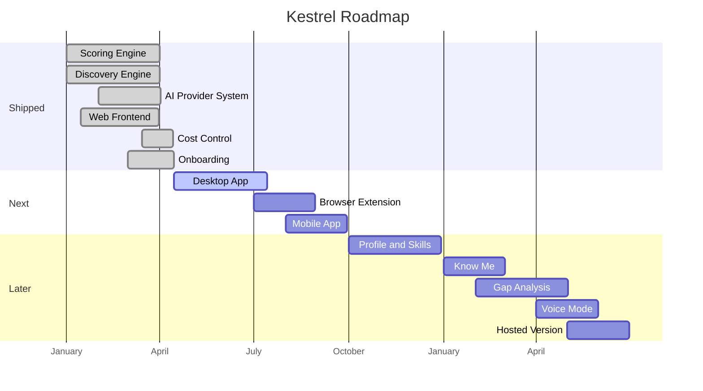
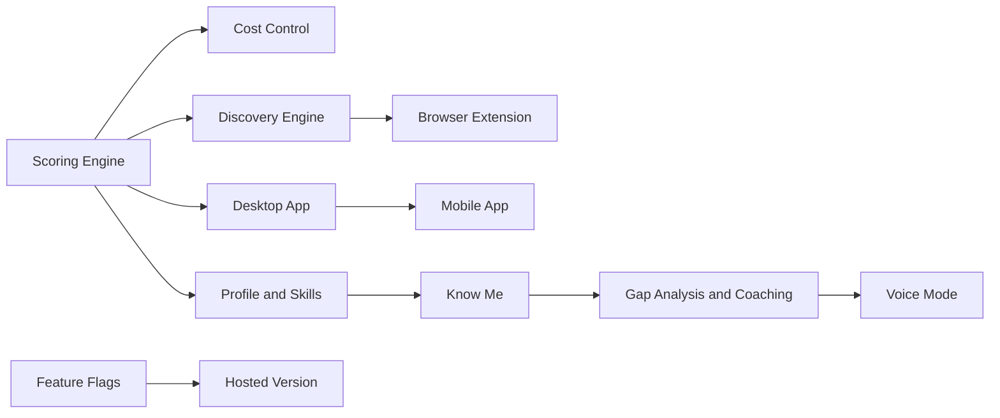

# Kestrel Roadmap

Kestrel is a self-hosted job search platform that runs entirely on your computer. Your data never leaves your machine unless you choose to send it to an AI provider, and even then, you bring your own API key and pick a provider you trust. Think of it as a personal command center for your job search: it finds jobs, scores them against your profile, and tracks your entire pipeline from discovery to offer.

This roadmap shows what Kestrel can do today and where it is heading.

---

## How Kestrel thinks about your data

Kestrel is built around a simple idea: your job search data is personal, and you should control where it lives. The application runs locally, stores everything in a database on your machine, and separates public data (job descriptions) from private data (your resume, stories, contacts) so each goes only where you allow. Kestrel is licensed under AGPL-3.0 and currently non-commercial.

---

## What's Shipped

Kestrel already does a lot. Here are the highlights. For the full list, see the [feature inventory](docs/roadmap/inventory.md).

#### Scoring Engine (v0.4 Peregrine)

*Status: Shipped* | [Deep dive](docs/roadmap/scoring-engine.md)

AI scores every job against your profile with dual fit and desire scores, 288 job family presets across 18 sectors, red flag detection for ghost postings and vague descriptions, and borderline re-scoring for close calls. [v0.4.0](CHANGELOG.md#040-2026-04-16)

> **Want to help?** Improve scoring accuracy for non-tech roles, add new job family presets, or help calibrate the red flag detector. See the [Scoring Engine deep dive](docs/roadmap/scoring-engine.md) for how scoring works and where it can improve.

#### Discovery Engine (v0.3 Osprey)

*Status: Shipped* | [Deep dive](docs/roadmap/discovery-engine.md)

Scans Indeed, LinkedIn, Glassdoor, and Arbeitsagentur automatically on a schedule. A pre-filter eliminates roughly 60% of irrelevant results before AI scoring, so you only spend tokens on jobs worth evaluating. [v0.3.0](CHANGELOG.md#030-2026-04-13)

> **Want to help?** Add a new job board adapter, improve pre-filter accuracy, or fix edge cases in result normalization. The [Discovery Engine deep dive](docs/roadmap/discovery-engine.md) covers the adapter architecture and known gaps.

#### AI Provider System (v0.5 Starling)

*Status: Shipped* | [Deep dive](docs/roadmap/ai-provider-system.md)

Eleven providers to choose from: OpenRouter, Anthropic, OpenAI, Together, Groq, xAI, Gemini, Ollama, Mistral, Hugging Face, and a mock provider for testing. Bring your own API key to any of them. Each provider has a privacy tier so you know exactly what happens to your data. [v0.5.0](CHANGELOG.md#050-2026-04-16)

> **Want to help?** Add a new AI provider, improve privacy tier documentation, or test provider behavior under edge cases like rate limiting and quota exhaustion. The [AI Provider System deep dive](docs/roadmap/ai-provider-system.md) explains the provider abstraction and how to add new backends.

#### Cost Control (v0.11 Merlin)

*Status: Shipped* | [Deep dive](docs/roadmap/cost-control.md)

Five presets (Free, Budget, Quality, Private, Custom) let you dial in exactly how much you want to spend. The Budget preset runs a full job search for about $0.81 per month. Batch scoring, prompt caching, and async Batch APIs cut costs by up to 50%. [v0.11.0](CHANGELOG.md#0110-2026-04-21)

> **Want to help?** Benchmark new providers for cost efficiency, improve batch scoring reliability, or help document cost trade-offs across preset configurations. See the [Cost Control deep dive](docs/roadmap/cost-control.md) for how presets and batch scoring work.

#### Application Pipeline (v0.2 Swift)

*Status: Shipped* | [Deep dive](docs/roadmap/application-pipeline.md)

A Kanban board tracks every application from Discovered to Offer. Status tracking, follow-up reminders with due dates, and activity logging keep your pipeline organized without a spreadsheet. [v0.2.0](CHANGELOG.md#020-2026-04-12)

> **Want to help?** Strengthen the state machine, add new pipeline views, or improve status transition validation. The [Application Pipeline deep dive](docs/roadmap/application-pipeline.md) covers the architecture and open improvement areas.

#### Web Frontend (v0.11 Wren)

*Status: Shipped* | [Deep dive](docs/roadmap/web-frontend.md)

Eleven pages covering your pipeline, discovery results, analytics, contacts, skills, interview prep, and settings. Responsive design built with React 19. [v0.11.0](CHANGELOG.md#0110-2026-04-21)

> **Want to help?** Fix responsive layout issues, improve accessibility, or add missing features to existing pages. The [Web Frontend deep dive](docs/roadmap/web-frontend.md) lists what each page does and where it can improve.

#### CLI (v0.3 Shrike)

*Status: Shipped* | [Deep dive](docs/roadmap/cli.md)

The `kestrel` command gives you terminal access to your pipeline, skills, goals, interview prep, and contacts for when you prefer working from the command line. [v0.3.0](CHANGELOG.md#030-2026-04-13)

> **Want to help?** Add new subcommands, improve output formatting, or add shell completion support. The [CLI deep dive](docs/roadmap/cli.md) describes the command structure and extension points.

#### Infrastructure (v0.12 Raven)

*Status: Shipped* | [Deep dive](docs/roadmap/infrastructure.md)

CI/CD with GitHub Actions runs linting, tests, smoke tests, nightly scans, and release automation. Over 300 tests across backend and frontend. PII scanning prevents personal data from leaking into commits. [v0.12.0](CHANGELOG.md#0120-2026-04-23)

> **Want to help?** Improve test coverage, add new CI checks, or help with release automation. The [Infrastructure deep dive](docs/roadmap/infrastructure.md) explains the CI pipeline and testing strategy.

#### Onboarding Flow (v0.11 Finch)

*Status: Shipped* | [Deep dive](docs/roadmap/onboarding-flow.md)

Six-step guided setup so new users can start scoring jobs in two minutes. [v0.11.0](CHANGELOG.md#0110-2026-04-21)

> **Want to help?** Improve the setup experience, add validation for edge cases, or test the onboarding flow on different platforms. The [Onboarding Flow deep dive](docs/roadmap/onboarding-flow.md) walks through each step and known rough edges.

#### PII Safety Boundary (v0.12 Harrier)

*Status: Shipped* | [Deep dive](docs/roadmap/pii-safety-boundary.md)

Personal data is blocked from providers without zero-data-retention guarantees. [v0.12.0](CHANGELOG.md#0120-2026-04-23)

> **Want to help?** Audit privacy controls, improve PII detection patterns, or help verify provider data retention claims. The [PII Safety Boundary deep dive](docs/roadmap/pii-safety-boundary.md) documents the trust model and detection approach.

---

## What's Next

### Now (v0.12)

#### Public Roadmap (v0.12 Wagtail)

*Status: In Progress* | [Deep dive](docs/roadmap/public-roadmap.md)

Making Kestrel's direction visible and structured so users can evaluate the product and contributors can find meaningful work.

> **Want to help?** Spot broken links, suggest missing milestones, or improve the documentation in this roadmap and its deep dives. The [Public Roadmap deep dive](docs/roadmap/public-roadmap.md) describes what this milestone covers.

### Next (v0.13 -- v0.15)

#### Desktop App (v0.13 Falcon)

*Status: Planned* | [Deep dive](docs/roadmap/desktop-app.md)

Download Kestrel, double-click, and start scoring jobs. No terminal, no Docker, no configuration files. A native application with signed installers for macOS and Windows, your data stored locally just like today. This is the most important step toward making Kestrel usable for everyone.

> **Want to help?** Research Electron vs Tauri trade-offs, prototype the installer experience, or explore auto-update mechanisms. The [Desktop App deep dive](docs/roadmap/desktop-app.md) outlines the vision and open design questions.

#### Browser Extension (v0.14 Kingfisher)

*Status: Planned* | [Deep dive](docs/roadmap/browser-extension.md)

Browse job boards the way you normally do, and add any posting to your Kestrel scoring queue with one click. The extension works on any site, even ones the built-in scrapers do not cover. Available for Chrome and Firefox.

> **Want to help?** Research Chrome and Firefox extension APIs, prototype the one-click save flow, or explore how to extract structured job data from arbitrary pages. The [Browser Extension deep dive](docs/roadmap/browser-extension.md) covers the planned approach and open questions.

#### Mobile App (v0.15 Sparrowhawk)

*Status: Planned* | [Deep dive](docs/roadmap/mobile-app.md)

Check your pipeline, review scores, and respond to opportunities from your phone. The web experience comes first, then native iOS and Android apps bring Kestrel wherever you go.

> **Want to help?** Research React Native performance patterns, help define the mobile-first UX, or prototype key screens for pipeline review on small displays. The [Mobile App deep dive](docs/roadmap/mobile-app.md) describes the planned architecture and design priorities.

### Later (v1.0+)

The vision. These shape where Kestrel is heading.

<!-- Feature Flags (ROAD-15) is internal infrastructure documented in docs/roadmap/ deep dives, not the user-facing roadmap. See D-29 in 03-CONTEXT.md. -->

#### Profile and Skills (v1.0 Nightjar)

*Status: Considering* | [Deep dive](docs/roadmap/profile-and-skills.md)

An honest map of where you stand professionally. Your strengths, gaps, and skill levels across the areas that matter for your target roles. Pick how you want to see it: RPG character sheet, baseball card, LinkedIn-style stats, spiderweb diagram, or a simple scorecard. Same data, your preferred lens.

> **Want to help?** Research skill taxonomy standards, prototype visualization styles, or explore how to map skills across different industries. The [Profile and Skills deep dive](docs/roadmap/profile-and-skills.md) lays out the vision and open design questions.

With your skills mapped, the next step is understanding what drives you.

#### Know Me (v1.0 Robin)

*Status: Considering* | [Deep dive](docs/roadmap/know-me.md)

Kestrel learns who you are, not just what you can do. Through your writing, reflective prompts, and everyday choices, it builds an understanding of your values, motivations, and professional identity. Over time the entire pipeline tunes to you: scoring weighs what matters to you personally, generated text sounds like you, and opportunities that clash with your values stop showing up.

> **Want to help?** Research personality modeling approaches, propose reflective prompt designs, or explore how preference signals can feed back into scoring. The [Know Me deep dive](docs/roadmap/know-me.md) describes the concept and research directions.

Once Kestrel understands what matters to you, it can show you what to work on.

#### Gap Analysis and Coaching (v1.0 Woodpecker)

*Status: Considering* | [Deep dive](docs/roadmap/gap-analysis-coaching.md)

Pick a target role and see exactly what's missing. Kestrel maps the gap between where you are and where you want to be, then suggests concrete steps to close it, from free resources to structured learning paths.

> **Want to help?** Research learning path aggregators, design the gap visualization, or explore how to match skill gaps to specific resources. The [Gap Analysis and Coaching deep dive](docs/roadmap/gap-analysis-coaching.md) outlines the planned approach and open questions.

Sometimes the best way to think through your career is to talk it out.

#### Voice Mode (v1.0 Lark)

*Status: Considering* | [Deep dive](docs/roadmap/voice-mode.md)

Talk to Kestrel instead of typing. Dictate pipeline updates, rehearse interview answers out loud, or think through career decisions by voice. Speech becomes another way to interact with everything Kestrel already does.

> **Want to help?** Research speech-to-text options, prototype voice interaction patterns, or explore how voice input can integrate with existing pipeline commands. The [Voice Mode deep dive](docs/roadmap/voice-mode.md) describes the vision and technical considerations.

#### Hosted Version (v1.0 Albatross)

*Status: Considering* | [Deep dive](docs/roadmap/hosted-version.md)

For users who would rather not install anything, a hosted option that works from any browser. Same features as the self-hosted version, zero setup required. Your data is encrypted and deletable whenever you choose.

> **Want to help?** Research multi-tenant SQLite approaches, help design the data isolation model, or explore authentication patterns for a hosted deployment. The [Hosted Version deep dive](docs/roadmap/hosted-version.md) covers the architecture considerations and open decisions.

---

## Timeline

Two diagrams show where Kestrel has been and where it is going.

### Milestone Timeline

<!-- Dates below are for positioning only — not delivery commitments. See "About This Project." -->

### How Milestones Connect

---

## Known Limitations

Being honest about the gaps:

**Developer-only install.** Right now, using Kestrel means cloning the repo, running pip install, or setting up Docker, all of which require comfort with a terminal. This is the biggest barrier to adoption and the reason the Desktop App milestone exists. The goal is a downloadable installer where you open the app and start using it, no terminal required.

**SQLite only.** Kestrel uses SQLite as its database, which is intentional for local-first deployment. Your data lives in a single file on your machine with no database server to manage. A Postgres migration path has been researched for a future hosted version, but for self-hosted single-user use, SQLite is the right choice.

**No pip lockfile.** Python dependency versions use `>=` floors rather than pinned versions. This means two installs at different times could pull different dependency versions. A proper lockfile for reproducible builds is on the list.

---

## About This Project

Kestrel is maintained by a solo developer. Plans evolve, priorities shift, and version targets may move. This roadmap reflects current thinking, not binding commitments. The project is currently non-commercial and licensed under AGPL-3.0.

For getting started, see the [README](README.md).

---

## Contributing

See [CONTRIBUTING.md](CONTRIBUTING.md) for how to get involved.
