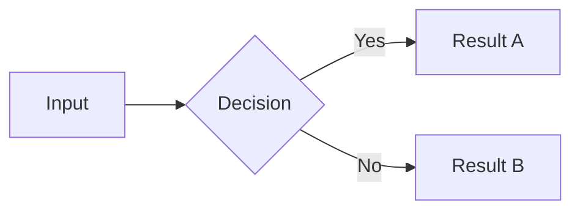

# Documentation Writing Guide

How to write, structure, and maintain documentation for the Kestrel project. Follow this guide when creating new docs or rewriting existing ones.

---

## Directory Structure

Every doc belongs in one of five directories. Pick the right one based on the audience:

| Directory | Audience | Purpose | Naming |
|-----------|----------|---------|--------|
| `docs/guides/` | End users | How-tos, explanations, onboarding | `how-X-works.md`, `UPPERCASE.md` for top-level guides |
| `docs/reference/` | Developers | Technical specs, API docs, setup | `kebab-case.md` or `UPPERCASE.md` |
| `docs/research/` | Decision makers | Research findings, analysis | `{topic}-research.md`, `{topic}-raw-research.md` |
| `docs/internal/` | Core team | Strategy, planning, sync docs | `kebab-case.md` |
| `docs/archive/` | Nobody (historical) | Superseded docs | Original filename, with archive header |

Root-level docs (`README.md`, `CONTRIBUTING.md`, `SECURITY.md`, `CHANGELOG.md`) stay at the repo root per GitHub convention.

---

## Templates by Doc Type

### User-Facing Guide (`docs/guides/how-X-works.md`)

```markdown
# How [X] Works

[One-paragraph hook using an analogy. Make the reader care.]

## The Short Version

- [3-4 bullet points for skimmers]

## How It Actually Works

[Detailed explanation in warm, teaching tone]

```mermaid
[At least one diagram per guide]
```

## Examples

[Concrete, real-world examples — not abstract descriptions]

## FAQ

**Q: [Most common question about this topic]**
[Direct answer, no hedging]

## Further Reading

- [Link to reference doc](../reference/X.md) — technical details
- [Link to research doc](../research/X-research.md) — the research behind the design
```

### Research Document (`docs/research/`)

Research follows a 3-format standard:

1. **Raw research** (`{topic}-raw-research.md`) — Unedited findings with sources, quotes, data tables. This is the evidence base.
2. **Developer synthesis** (`{topic}-research.md`) — Curated analysis for developers. Conclusions, trade-offs, recommendations. References the raw doc.
3. **User-facing guide** (`docs/guides/how-X-works.md`) — The edutainment version. References both research docs in Further Reading.

### Reference Document (`docs/reference/`)

```markdown
# [Feature Name] Reference

[One-line description of what this reference covers]

## Overview

[Brief context — what this is for, who needs it]

## [Main Content]

[Tables, parameter lists, configuration options, API endpoints]
Use tables for structured data. Use code blocks for commands.

## Troubleshooting

[Common issues and fixes, if applicable]
```

### Archive Header

When archiving a superseded doc, prepend this header (after any YAML frontmatter):

```markdown
> **Archived:** This document has been superseded by [Replacement Title](../path/to/replacement.md).
> Preserved for historical reference only.

---
```

Do not modify the original content below the header.

---

## Tone and Voice

### User-Facing Docs (guides/)

- **Warm and teaching.** Write like you're explaining to a smart friend who's new to the topic.
- **Use analogies.** "Think of AI providers like electricity providers" is better than "AI providers abstract model selection."
- **Be direct.** Lead with the answer. "No, you can't use your ChatGPT subscription" not "There are several considerations regarding subscription compatibility."
- **Use concrete numbers.** "$3-10/month" beats "affordable." "2,800 tests in 2 minutes" beats "comprehensive test suite."
- **Avoid jargon without explanation.** If you must use a technical term, define it inline on first use.

### Developer Docs (reference/, research/)

- **Technical and precise.** Assume the reader knows how to code.
- **Tables over prose** for structured data (API endpoints, config options, comparison matrices).
- **Code blocks** for anything the reader might copy-paste.
- **No analogies needed** — but still be clear, not dense.

### Internal Docs (internal/)

- **Factual and current.** These inform decisions. Stale data here is dangerous.
- **Date-stamp volatile data.** "As of April 2026" so readers know when to re-verify.
- **Link to evidence.** Every claim should trace back to a research doc, git commit, or external source.

---

## Mermaid Diagrams

Every user-facing guide must include at least one Mermaid diagram. Mermaid renders natively on GitHub.

**Good diagram subjects:**
- Data flows (how does data move through the system?)
- Decision trees (which provider should I pick?)
- Pipelines (what happens when I push code?)
- Hierarchies (how are tests layered?)

**Keep diagrams simple.** 5-10 nodes maximum. If it needs more, split into two diagrams.



---

## Cross-References

### Relative Paths

Links between docs use relative paths based on the file's location:

| From | To | Link |
|------|----|------|
| `docs/guides/A.md` | `docs/guides/B.md` | `[B](B.md)` |
| `docs/guides/A.md` | `docs/reference/B.md` | `[B](../reference/B.md)` |
| `docs/guides/A.md` | `docs/research/B.md` | `[B](../research/B.md)` |
| `docs/reference/A.md` | `docs/guides/B.md` | `[B](../guides/B.md)` |
| `README.md` (root) | `docs/guides/B.md` | `[B](docs/guides/B.md)` |

### When to Link

- **Always:** Further Reading sections should link to related research and reference docs.
- **Inline:** When mentioning a concept explained in another doc, link it on first mention.
- **Never:** Don't link to archived docs from active docs. Archived docs link forward to their replacements, not the reverse.

---

## Naming Conventions

| Pattern | Use for | Example |
|---------|---------|---------|
| `how-X-works.md` | User-facing guides explaining a feature | `how-scoring-works.md` |
| `UPPERCASE.md` | Top-level guides (GitHub convention) | `FAQ.md`, `QUICKSTART.md` |
| `kebab-case.md` | Reference and research docs | `testing-strategy.md` |
| `{topic}-research.md` | Developer-facing research synthesis | `scoring-research.md` |
| `{topic}-raw-research.md` | Raw research findings | `scoring-raw-research.md` |
| `YYYY-MM-DD_topic.md` | Date-stamped session logs (archive only) | `2026-04-14_scoring-evolution.md` |

---

## Maintenance Rules

1. **Update `docs/index.md`** when adding or removing any doc.
2. **Check cross-references** when moving or renaming a doc. Grep for the old filename.
3. **Add archive headers** when superseding a doc. Never delete docs — archive them.
4. **Fix stale content in place** per D-07. If >50% of a doc is stale, rewrite entirely rather than patching.
5. **Replace "CareerOS" with "Kestrel"** in prose. Keep `career_os` in code references (Python package name).
6. **Preserve Jekyll frontmatter** (`permalink`, `layout`, `title`) unchanged when moving files.

---

## Checklist for New Docs

- [ ] File is in the correct directory for its audience
- [ ] Follows the appropriate template (guide/reference/research)
- [ ] Has at least one Mermaid diagram (guides only)
- [ ] All cross-references use correct relative paths
- [ ] Added to `docs/index.md`
- [ ] No "CareerOS" brand references in prose
- [ ] Tone matches the directory (warm for guides, technical for reference)
