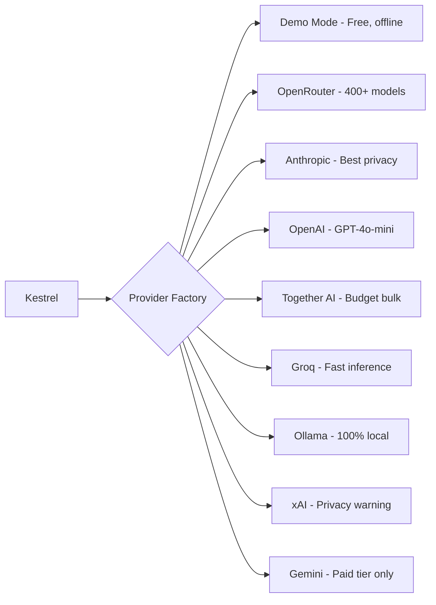

# AI Providers Guide

You know how you use ChatGPT or Claude to ask questions? Kestrel does the same thing — but automatically, behind the scenes, to score jobs, prep you for interviews, and analyze your career gaps.

The difference: ChatGPT is like a TV set — you watch what's on. Kestrel needs a **power source** — an AI service that it can call programmatically, hundreds of times, without you typing anything.

---

## The Short Version

- **Demo Mode** — free, offline, works now. Explore everything with simulated data.
- **OpenRouter** — one account, 400+ models, ~$3-10/month. Best starting point.
- **Anthropic (Claude)** — best privacy (7-day retention) + prompt caching savings.
- **OpenAI (GPT)** — GPT-4o-mini at $0.15/M input. $5 signup credits.
- **Together AI** — budget-friendly bulk scoring, EU data center option.
- **Groq** — blazing fast inference, green privacy tier. Free tier available.
- **Ollama** — run AI on your own computer. Nothing leaves your machine. Free.
- **xAI (Grok)** — available but **privacy warning**: irrevocable data sharing.
- **Gemini** — Google's models. Paid tier only recommended (free tier trains on data).

---

## The Electricity Analogy

Think of AI providers like electricity providers:

- **You don't generate your own electricity** — you pick a provider, they send power through the wire, you pay for what you use
- **The light switch works the same** no matter which company provides the power
- **Some providers are cheaper**, some are greener, some are local (solar panels on your roof)

Kestrel works the same way. Pick a provider, connect it, and every feature — scoring, coaching, interview prep — works identically regardless of which AI is behind it.

---

## Your Options

### 1. Demo Mode — Free, Works Offline

**Cost:** Free forever | **Privacy:** Perfect — nothing leaves your device

This is the default. Kestrel works completely offline with pre-generated responses. AI features return realistic but not personalized data — good enough to explore and understand how everything works.

*Best for:* Trying Kestrel before committing to an AI provider.

### 2. OpenRouter — One Account, 300+ Models

**Cost:** ~$3-10/month for typical use | **Privacy:** Good (your data is not used for training)

OpenRouter is like a phone plan for AI. You load credits, Kestrel uses them when scoring jobs or preparing interviews. One account gives you access to Claude, GPT, Gemini, and hundreds of other models.

**Setup:** Click "Connect to OpenRouter" in Settings → log in → done. No copying API keys.

*Best for:* Most users who want quality AI without complexity.

### 3. Direct Anthropic (Claude) — Best for Power Users

**Cost:** ~$4-10/month | **Privacy:** Excellent (7-day data retention, shortest in industry)

Connect directly to Claude's API for the best privacy and lowest cost. Kestrel uses **prompt caching** — your profile is sent once and remembered, so scoring 50 jobs costs 88% less than sending your profile each time.

*Best for:* Users who want the best privacy-cost balance.

### 4. Together AI — Budget-Friendly Bulk Scoring

**Cost:** ~$1-5/month | **Privacy:** Good ([ZDR available](https://www.together.ai/blog/soc-2-compliance), SOC 2 Type 2 certified)

Together AI runs open-source models (Llama 3.3, Mixtral) on their own GPUs — no middleman markup. If you're in Europe, their **Frankfurt data center** means lower latency too.

*Best for:* Budget-conscious users, bulk scoring, EU users wanting data locality.

### 5. Ollama — Run AI on Your Own Computer

**Cost:** Free (after hardware) | **Privacy:** Perfect — nothing leaves your machine

Install [Ollama](https://ollama.com), download a model, and Kestrel talks to it on your computer. No internet needed, no data sent anywhere, no monthly bill.

**The trade-off:** You need a decent computer (16GB+ RAM recommended), and local models aren't quite as smart as Claude or GPT. Scoring is good, deep analysis is weaker.

*Best for:* Privacy maximalists, offline users, developers.

### 6. OpenAI (GPT) — Direct Access

**Cost:** ~$1-5/month | **Privacy:** Good (API data not used for training since March 2023)

Connect directly to OpenAI's API. GPT-4o-mini at $0.15/M input tokens is near-free for scoring. New accounts get $5 in credits.

*Best for:* Users already in the OpenAI ecosystem.

### 7. Groq — Blazing Fast Inference

**Cost:** Free tier available | **Privacy:** Excellent (does not train on API data)

Groq runs open-source models on custom LPU hardware — inference is 10-50x faster than GPU-based providers. Great for real-time scoring when speed matters.

*Best for:* Speed-sensitive workflows, free tier users.

### 8. xAI (Grok) — Use With Caution

**Cost:** Varies | **Privacy:** RED — Irrevocable data sharing program

xAI/Grok is available but comes with a strong privacy warning. Their data sharing program is irrevocable — once opted in, there's no way to remove your data. Multiple active GDPR investigations are ongoing.

Kestrel shows a warning every time this provider is initialized.

*Best for:* Only if you specifically want Grok and accept the privacy trade-off.

### 9. Gemini — Google's Models (Paid Tier Only)

**Cost:** Free tier available but NOT recommended | **Privacy:** Yellow (paid: good, free: trains on data)

Google Gemini offers competitive models, but the free tier explicitly uses your data for training and is banned in the EU by Google's own terms. Paid tier does not train on data.

*Best for:* Users who want Google's models on the paid tier. Avoid the free tier.

---

## Cost Presets — One Setting, Everything Configured

Instead of tweaking individual settings, pick a preset and Kestrel configures everything:

| Preset | Provider | Monthly Cost | What it does |
|--------|----------|-------------|--------------|
| **Free** | Groq / Cerebras / SambaNova | $0 | Rate-limited, open-source models |
| **Budget** | GPT-4o-mini via OpenRouter | ~$0.81 | Reliable JSON, good quality (DEFAULT) |
| **Quality** | Sonnet scoring + Opus generation | $5-25 | Best reasoning for research/prep |
| **Private** | Together.ai (ZDR) or Ollama | $0 + hardware | Zero data retention |
| **Custom** | You configure everything | Varies | Full control over all knobs |

Change presets in Settings or via `PUT /api/presets/active`. The Budget preset is the default — it covers 18,000 scores/month for under a dollar.

---

## "I Already Pay for ChatGPT / Claude. Can I Use That?"

Short answer: you can't use it directly.

Your $20/month ChatGPT Plus or Claude Pro subscription gives you access through their chat interface — like a gym membership that only works at one location. The API is a separate service with separate billing, like getting a personal trainer.

**The good news:** You don't need those subscriptions. OpenRouter gives you access to both Claude and GPT (plus dozens more) through a single account, often cheaper than a subscription.

---

## How Much Does It Cost?

AI pricing is measured in "tokens" (roughly 4 characters = 1 token), but you don't need to think about that. Here's what matters:

| Action | Approximate cost |
|--------|-----------------|
| Score one job | $0.005 - $0.02 |
| Interview prep session | $0.02 - $0.05 |
| Company research | $0.02 - $0.05 |
| Gap analysis | $0.01 - $0.03 |
| Monthly budget (active job search) | **$3 - $10** |

For context: a single coffee costs more than a month of AI-powered job searching.

With prompt caching enabled, discovery sweeps (scoring 50+ jobs at once) cost 88% less because Kestrel reuses your cached profile instead of re-sending it each time.

---

## Privacy: Where Does My Data Go?

Kestrel sends job descriptions and your profile summary to whichever AI provider you choose. Here's what happens to that data:

| Provider | Trains on your data? | How long kept? | Human review? | Tier |
|----------|---------------------|----------------|---------------|------|
| **Ollama (local)** | No — stays on your computer | Forever (your disk) | No | Green |
| **Anthropic (Claude)** | Never | 7 days | No | Green |
| **Together AI** | No (ZDR enabled) | Not stored | No | Green |
| **Groq** | No | Not stored | No | Green |
| **OpenAI (API)** | No (since March 2023) | 30 days | No | Yellow |
| **OpenRouter** | No (unless you enable logging) | Not stored | No | Yellow |
| **Gemini (paid)** | No | 55 days | No | Yellow |
| **Gemini (free)** | **Yes** | **Indefinite** | **Yes** | Yellow |
| **xAI (Grok)** | **Yes — irrevocable** | **Indefinite** | Unknown | **Red** |

**The rule of thumb:** If you're on a paid tier, your data is not used for training. Free tiers are riskier — especially Google's, which explicitly uses free-tier data to improve their models.

### PII Protection

Kestrel can automatically strip personal information (phone numbers, email addresses, profile URLs) from prompts before sending them to any AI provider. The AI never sees your real contact details — it works with placeholders like `[EMAIL_1]` and `[PHONE_1]`, and Kestrel puts the real values back in the response.

---

## EU Users: Special Considerations

If you're in the EU, data privacy laws (GDPR) add extra considerations:

- **Recommended:** Anthropic, Ollama (local), Together AI (Frankfurt DC), or Mistral (French company, EU data centers)
- **Fine with caution:** OpenRouter, Gemini (paid tier only)
- **Avoid:** Gemini free tier (banned in EU by Google's own terms), DeepSeek (data stored in China)

---

## FAQ

**Can I use multiple providers at once?**
Yes. Kestrel can route simple scoring to a cheap model (Together AI) and complex analysis to a premium model (Anthropic). You configure this per feature.

**What happens if my provider goes down?**
Kestrel has automatic provider fallback. If one provider's quota runs out or errors, it tries the next one. No failed scores, no wasted retries.

**Can I switch providers later?**
Absolutely. The light switch works the same no matter who provides the power. Switch any time in Settings.

**Is Demo Mode actually useful?**
Yes — it's fully functional for exploring the UI, understanding the pipeline, and deciding if Kestrel is right for you. The only limitation is that scores aren't personalized to your actual profile.

---

## Quick Start

1. **Try Demo Mode** — explore Kestrel with pre-generated AI responses
2. **When ready:** Click "Connect to OpenRouter" in Settings
3. **Load $5 in credits** — that's roughly 500 job scores
4. **Start discovering** — Kestrel handles the rest

No PhD required.

---

## Further Reading

- [Cost Optimization Guide](cost-optimization.md) — tiers, privacy, monthly costs, optimization tips
- [Automation Paths](automation-paths.md) — cron, GitHub Actions, MCP, n8n, scheduled agents
- [AI Provider Setup Reference](../reference/AI-PROVIDERS.md) — full comparison tables, API key setup instructions, pricing details
- [Provider Privacy Audit](../research/provider-privacy-audit.md) — detailed privacy findings per provider with source links
- [OpenRouter Rate Limits](../research/openrouter-rate-limits.md) — rate limits at $0/$10/$50 balance tiers
- [How Token Optimization Works](how-token-optimization-works.md) — how Kestrel keeps AI costs low with 8 stacked optimizations
