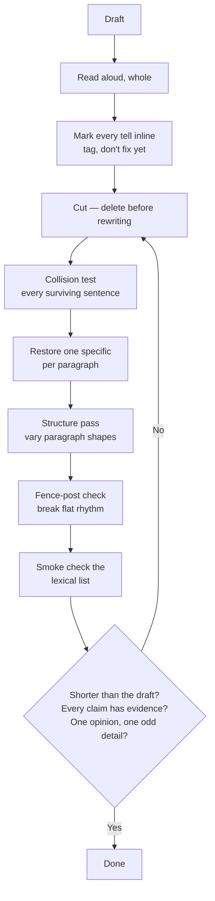

# Writing Without the AI Tells

A recruiter reading your cover letter has read a hundred others this month, and a good chunk of them were quietly written by a chatbot. They can feel it. Not because of any single word, but because AI prose has a *register* — evenly polished, agreeable, noun-heavy, every sentence pulling the same weight. Think of it like a room where every wall is painted the same shade of beige: nothing is wrong, and that's exactly what's wrong. This guide teaches you to hear that beige in your own drafts and knock it back out. The core move is almost never "rephrase it." It's **delete the tell, then make what's left concrete.**

## The Short Version

- The thing readers detect isn't machine authorship — it's the **smooth assistant register**. Write away from that register and the "AI feel" goes with it.
- **Structural tells matter more than word choice.** Flat sentence rhythm and vague claims survive a thesaurus pass; that's why they're ranked first.
- **Fix by subtraction.** Delete the slop and restore one concrete specific per paragraph. Rephrasing slop just produces different slop.
- **Read it aloud.** It's the highest-yield check there is. Anywhere it sounds like a press release, cut.
- Don't trust AI-detector scores in either direction — they're unreliable and measure the wrong thing. The real judge is a human who reads AI text all day.

## How It Actually Works

### Why "AI-sounding" is a register, not a fingerprint

When people say a piece "reads like AI," they rarely mean a specific banned word. They mean the whole thing sits in one flat, over-helpful tone: balanced hedges, tidy transitions, every paragraph the same shape, a confident summary at the end. That register comes from how assistant models are tuned to be agreeable and complete. The good news is that your own natural writing — jagged and opinionated — is already the antidote. The job is mostly to *protect* that jaggedness, not to add polish on top of it.

This also means the lexical tricks age fast. The buzzwords everyone flagged two years ago (*delve*, *tapestry*, *meticulous*) are already fading, because writers learned to avoid them and models drifted too. Structural tells — rhythm, density, paragraph shape — don't decay that way. Chase those first.

### The tells, ranked

Work top to bottom. The structural tells at the top survive paraphrasing and matter most; the lexical smoke list at the bottom rots every few months and is the weakest layer. Each row names the tell and the fix.

| # | Tell | Fix |
|---|------|-----|
| 1 | **Flat cadence (low burstiness)** — three or more sentences in a row within about five words of each other's length | Read your sentence lengths as a sequence. Force one under 8 words or over 30. Let one be a fragment. A flat line fails even if every word is clean. |
| 2 | **Low information density** — asserts a lot, specifies nothing | One number, name, date, or place per paragraph, or the paragraph *is* the slop. Cut it. |
| 3 | **Swap-test failure** — the sentence would work unchanged in a competitor's letter (or, in a form answer, in another candidate's) | Cut it, or rebuild it around a fact true only of *this* company or *this* writer. |
| 4 | **Contrast-reframe** — "not just X, but Y," "it's not about X, it's about Y," "no fluff, no filler, just results" | Delete the X clause. Keep Y only with evidence attached. One real contrast per piece, maximum. |
| 5 | **Uniform paragraph arc** — every paragraph runs claim → elaboration → tidy mini-conclusion | Merge, split, and reorder until paragraph shapes vary. End on the last concrete point, not a zoom-out. |
| 6 | **Claim with no incident** — "detail-oriented," "proven track record," "passionate about quality" | Replace the adjective with the incident that would prove it, or with nothing. |
| 7 | **Participial tails and openers** — "…, ensuring seamless delivery," "…, highlighting my impact"; "Leveraging my background…" | Cut the tail; end on the fact. Kill "-ing" openers. This is one of the strongest syntactic tells — such clauses run several times the human rate. |
| 8 | **Manufactured significance** — "stands as a testament to," "marks a pivotal moment," "boasts a rich history" | Restore a plain "is" or "has," or delete the sentence. The repair is delete-and-concretize, never a synonym. |
| 9 | **Nominalizations and passive voice** — "the optimization of the pipeline resulted in a reduction of costs" | Use verbs with a person as the subject: "I rewrote the pipeline and the bill halved." |
| 10 | **Rule-of-three triads** — "robust, scalable, and flexible"; three-item bold-header lists | Keep the most specific item, drop the other two. Use lists of two or four, or fold them into a sentence. |
| 11 | **Throat-clearing openers** — "In today's fast-paced landscape," "Furthermore," "Here's the thing" | Delete the first ten percent. The real opening is usually your second paragraph. Connect by logic, not signpost. |
| 12 | **Fit-assertion closers** — "I'm confident my skills align," "I look forward to the opportunity to contribute" | End on a plain next step or a concrete offer. Never recapitulate. |
| 13 | **Job-description mirroring** — the posting's own language handed back to it | Answer one requirement with proof. Cite something that isn't on the careers page. |
| 14 | **No opinion, no accidental detail** — every sentence safe and load-bearing | Plant one defensible stance and one oddly specific detail that doesn't serve the argument. Humanizer tools can fake rhythm; they can't fake a position. |
| 15 | **Weasel attribution** — "studies show," "observers have noted," "it is widely believed" | Name the source or delete the claim. |
| 16 | **Punctuation density** — a dash in every paragraph, long semicolon chains | Judge punctuation by density and function, never by presence (see the note on dashes below). |
| 17 | **Lexical smoke list** (weakest layer, rotates every few months) — *emphasizing, enhance, showcasing, fostering, foster, align with, robust, comprehensive, seamless, leverage, harness, elevate* | Dense hits mean the *structure* is slop — fix that, don't swap synonyms. Swapping just lands on the next slop word. |

**A note on the em dash.** For a while the em dash was treated as a human signal, and then as an AI signal, and by now it's neither — it has decayed into a false-positive trap. Don't add dashes to sound human, and never "fix" someone's writing by stripping the dashes they chose; that itself is a humanizer artifact. Judge punctuation by density and function, not by whether a mark is present. If your prose has a dash in every line, thin them out. If it doesn't, leave it alone.

**On detector scores.** No reliable AI detector exists. Their verdicts drift day to day, they flag non-native English as "AI" at high rates, and they're really measuring the assistant register rather than authorship. Never edit toward a detector score in either direction. The gate that matters is a human read against your own genuine writing.

### The mechanical passes

Once you know the tells, run these ten moves over a draft. They're deliberately mechanical — things you can do without agonizing.

1. **Delete-the-opener.** Cut the throat-clearing in paragraph one. Paragraph two is usually the real start.
2. **Delete-the-closer.** Cut any ending that widens out to "the bigger picture." End on your last concrete point.
3. **Fence-post pass.** Find three same-length sentences in a row and break the run: force one very short or very long, and keep at least one fragment.
4. **Structure pass.** After you've fixed the words, vary the paragraph *shapes*. De-slopped prose still reads as AI when every paragraph runs the same arc.
5. **De-noun pass.** Turn nominalizations back into verbs with agents. Kill "-ing" openers and tails. Restore "is" and "has."
6. **Concrete over abstract.** One specific per paragraph, plus one non-load-bearing detail per piece — the small true thing that doesn't advance the argument but proves a person was there. If you don't have a real one, leave a placeholder and fill it later. Never invent it.
7. **Span/collision test.** For every surviving sentence, ask: could this be pasted, unchanged, into someone else's application? If yes, cut it.
8. **One opinion.** Add a single stance or reservation you'd defend out loud.
9. **Show the seams.** State the real constraint, the thing that went wrong, the trade-off you actually made. Plainly.
10. **Read aloud.** The highest-yield check. Re-cut anywhere it sounds like a press release.

### The editing protocol

Here's the whole thing as one pass, top to bottom. Notice how much of it is *cutting* and *tagging* rather than writing.

1. **Register gate.** Before touching individual words, read the draft aloud next to a piece of your own real writing — something you wrote unassisted and were happy with. If the draft is smoother or more enthusiastic than your genuine voice, reject it wholesale and start closer to your own samples. Don't patch a register problem word by word. (Keeping a small library of your own real samples is worth doing on its own — see the [voice corpus guide](voice-corpus-architecture.md).)
2. **Read aloud, whole.** Note the press-release spots and any flat, fence-post rhythm.
3. **Mark every tell** inline, like `[SLOP: contrast-reframe]`. Tag, don't fix yet.
4. **Cut, don't rewrite.** Your first action on every tag is to delete it and see if the sentence survives.
5. **Collision test** every surviving sentence: swappable to another company or another writer? Cut it.
6. **Restore specificity.** One concrete per paragraph, plus one accidental detail per piece. Leave a `[TODO: real detail]` slot if you have none — never fabricate.
7. **Structure pass.** Vary paragraph arcs and lengths. Kill the zoom-out closer.
8. **Fence-post check.** Break uniform sentence runs. Keep a fragment.
9. **Log old → new** for every change, so you can see what you cut and undo a step that went too far.
10. **Flag, don't guess.** For anything you can't verify — a number, a claim, a stance only the author can take — mark it and surface it rather than inventing something plausible.
11. **Smoke check** the lexical list. Dense hits mean fix the structure, not the vocabulary.

**Stop when** the piece is shorter than the draft, every claim has evidence or a flag, no sentence survives the collision test, and there's at least one opinion and one accidental detail.

## Examples

**Before (slop):** "As a detail-oriented professional with a proven track record, I am excited to leverage my comprehensive skill set to drive impactful results and foster seamless collaboration across cross-functional teams."

**After:** "I once spent a week tracing a billing bug at Northwind Data that turned out to be a timezone off by one. It shipped in the fix that halved our support tickets that quarter. That's the kind of problem I like."

The rewrite is shorter, carries a real incident, states a preference, and could not be pasted into anyone else's letter. Nothing was rephrased; the slop was deleted and one concrete thing was restored.

**Before (flat cadence):** "I built the reporting service. I tested the reporting service. I deployed the reporting service. It worked well in production." Four sentences, nearly identical length — the fence-post pattern.

**After:** "I built the reporting service, tested it against a year of replayed traffic, and shipped it. It held. (The one incident was a cache we'd sized for the wrong percentile — very educational.)" The rhythm now varies, and the parenthetical adds the seam that a machine would smooth away.

## FAQ

**Q: Isn't this just "write well"?**
Partly. But the tells give you a checklist, which is faster and more reliable than a vague sense that something is off. When you're editing at 11pm before a deadline, "flag three same-length sentences and break the run" is a move you can actually execute.

**Q: Should I run my writing through an AI detector before sending it?**
No. Detectors are unreliable and flag plenty of genuine human writing, especially from non-native English speakers. Edit against your own real samples and read the piece aloud instead.

**Q: If I delete all the polish, won't the writing feel rough?**
A little rough beats a little robotic. The reader trained on AI text is scanning for the smooth assistant register, and slightly uneven, specific, opinionated prose reads as *a person wrote this* — which is the whole point.

**Q: Does this apply to everything I write?**
It applies to prose meant to persuade or represent you: cover letters, outreach, application answers, posts. It does **not** apply to CVs, which are keyword-driven documents optimized for scanning. See the [cover letter guide](cover-letter-writing.md) for why the two diverge.

## Further Reading

- [Building a Voice Corpus](voice-corpus-architecture.md) — how to collect the real writing samples the register gate depends on
- [Writing Cover Letters That Don't Read as AI](cover-letter-writing.md) — the full 14-category taxonomy and pre-send checklist
- [Optimizing a LinkedIn Profile](linkedin-profile-optimization.md) — where distinctive voice helps and where keyword discipline wins instead
