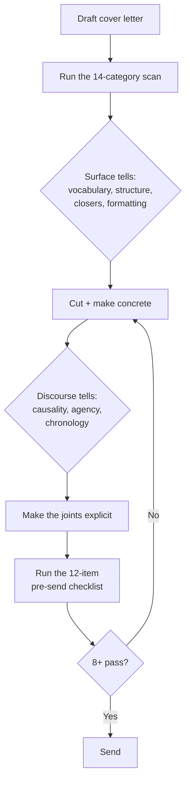

# Writing Cover Letters That Don't Read as AI

A recruiter at an AI-literate company is, by now, an expert AI-text detector — not because they run your letter through a tool, but because they read the assistant register all day and their ear is tuned to it. A letter that pings that ear is worse than a slightly rough human one: it signals both a lack of effort *and* a lack of judgment about how your reader reads. Think of it like sending a form email that opens "Dear Sir or Madam" — the problem isn't any single word, it's that the whole thing announces you didn't really show up. This guide breaks down the specific patterns those readers flag, gives you a checklist to catch them before you send, and explains why you should throw all of it out the moment you touch your CV.

## The Short Version

- Frequent AI users are startlingly good at spotting AI prose — better than any detector tool — so your real audience is the toughest possible judge.
- Experts flag **14 recurring categories**, led by vocabulary, sentence structure, and grammar. The fix for almost all of them is *cut and make concrete*, not rephrase.
- Some tells are **discourse-level** — how a story handles cause, agency, and time — and survive even when you scrub the vocabulary.
- A **12-item pre-send checklist** catches most of it in a few minutes.
- **Do not apply any of this to your CV.** A CV is a keyword-scannable document; distinctive voice actively hurts it.

## How It Actually Works

### Why this is worth the effort

Three findings from recent research set the stakes:

1. **People who use LLMs daily are near-perfect at spotting AI prose.** In a controlled study (Russell, Karpinska & Iyyer, ACL 2025, arXiv:2501.15654), a five-expert majority vote of frequent LLM users misclassified only 1 of 300 articles — beating every detector tool, even against paraphrasing and "humanization" attacks. Recruiters at AI-adjacent companies are exactly this cohort.

2. **AI prose is everywhere in professional writing.** A follow-up (arXiv:2510.18774) found a meaningful share of 2025 newspaper articles were AI-generated, with opinion pieces far more likely than news to contain AI content. The pool of readers trained on real AI submissions is enormous and growing.

3. **Discourse-level tells persist even when surface tells are scrubbed.** The StoryScope work (arXiv:2604.03136) shows AI text is distinguishable at the structural level — narrative arc, agency, chronology — not just word choice. Polishing vocabulary alone does not solve the problem.

The implication: a letter that reads as AI to your reader is a worse outcome than a plainer, human-sounding one. Effort and judgment are the things you're actually signaling.

### The 14-category taxonomy

Descending by how often experts cited each category. For each: what AI tends to do, and what to do instead. Every example here is invented.

**1. Vocabulary.** *AI overuses:* delve, testament, crucial, vibrant, harness, foster, robust, comprehensive, multifaceted, leverage, intricate, showcase, demonstrate, "serves as a testament to." *Do instead:* your actual working vocabulary — "the obvious move was," "what bit me last time was," "the architecture I'd reach for." Precise domain terms used correctly are signal, not noise.

**2. Sentence structure.** *AI patterns:* "not only X, but also Y"; three-item lists ("robust, scalable, and flexible"); sentences of uniform length forming even blocks. *Do instead:* vary length aggressively — three short clipped sentences, then one long one with an aside. List two items or four, never three. Cut every "not only … but also."

**3. Grammar and punctuation.** *AI:* grammatically flawless, avoids parentheticals, identical comma rhythm throughout. *Do instead:* use parentheses (like this) and the occasional colon. One comma splice per letter is fine. Judge punctuation by density and function rather than by presence — including dashes, which have decayed into a false-positive tell: don't add them to sound human, and don't strip a writer's chosen dashes to sound less like AI.

**4. Originality.** *AI:* safe, no surprises, no humor, no specific imagery. *Do instead:* one concrete, unexpected detail per letter. "I shipped the checkout rewrite at Northwind Data the week our payment provider changed their API — that was a long week." Specifics that couldn't appear in anyone else's letter are the strongest human-authorship signal.

**5. Quotes and cited claims.** *AI:* smooths all cited material into the surrounding voice. *Do instead:* let it sit jagged. "My lead at Meridian Labs used to say 'ship it and watch the graphs' — that's the loop I want back."

**6. Clarity.** *AI:* over-explains, adds connective tissue, tells rather than shows. *Do instead:* trust the reader. Cut every "in order to," "it is worth noting that," "what this means is." State the result and let them infer the process.

**7. Formatting.** *AI:* uniform headings, even paragraphs, bulleted lists. *Do instead:* no bullets, no headings in a cover letter. Vary paragraph length — one paragraph can be a single sentence.

**8. Conclusions.** *AI:* cheerful summary closings ("I would welcome the opportunity to contribute," "I look forward to discussing"). *Do instead:* end abruptly on a concrete next step. "Happy to walk you through the pipeline if it helps." / "If the role's still open in two weeks, I'll follow up." Never recapitulate.

**9. Formality.** *AI (un-humanized):* no contractions, no fillers, uniformly polished. *Do instead:* use contractions naturally (I'd, I'm, didn't). One mild filler is fine (honestly, frankly). Don't over-correct into breezy informality either — precise is not the same as casual.

**10. Names, titles, and entities.** *AI:* generic placeholder names, the same job title for everyone, avoids specific brands. *Do instead:* name real things. "Atlas Robotics' warehouse SDK," not "a major logistics platform." Concrete named entities are hard for a generic draft to produce.

**11. Tone.** *AI:* consistently neutral-positive, no critique, no edge. *Do instead:* one moment of genuine opinion or honest reservation. "I'm wary of platform roles that turn into ticket triage — what I want is to own a surface end to end again."

**12. Introductions.** *AI:* generic scenic openers. "In today's rapidly evolving landscape…" *Do instead:* open with something specific to *this* company or role that couldn't appear elsewhere — a reference to a real release note, a product you actually used and what happened. Never "I'm writing to express my interest in…"

**13. Factuality (critical).** Never invent numbers, dates, project names, or company facts. Every metric must trace to something real, or be flagged for you to verify. Hallucinated specifics are catastrophic — both a detection signal *and* a credibility-killer if the reader checks. If unsure, leave it out or mark `[VERIFY: X]` and resolve it before sending.

**14. Topics.** *AI:* avoids critique and smooths over career discontinuities. *Do instead:* a real career has gaps and pivots — naming yours tells the reader you're not afraid of the question. "I joined a startup that got acquired and wound down my team six months later; the time since has gone into shipping a project end to end, which is the work I actually want."

### Discourse-level tells (StoryScope)

Beyond words and sentences, AI prose has structural giveaways that survive a vocabulary scrub:

- **Causality.** Real careers have *because*, *which led to*, *which didn't work because*. AI smooths everything into *and then* / *building on this*. Force the causal joints to be explicit.
- **Agency.** Whose decision was each move? AI drifts into passive arcs ("the opportunity arose to…"). State the agent: "I left because…," "I took the offer because…"
- **Chronological discontinuity.** Real timelines have gaps, overlaps, and pivots. If your arc reads as one smooth ascending curve, it's wrong.

### Pre-send checklist

Self-check before you send. If 8+ pass, the letter probably reads as human. Fewer than 6, redraft.

1. **Banned-vocab scan** — delve, testament, crucial, vibrant, harness, foster, leverage, robust, comprehensive, multifaceted, showcase, demonstrate. Replace or cut every hit.
2. **"Not only / but also"** — search and rewrite.
3. **Three-item lists** — reduce to two or expand to four.
4. **Transition openers** — Furthermore, Moreover, Additionally, In conclusion. Rewrite.
5. **Closing phrases** — "I look forward to," "I would welcome," "Thank you for considering." Replace with a concrete next step.
6. **Specificity per paragraph** — every paragraph has at least one named entity or real number.
7. **Punctuation variety** — at least one parenthetical aside; no single mark in every line.
8. **Opening specificity** — the first sentence couldn't be pasted into another application.
9. **Paragraph-length variance** — not all the same length.
10. **Factual provenance** — every metric traces to something real; mark `[VERIFY: X]` for anything uncertain.
11. **Career honesty** — gaps and pivots named, not smoothed.
12. **Tonal shift** — at least one sentence carries opinion, edge, or honest reservation.

## What NOT to apply to CVs

**Do not apply this guide to CVs.** A cover letter and a CV are read by different judges with opposite criteria, and the strategy diverges completely.

A CV is a convention-bound, scannable, keyword-driven document read by an applicant tracking system (ATS) first and a human second. Its signal is keyword alignment with the job description and clarity of scope and impact — not human-sounding prose. "Distinctive voice" in a CV actively reduces parseability and hurts your result.

For CVs:

- Keep the template clean and terse.
- Lead bullets with strong verbs and quantified outcomes — the *opposite* of the "show, don't tell" advice above.
- Mirror the job description's keywords explicitly; do not paraphrase them into your own words.
- Avoid parentheticals — they confuse some ATS parsers.
- Three-item parallel structure is fine in a CV. It isn't, in a cover letter.

The rule of thumb: a CV is judged by systems aligned *with* convention, while a cover letter is judged by humans who read AI text all day. Optimize each for its actual reader.

## FAQ

**Q: If I follow all this, won't my letter sound less polished?**
Yes, a little — and that's the goal. Your reader is scanning for the smooth assistant register. Specific, opinionated, slightly uneven prose reads as *a person wrote this*, which is exactly the signal you want.

**Q: Can I use an assistant to draft the letter at all?**
Use it to research the company, check facts, and mark the tells in a draft — but the sentences that carry your voice should be yours. See [Building a Voice Corpus](voice-corpus-architecture.md) for how to give an assistant real samples to work from, and [Writing Without the AI Tells](anti-slop-writing.md) for the editing protocol.

**Q: How long should a cover letter be?**
Short. One achievement matched to the role, one specific reason you want *this* company, and a plain ask. A tight letter that a reader finishes beats a long one they skim.

**Q: What if I genuinely don't have a specific detail for a company?**
Then find one before you write — read a real release note, changelog, or product page — or don't send a cover letter at all. A generic letter is worse than none.

## Source papers

- Russell, J., Karpinska, M., & Iyyer, M. (2025). *People who frequently use ChatGPT for writing tasks are accurate and robust detectors of AI-generated text.* ACL 2025. arXiv:2501.15654.
- Russell, J., Karpinska, M., Akinode, D., Thai, K., Emi, B., Spero, M., & Iyyer, M. (2025). *AI use in American newspapers is widespread, uneven, and rarely disclosed.* arXiv:2510.18774.
- Russell, J., Rajendhran, R., Pham, C. M., Iyyer, M., & Wieting, J. (2026). *StoryScope: Investigating idiosyncrasies in AI fiction.* arXiv:2604.03136.

## Further Reading

- [Writing Without the AI Tells](anti-slop-writing.md) — the ranked tell checklist and editing protocol behind this guide
- [Building a Voice Corpus](voice-corpus-architecture.md) — how to give an assistant real samples of your voice to work from
- [Optimizing a LinkedIn Profile](linkedin-profile-optimization.md) — the keyword-driven counterpart, where CV logic applies instead
