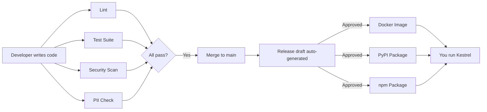

# How CI/CD Works

You've probably installed software before — download, double-click, done. But what happens between someone writing code and you running it? Think of it like a restaurant's back-of-house operation. A chef creates a recipe, but before it reaches your table, the recipe gets reviewed, ingredients get quality-checked, the dish gets plated, and a server brings it to you. If any step fails — bad ingredient, wrong temperature, dropped plate — you never see the mistake. That invisible kitchen is CI/CD: Continuous Integration (checking the code) and Continuous Delivery (getting it to you).

## The Short Version

- Every code change passes through **three checkpoints** (works? ready? deliverable?) before reaching you
- **12 automated workflows** check each change — tests, security scans, PII leak detection, dependency audits
- Releases are packaged automatically as **Docker images**, **Python packages (pip)**, and **npm packages**
- Self-hosted means we can't hotfix after shipping — the kitchen has to be really good because we can't fix a bad dish once it's on your table

## How It Actually Works

### The Three Checkpoints



**Checkpoint 1: Does It Work?** When new code is submitted for review, automated checks run immediately. A linter checks coding standards (grammar rules for code). The full test suite runs in under 2 minutes. Security scanners check for known vulnerabilities in dependencies. A special scanner checks that no personal information, passwords, or API keys accidentally ended up in the code — like checking that a letter you're mailing doesn't have your credit card number on the envelope. If any check fails, the code can't move forward.

**Checkpoint 2: Is It Ready to Ship?** Once code passes all checks, it gets merged into the main codebase, but that doesn't make it a release. Changes accumulate until there's enough to justify a new version. Kestrel uses conventional commits — every change is labeled (`feat:` for features, `fix:` for bug fixes, `docs:` for documentation). A bot reads these labels and auto-generates a release draft:

```
Version 0.4.0

New Features:
- Expanded scoring to work with finance and design roles
- Added new AI provider options

Bug Fixes:
- Fixed scoring inconsistency with profile-aware wrapping
- Corrected golden set test categorizations
```

The developer reviews and decides when to publish. We don't auto-release because self-hosted users need time to plan upgrades.

**Checkpoint 3: Can You Get It?** When a release is published, the code gets packaged automatically in three formats:
- **Docker image** — the most common way to run Kestrel. The entire app (backend + frontend) in a single container, like a meal kit with everything pre-measured and pre-prepped.
- **Python package (pip)** — for users who want to install Kestrel as a Python tool, published to PyPI.
- **npm package** — a convenience wrapper that installs the Python package using Node.js tooling.

All three are published automatically when a release is tagged.

### How Self-Hosting Works

When you self-host Kestrel, you're running it on a server you control:

```
Your Server
+-------------------------------------+
|  Kestrel (the app)                  |
|  |-- Backend: finds and scores jobs |
|  |-- Frontend: the web UI you see   |
|  +-- Database: your job data        |
|                                     |
|  + Backup system (automatic)        |
|  + Health monitor (checks it's up)  |
+-------------------------------------+
```

**Your data stays yours.** That's the whole point. Your job applications, scores, contacts, and career goals live on your server, not ours. The database is a single SQLite file — you could copy it to a USB drive. A backup system called Litestream continuously copies database changes to cloud storage, like your phone automatically backing up photos.

**Updating is two commands:**
```bash
docker compose pull        # Download the new version
docker compose up -d       # Restart with the new version
```

The database migrates automatically — new tables get created, old data gets preserved. Roll back just as easily if needed.

**The mobile app** works differently — it connects to your self-hosted server like a remote control. App updates come through the app store, and some can be pushed instantly without app store review (OTA updates).

## Examples

**A typical release cycle:** Three bug fixes and one new feature are merged over a week. Each passed all 12 automated checks independently. The conventional commit bot drafts a changelog. The developer reviews it Friday afternoon, approves the release, and Docker/pip/npm packages are published automatically within minutes. Users update at their convenience.

**A caught mistake:** A developer accidentally includes a test API key in a code comment. The PII leak scanner flags the pattern before the PR can merge. The developer removes it, resubmits, and the key never enters the codebase.

**A conflict between PRs:** Two pull requests individually pass all tests, but when merged together they conflict. The merge-to-main pipeline catches this because it runs the full test suite again after merge — the same safety net that prevents "it worked on my machine" issues.

## FAQ

**Q: Why should I care about CI/CD?**
Because it directly affects the reliability and security of the app managing your career data. Every feature was tested hundreds of times before reaching you. Automated security scanning ensures no version ships with known vulnerabilities. And because Kestrel is open source, every check is visible in the GitHub repository.

**Q: What if an update breaks something?**
Roll back to the previous version with the same two Docker commands. Database migrations are tested both up and down to ensure they're reversible.

**Q: How fast do releases ship?**
Zero manual steps between "release approved" and "packages published." The bottleneck is the developer deciding the changelog is ready, not the pipeline.

**Q: What does "conventional commits" mean?**
Every code change gets a label: `feat:` (new feature), `fix:` (bug fix), `docs:` (documentation), etc. This makes changelogs automatic and predictable — you know exactly what changed in each release.

## Further Reading

- [CI/CD Strategy](../research/cicd-research.md) — the research behind pipeline design
- [Raw Findings](../research/cicd-raw-research.md) — source data and methodology
- [Dev Review](../research/cicd-dev-review.md) — technical implementation review

### Glossary

| Term | What It Means |
|------|---------------|
| **CI** | Continuous Integration — automatically testing code when it's submitted |
| **CD** | Continuous Delivery — automatically packaging and publishing tested code |
| **Docker** | A way to package an app so it runs the same everywhere (like a shipping container for software) |
| **Pipeline** | The sequence of automated checks that code goes through |
| **Linting** | Checking code for style and formatting consistency |
| **SAST** | Static Application Security Testing — scanning code for security issues without running it |
| **SemVer** | Semantic Versioning — version numbers like 1.2.3 (major.minor.patch) |
| **OTA** | Over-The-Air — updating a mobile app without going through the app store |

### The Numbers

- **12 automated workflows** check every code change
- **100+ backend tests** validate the API, scoring, and data layer
- **20+ frontend tests** validate the web interface
- **6 security scanners** check for vulnerabilities, secrets, and supply chain risks
- **Every release** built for both Intel and ARM processors
- **Zero manual steps** between "release approved" and "packages published"
