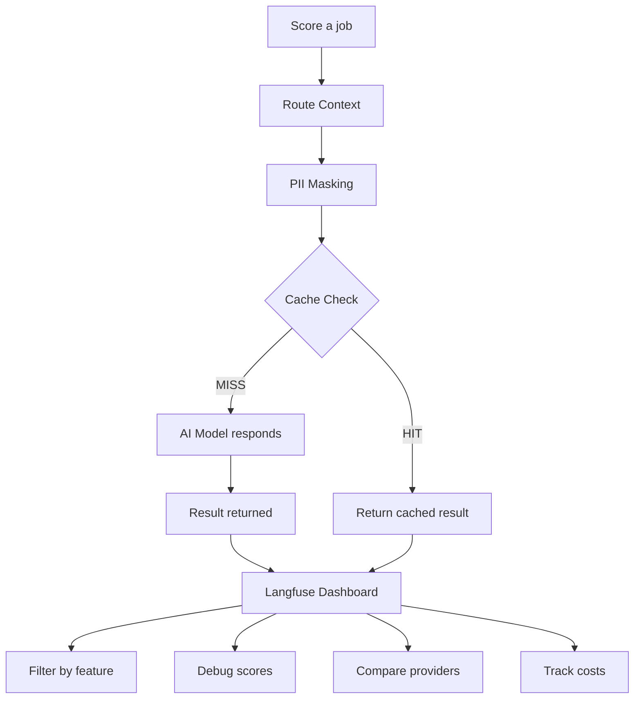

# How Observability Works

Imagine you're running a busy restaurant but you can't see the kitchen. You don't know how long each dish takes, which ingredients cost the most, or whether someone's been burning the garlic all night. Customers complain and all you can say is "I'll look into it." That's what running an AI system without observability feels like. Kestrel makes dozens of AI calls — scoring jobs, analyzing gaps, coaching interview prep, researching companies — and each model response is slightly different every time. Observability is the kitchen camera: it shows you every AI call, what went in, what came out, how long it took, and how much it cost.

## The Short Version

- Every AI call gets a **trace** recording model, tokens, latency, cost, and truncated input/output
- Data flows through **layers** — PII masking, caching, route context — each adding metadata to the trace
- The Langfuse dashboard at `localhost:3100` lets you **filter, debug, and compare** across providers and features
- Completely **optional** — zero overhead when disabled, one Docker command to enable

## How It Actually Works

### What Gets Traced

When observability is enabled, every AI provider call (OpenRouter, Anthropic, Together, Ollama) records a detailed trace:

- **Model** — Which AI handled the request (Claude Sonnet, Llama 3, etc.)
- **Input/Output** — First 500 characters of what was sent and returned (truncated for privacy)
- **Token usage** — How many tokens went in and came out (this is how AI bills you)
- **Latency** — How long the model took to respond

Think of each trace like a receipt for an AI interaction.

### The Data Flow

But a generation doesn't happen in isolation. Before your prompt reaches the AI model, it passes through layers — and each layer adds information to the trace.

**Route context** adds metadata about who asked and why — your profile ID, the scoring session, what kind of AI feature was used. This lets you filter traces later ("show me all scoring calls for engineering roles last week").

**PII masking** strips sensitive information before the AI ever sees it. Your email becomes `[EMAIL_1]`, your phone becomes `[PHONE_1]`. The trace records how many PII items were detected (say, 3 emails and a phone number) but never the actual values. That's the whole point of masking.

**Caching** checks whether we've asked this exact question before. Score the same job twice and the second time is instant — served from an encrypted local cache. The trace records whether it was a hit (free) or miss (costs tokens).

All of this shows up as a single trace in the Langfuse dashboard, with each layer as a nested span.

### Why This Matters

**Cost visibility.** AI models charge by the token. Without tracking, your monthly bill is a mystery. With observability, you see which features consume the most tokens, whether caching is saving you money (a 60% hit rate means 60% of repeat calls are free), and whether complexity routing is working (simple tasks should use cheaper models).

**Debugging.** When a score looks wrong, you need to see what the AI actually received and returned. The truncated conversation history is enough to spot issues like garbled job descriptions or a model returning a score of 15 on a 0-10 scale.

**Privacy verification.** Kestrel promises PII is masked before reaching external AI providers. Observability lets you verify this claim. If PII detection count is consistently 0 on prompts that should contain emails, something is broken. If it's catching 5-10 items per scoring call, the masking is working.

**Provider comparison.** Running multiple AI providers? See side-by-side how they compare on latency, token efficiency, and output quality. Maybe Anthropic is 40% faster but costs 2x more. Maybe Together.ai is great for simple tasks but struggles with complex scoring.

### The Stack

The observability stack runs alongside Kestrel as separate Docker containers:

| Component | Purpose |
|-----------|---------|
| **Langfuse Web** | The dashboard where you view traces |
| **Langfuse Worker** | Processes incoming trace events asynchronously |
| **PostgreSQL** | Stores trace metadata and project configuration |
| **ClickHouse** | Stores actual trace data (optimized for analytics queries) |
| **Redis** | Manages job queues between web and worker |
| **MinIO** | S3-compatible storage for large trace payloads |

It sounds like a lot, but it's all managed by a single `docker compose` command and runs quietly in the background.

### Turning It On (and Off)

**To enable:** Start the Langfuse stack (one-time Docker setup), set three environment variables in `.env`, install `pip install kestrel-app[observability]`, restart Kestrel. Open `http://localhost:3100` to see traces.

**To disable:** Remove the environment variables and restart. All observability code becomes a no-op — zero overhead, zero network calls.

## Examples

**Diagnosing a bad score:** A job that should be a dream match scores 4. You open the Langfuse trace and see the input — the job description was truncated mid-sentence because the posting exceeded the context window. The AI scored an incomplete description. You adjust the prompt truncation logic and re-score.

**Catching a cache break:** Your monthly AI costs spike 3x. Observability shows the cache hit ratio for scoring dropped from 85% to 12% after a code change introduced a timestamp into the prompt prefix. Every call looked "new" to the cache. Remove the timestamp, costs return to normal.

**Comparing providers:** You switch from OpenRouter to direct Anthropic API calls. Langfuse shows latency dropped 40% but cost increased 15%. You decide the speed is worth it for real-time scoring and keep OpenRouter for batch jobs.

## FAQ

**Q: Does observability send my data anywhere?**
No. The entire Langfuse stack runs on your machine. Traces never leave your server. Only the first 500 characters of inputs/outputs are logged, and actual PII values are never recorded.

**Q: What's the performance overhead?**
Negligible when enabled (traces are sent asynchronously). Literally zero when disabled — the code becomes a no-op.

**Q: Do I need observability to use Kestrel?**
No. Kestrel works identically with or without it. Observability is a power-user tool for understanding AI behavior and controlling costs.

**Q: What if I just want cost tracking without the full stack?**
Every AI call already logs token usage to a local SQLite table (provider, model, feature, tokens, estimated USD cost) regardless of whether Langfuse is running. Observability adds the detailed trace inspection and dashboard on top of that.

## Further Reading

- [Observability Setup](../reference/observability-setup.md) — installation and configuration guide
- [Observability Research](../research/observability-research.md) — the research behind the observability design
