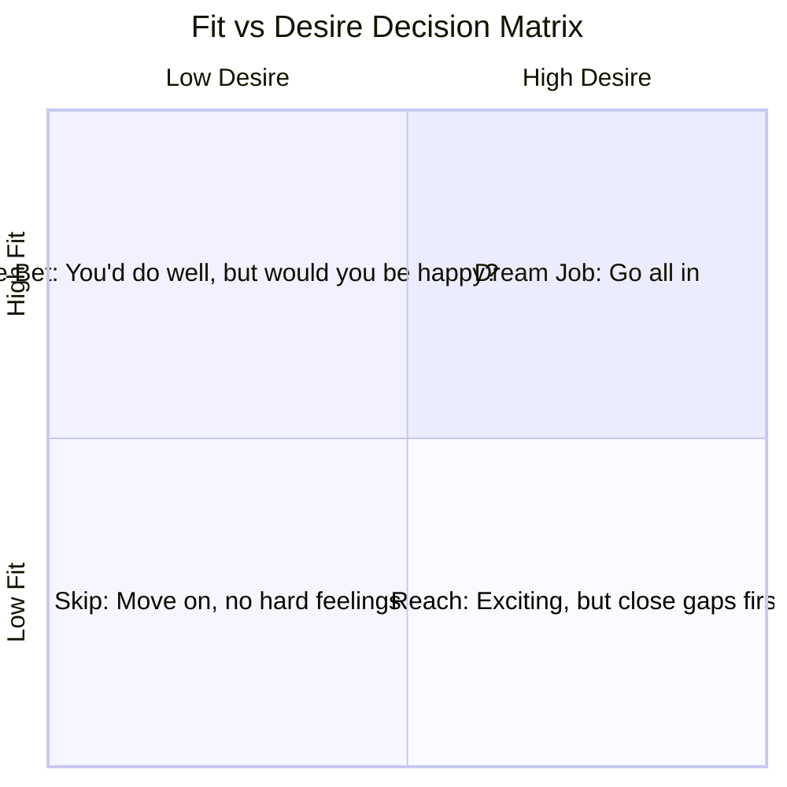
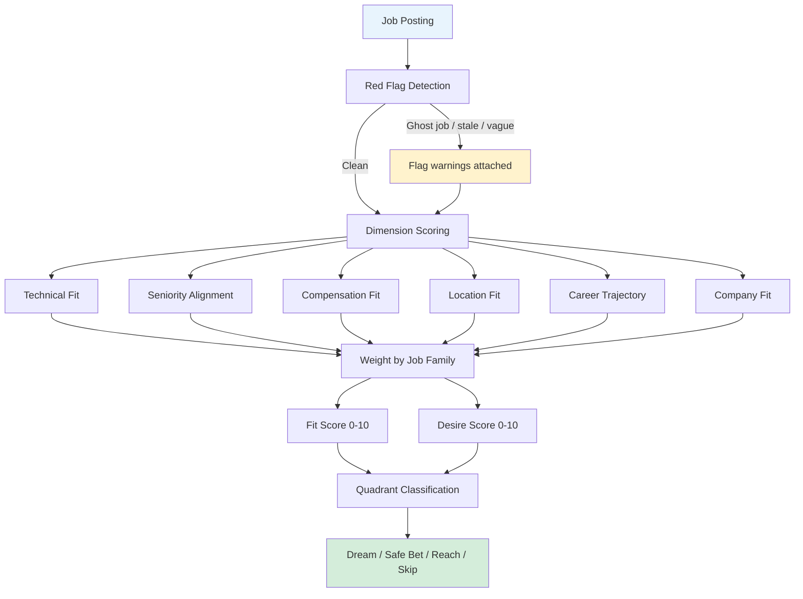

# How Scoring Works

Job descriptions are marketing copy. "Fast-paced environment" could mean exciting growth or chronic understaffing. "Competitive salary" could mean anything from generous to "we'd rather not say." Reading 50 postings and hoping your gut gets it right is exhausting and unreliable. Kestrel's scoring engine works like a panel of specialist judges at a talent show — each one evaluates a different dimension (technical skills, salary, career trajectory), scores it independently, and then the scores combine into a structured picture of how well a role fits what you can do and what you actually want.

## The Short Version

- Every job gets **two scores**: Fit (can you do it?) and Desire (do you want it?) — because a single number hides important tensions
- Each score is built from **six sub-dimensions** like technical match, seniority alignment, and career trajectory
- **Red flags** (ghost jobs, stale postings, unrealistic requirements) are caught before AI scoring even starts
- Scoring **learns from your feedback** — after ~10 corrections, it adapts to your definition of "good fit"

## How It Actually Works

### Two Scores, One Picture

Most job-matching tools give you a single score. Kestrel gives you two, because "can you do this job?" and "do you want this job?" are completely different questions.

**Fit Score (0-10)** measures objective alignment. Do your skills match what they need? Is the seniority level right? Does the salary range overlap with your expectations? Would the location or remote policy work for your life? A high fit score means you'd be a competitive candidate. It doesn't mean you'd be happy.

**Desire Score (0-10)** measures subjective alignment. Does the company's mission excite you? Would this role advance your career in the direction you want? Is the team culture a match for how you like to work? A high desire score means you'd love the role. It doesn't mean you'd get it.

The real insight comes from looking at both together:

A "Safe Bet" isn't a bad outcome — sometimes stability is exactly what you need. And a "Reach" isn't hopeless — it tells you where to invest if you really want that role. The quadrant helps you make intentional decisions instead of applying to everything and hoping for the best.

### The Six Dimensions

Neither score is pulled from thin air. Each one is built from six sub-scores that examine different aspects of the match.

**Technical Fit** — Do your skills match what they need? This goes deeper than keyword matching. If a role asks for React and you have five years of Vue, that's a partial match — the mental models transfer, but there's a ramp-up. If they want Kubernetes and you've only used Docker Compose, that's a real gap, not a deal-breaker.

**Seniority Alignment** — Are you the right level? A senior engineer applying for a junior role means you'll be bored and they'll worry you'll leave in six months. The reverse means you'd be underwater from day one.

**Compensation Fit** — Does the money work? A dream job that pays 40% below your target is going to create friction, no matter how exciting the mission is.

**Location Fit** — Can you actually work there? Remote-first, hybrid three days a week, on-site only — these aren't minor details. "Remote-friendly" sometimes means "remote but you need to be in the office for quarterly planning weeks in San Francisco."

**Career Trajectory** — Does this role get you where you want to go? If your goal is engineering management, a deep IC role might sharpen your skills but won't build the leadership experience you need.

**Company Fit** — What's the company actually like? A Series A startup and a Fortune 500 company are completely different work experiences, even for the same job title.

### The Scoring Pipeline

### Red Flags

Before any AI scoring happens, Kestrel runs pattern-matching checks on the posting itself. These catch warning signs that no amount of skill-matching can fix.

- **Ghost jobs** — The same role reposted 5+ times. The company might not actually be hiring.
- **Stale postings** — Still active after 60+ days. Either glacially slow hiring or the role was filled and nobody took the listing down.
- **Vague responsibilities** — "Other duties as assigned" dominating the description signals the company hasn't figured out the role internally.
- **Staffing agencies in disguise** — The posting looks like a direct hire, but the actual employer is a staffing firm.
- **Unrealistic requirements** — Ten years of experience for a junior title. Five years of a framework that's existed for three.
- **Missing salary in mandatory-disclosure states** — Suggests the company is either unaware of the law or hoping you won't notice.

Think of red flags as the fine print detector — they catch things you might miss when you're excited about a role.

### Score Bands

Here's what the numbers mean in plain language:

| Band | Meaning |
|------|---------|
| **9-10** | Dream fit. Everything aligns — skills, seniority, compensation, trajectory. Rare. Act fast. |
| **7-8** | Strong. Minor gaps (one unfamiliar tool, salary at the low end) that preparation can bridge. |
| **5-6** | Moderate. Real gaps exist but transferable skills help. A strong cover letter or referral could make the case. |
| **3-4** | Weak. Major pivot territory. Closing these gaps takes significant time. |
| **1-2** | Skip. Fundamentally different career path. No amount of interview prep bridges the gap. |

A 7 doesn't mean the job is bad — it means you're competitive but there are gaps to prepare for. Use the sub-scores to find exactly where those gaps are.

### How Scoring Learns

Kestrel's scoring isn't static. It adapts to you.

When you look at a score and think "that's too high" or "that's too low," you can tell Kestrel. Maybe it scored a DevRel role at 8 because your skills match, but you know from experience that you don't enjoy public speaking enough to thrive in that kind of position.

After roughly ten corrections, Kestrel starts injecting your calibration examples into future scoring prompts. Your feedback becomes part of the scoring context, nudging future evaluations toward your actual preferences.

Scoring weights also aren't one-size-fits-all. A software engineering role emphasizes technical skills more heavily (around 35% of the overall score), while a Developer Relations role gives more weight to culture and communication fit (around 25%). The weighting adjusts based on job family, so a perfect score for a backend engineer looks different from a perfect score for a product manager.

The more you use it, the sharper it gets.

## Examples

**The misleading title:** A "Senior Engineer" posting at a startup. The title sounds right for someone with 8 years of experience, but the description reveals the day-to-day is ticket triage and maintaining a legacy CRUD app. Technical Fit scores high (your skills match), but Career Trajectory scores low (this won't grow you). Desire Score lands at 4 despite a Fit Score of 7 — the quadrant says "Safe Bet," nudging you to think carefully about whether stability is what you need right now.

**The hidden gem:** A small company posts a brief, informal description for a "Platform Engineer" role. The listing is thin — few keywords, no salary listed. Fit Score comes in at 5 with a note that the low score may reflect limited information rather than a bad match. You dig deeper, talk to a friend who works there, and discover it's exactly what you want. Scoring is a compass, not a GPS.

**Cross-domain accuracy:** A finance role listing "DCF modeling" and "LBO analysis" instead of programming languages. Because Kestrel's scoring uses job-family-aware weights rather than pure keyword matching, it correctly evaluates the role against a finance professional's profile without penalizing the absence of tech keywords.

## FAQ

**Q: Can scoring replace my own judgment?**
No, and it's not trying to. Culture fit is guesswork from a job description. Salary estimates without posted ranges are rough. Networking isn't factored in. A referral from a friend at the company can matter more than any skill match. Scoring is a compass, not a GPS — it points you in the right direction, but you still need to talk to people and trust your gut when something feels off.

**Q: Why do short job descriptions get lower scores?**
Less text means fewer signals, which means lower confidence. Small companies and startups often write brief postings. A low score here might reflect limited information, not a bad match. The sub-score breakdown helps you tell the difference.

**Q: Does scoring only work for tech roles?**
No. The golden sets include jobs in finance, design, and technical program management. Scoring heuristics are validated across career domains because a system biased toward tech keywords would underrate perfectly good non-tech matches.

**Q: How many corrections before scoring adapts?**
Roughly ten. After that threshold, your calibration examples get injected into the scoring prompt for future evaluations.

## Further Reading

- [Scoring Strategy](../research/scoring-research.md) — the research behind how scoring was designed
- [Raw Findings](../research/scoring-raw-research.md) — source data and methodology
- [Validation Report](../reference/scoring-validation-report.md) — golden set test results and regression tracking
