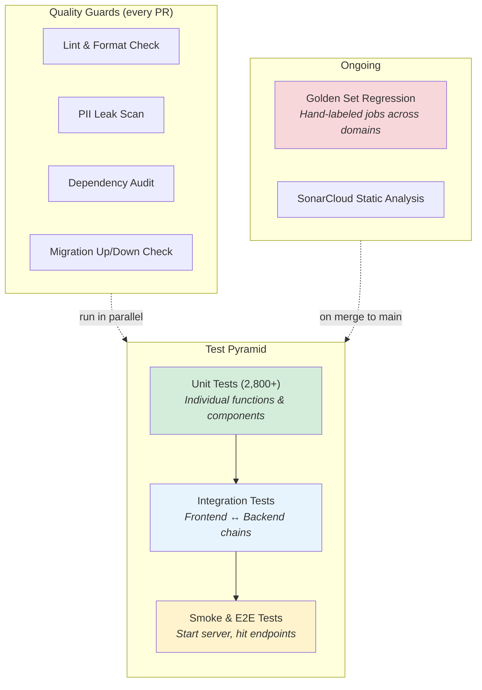
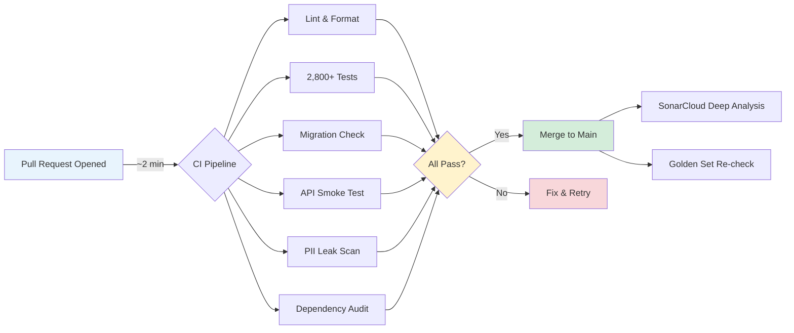

# How Testing Works

Every time you open Kestrel, search for jobs, or check your pipeline, over 2,800 automated checks have already confirmed that things work the way they should. Think of it like quality control in a restaurant kitchen — the chef tastes every sauce, someone checks each completed plate, and a health inspector verifies the kitchen itself is safe. Each layer catches a different kind of problem, and together they make it really hard for bugs to slip through to your table.

## The Short Version

- **2,800+ automated tests** run on every code change, catching bugs in under 2 minutes
- Tests are organized in layers: unit tests (individual ingredients), integration tests (the full plate), golden set regression tests (is it as good as last time?), and security scans (the health inspection)
- **Golden sets** of hand-labeled real-world jobs prevent scoring drift across career domains (tech, finance, design)
- The entire quality infrastructure costs **$0/month** — all open-source tooling

## How It Actually Works

### The Test Pyramid

Software testing follows a pyramid shape — many fast, cheap tests at the base, fewer expensive tests at the top. Here's what each layer does for Kestrel.

**Unit tests** are like tasting while you cook. Does this function calculate the right score? Does that button render with the correct label? Over 2,800 of these run in about two minutes. They're fast, focused, and form the foundation of everything else.

**Integration tests** are the full plate check. When the frontend asks the backend for your pipeline data, does the whole chain deliver the right answer? These verify that different parts of the system work together correctly.

**Smoke tests** are the surprise food critic visit. Start the actual server, hit the health endpoint, confirm the app boots. They exercise the app in ways structured tests might not cover.

**Quality guards** run alongside the tests on every pull request: lint checks catch style issues, PII scanners check for accidentally leaked personal data, dependency audits flag known vulnerabilities, and migration checks confirm schema changes are reversible.

### What Gets Tested

**When you search for jobs** — The scoring algorithm is tested against golden sets: curated collections of real-world-style jobs that have been hand-labeled by category. Dream matches must score high. Clear misses must score low. This prevents score drift — without it, a well-intentioned optimization could silently rearrange your entire job ranking overnight.

**When you manage applications** — The application pipeline has a strict state machine. You can go from "discovered" to "applied" to "interviewing," but you can't jump from "discovered" straight to "offer accepted." Every valid transition is tested. Every invalid transition is tested too.

**When you view the dashboard** — Frontend components are tested with a range of data: empty states, single items, full lists, edge cases like extremely long company names or missing fields.

**When AI writes for you** — The AI provider abstraction is tested to handle failures gracefully. If the AI service is slow, down, or returns garbage, Kestrel tells you what happened instead of crashing.

### The Golden Sets

The golden sets deserve special attention because they're unusual for a project this size.

Most job-matching tools validate against synthetic data — fake jobs with predictable attributes. That's convenient but doesn't catch real-world messiness. "Senior Engineer" at a startup and a Fortune 500 company describe completely different roles.

Kestrel's golden sets contain real-world-style job descriptions across multiple career domains — technical program management, finance, design. Each job is hand-labeled: dream match, strong fit, mediocre, or clear reject. Each category has an expected score band.

When the scoring algorithm changes, every golden set job gets re-scored. If a "dream match" suddenly lands in the mediocre band, the test fails. If a "reject" creeps up into the strong range, the test fails. The golden sets grow over time — when we find a scoring edge case, we add it so that same mistake can never recur.

### What Runs When

**On every code change (~2 minutes):** Lint, 2,800+ tests, migration check, API smoke test, PII scan, and dependency audit — all running in parallel on GitHub Actions.

**On every merge to main:** The same pipeline runs again (catching conflicts between individually-passing PRs), plus SonarCloud deep analysis for code smells and complexity hotspots.

### Why This Approach Is Unusual

**AI writes code, but we verify like humans.** A significant portion of Kestrel's code is written with AI assistance. AI can write code that looks reasonable and is subtly wrong — compiles, runs, happy path works, but an edge case fails silently. The large test suite is the primary quality backstop when your co-developer is an AI.

**Cross-domain testing.** Scoring isn't just for software engineers. The golden sets include finance, design, and TPM roles because heuristics that work for tech can fail badly for other domains. A finance role lists "DCF modeling," not "Python."

**$0/month infrastructure.** Every quality tool is open source: pytest, Vitest, Ruff, ESLint, SonarCloud (free for open source), GitHub Actions (free for public repos).

## Examples

**Catching score drift:** A developer optimizes the scoring prompt to be more concise. The change looks harmless — same logic, fewer words. But the golden set catches that a "dream match" TPM role now scores in the mediocre band. The optimization subtly changed how the AI interprets seniority requirements. The test fails, the developer investigates, and the bug never reaches users.

**State machine protection:** A frontend bug accidentally sends a request to move an application from "discovered" to "offer accepted" (skipping four states). The API's state machine validation rejects it. The integration test covering this exact invalid transition already exists and would have caught the issue even earlier.

**PII leak prevention:** A developer accidentally includes a test fixture with a real email address in a code comment. The PII scan flags it before the PR can merge.

## FAQ

**Q: Why test so heavily for a self-hosted app?**
When something breaks in a self-hosted app, there's no server-side hotfix. Users are running their own instances — a bug that ships is a bug every user has to wait for a release to fix. And career data bugs are the worst kind: if scoring silently degrades, you might not notice for weeks — you'd just see fewer interesting jobs and blame the market.

**Q: Doesn't this slow down development?**
The opposite. The test suite makes it safe to move fast because the robots check what humans would miss. Without automated gates, every change would require careful manual review of every possible interaction.

**Q: How were these testing practices chosen?**
Not by gut feel. The strategy was designed after parallel research into modern testing practices, AI-assisted development patterns, and security testing — specifically what works for solo developers, not teams of fifty.

## Further Reading

- [Testing Strategy](../reference/testing-strategy.md) — what was built, what was trimmed, and why
- [Testing Research](../research/testing-research.md) — the full technical analysis
- [Raw Findings](../research/testing-raw-research.md) — source data and methodology

### The Numbers

| Metric | Count |
|--------|-------|
| Backend test files | 102 |
| Frontend test files | 22 |
| Total test functions (backend) | 2,800+ |
| Golden set career domains | 3 |
| Hand-labeled golden set jobs | 20+ per domain |
| CI checks per pull request | 6 parallel jobs |
| Time to full CI pass | ~2-3 minutes |
| Monthly cost | $0 |
