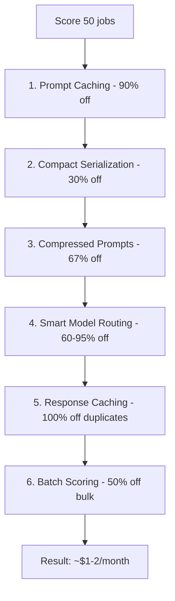

# How Token Optimization Works

Every time Kestrel asks an AI to score a job, it sends text — your profile, the job description, scoring instructions. The AI reads it, thinks, and sends back a structured answer. You're charged by the token (roughly 0.75 words each). Score 50 jobs and you've sent your profile 50 times — like printing 50 copies of your CV to hand to the same person who already read it. At full price, daily scanning across hundreds of positions could cost $30-60/month. Kestrel uses six layered strategies to cut this by 90%+ while keeping the same scoring quality. Think of it like a factory assembly line where each station removes a different kind of waste.

## The Short Version

- **Six strategies** compound to drop monthly costs from ~$30-60 to under $2
- Prompt caching (90% off repeats), compact serialization (30% off data), compressed prompts (67% off instructions), smart model routing (60-95% on simple tasks), response caching (100% off duplicates), batch scoring (50% off bulk work)
- Every optimization is **validated against golden sets** — same quality, lower cost
- **Cache break detection** alerts you if costs silently spike

## How It Actually Works

### The Six Strategies



**Strategy 1: Prompt Caching (90% off repeat prefixes).** When scoring multiple jobs for the same person, your profile doesn't change between calls. Anthropic's prompt caching "remembers" the system prompt and profile for 5 minutes. The first call pays full price; the other 49 get a 90% discount on those tokens. If your profile is 1,500 tokens and you score 50 jobs, you save ~67,500 tokens of processing.

**Strategy 2: Compact Serialization (30% off profile data).** The default pretty-printed JSON adds unnecessary whitespace — indentation, line breaks, extra spaces. The AI doesn't need them.

```json
// Before (indented — extra whitespace tokens):
{
  "name": "Jane Doe",
  "skills": [
    "Python",
    "TypeScript"
  ]
}

// After (compact — same data, fewer tokens):
{"name":"Jane Doe","skills":["Python","TypeScript"]}
```

Same data, ~30% fewer tokens, zero risk.

**Strategy 3: Compressed Prompts (67% off system instructions).** AI models understand telegraphic instructions just as well as verbose ones. "You are a career scoring AI. Return valid JSON with:" (11 tokens) means the same as "Career scoring AI. Valid JSON output:" (6 tokens). The scoring system prompt went from ~113 tokens to ~39. Across all 9 features, total system prompt tokens dropped from ~395 to ~129. All compressed prompts pass golden set regression tests.

**Strategy 4: Smart Model Routing (60-95% on simple tasks).** Not every task needs the most powerful model.

| Task | Model | Relative Cost |
|------|-------|---------------|
| "Is this job relevant?" (classification) | Haiku (small) | 1x |
| Score a job (analysis) | Sonnet (standard) | 4x |
| Deep career strategy (reasoning) | Opus (large) | 19x |

A simple yes/no relevance check doesn't need the model that writes novels.

**Strategy 5: Response Caching (100% off repeated questions).** Ask the same question twice and Kestrel serves the answer from a local encrypted cache. Zero API calls, instant response. The cache uses SHA-256 hashing, Fernet symmetric encryption at rest (scores are never stored in plaintext), and entries expire after 7 days.

**Strategy 6: Batch Scoring (50% off bulk work).** Scoring a big backlog overnight? Anthropic's Batch API gives a flat 50% discount for non-urgent work with a 24-hour SLA. Kestrel detects when you have many jobs to score and automatically submits them as a batch. Real-time scoring (when you paste a URL) always uses the fast path.

### How They Stack

These strategies compound. Think of a scoring call like a sandwich:

```
+------------------------------------------+
|  System prompt (the instructions)        |  <-- Same every time (bread)
|  "Career scoring AI. Valid JSON..."      |
+------------------------------------------+
|  Your profile (who you are)              |  <-- Same for all jobs in a batch (filling)
|  Skills, experience, preferences...      |
+------------------------------------------+
|  Job description (what to score)         |  <-- Different every call (unique part)
|  The actual posting text.                |
+------------------------------------------+
```

Only the bottom layer changes. The bread and filling are identical across all 50 jobs in a batch — so why pay full price every time?

```
Base cost per job:         $0.03
After prompt caching:      $0.003  (90% off on repeats)
After compact JSON:        $0.002  (30% off profile data)
After compressed prompts:  $0.001  (67% off system prompt)
After model routing:       $0.0004 (use Haiku where possible)
After response cache:      $0.00   (if already scored)
After batch API:           50% off (for overnight sweeps)
```

**Result:** Monthly scanning cost drops from ~$30-60 to under $2.

### Why It's Not "90% Savings" on Everything

The cacheable parts (system prompt + profile) make up about 40% of a typical scoring call. The job description — unique, can't be cached — makes up the other 60%. Think of it like commuting: if your drive is 40% highway and 60% city streets, even a 90% improvement on highway speed only cuts total commute time by ~36%. The city streets are the bottleneck. As profiles get richer (more skills, preferences, context), the cacheable portion grows and savings compound further.

### Real Numbers

For a Technical Product Manager profile (775 chars pretty, 598 chars compact) scoring a typical "Senior TPM - AI Platform" posting (857 chars):

| Provider | Old | New | Saved |
|----------|-----|-----|-------|
| OpenRouter / Together / Ollama | ~877 tokens | ~775 tokens | **12%** |
| Anthropic (first call) | ~877 tokens | ~772 tokens | **12%** |
| Anthropic (repeat, cached) | ~877 tokens | ~512 tokens | **42%** |

At batch scale (200 jobs/day):

| | Monthly cost (Sonnet, input tokens) |
|---|---|
| **Before optimization** | ~$15.79 |
| **After optimization** | ~$9.45 |
| **Input token savings** | **$6.35/month (40%)** |

Add output token reduction (70%), batch API discount (50%), and response caching (100% on duplicates) — real-world all-in cost lands around **$1-5/month**.

### Cost Visibility and Cache Break Detection

Every AI call logs token usage to a local SQLite table — provider, model, feature, input/output tokens, estimated USD cost. Nothing leaves your machine. OpenRouter calls include an `X-Title: kestrel` header so costs show up separately in the OpenRouter dashboard.

When prompt caching stops working (a "cache break"), costs can silently spike 10x. Kestrel monitors the cache hit ratio per feature and logs a warning when it drops below 80%:

```
WARNING: Cache break detected for feature=score: hit ratio 40%
(threshold 80%, window=20 events, 8 hits, 12 misses)
```

Common causes: a timestamp in the prompt, randomized field ordering, or a profile update mid-batch.

## Examples

**The overnight discovery sweep:** You have 300 new jobs to evaluate from daily board scraping. Kestrel submits them as a batch through the Batch API (50% off) at midnight. Your profile and system prompt are cached after the first call (90% off for the next 299). By morning, all 300 are scored for roughly the cost of 15 full-price calls.

**The accidental cost spike:** You add a "scored_at" timestamp to the system prompt for debugging. Every call now has a unique prefix, breaking the cache. Costs jump 8x overnight. The cache break alert fires, you remove the timestamp, costs return to normal.

**The profile upgrade:** You add 5 new skills and 2 certifications to your profile. The compact serialization saves even more tokens on the now-larger profile (30% of a bigger number), and caching benefits grow because the profile is a larger share of each call.

## FAQ

**Q: Does optimization affect scoring quality?**
No. Every optimization is validated against golden set regression tests — same output quality, fewer tokens. We never trade accuracy for savings.

**Q: What if I only score a few jobs per week?**
The strategies still help — compact serialization and compressed prompts reduce every call regardless of volume. Prompt caching and batching benefit more at scale, but even single calls are 12% cheaper.

**Q: Can I see exactly what each call costs?**
Yes. Every call is logged to a local SQLite table with provider, model, feature, token counts, and estimated USD. The observability dashboard (if enabled) shows this visually.

**Q: Why not just use the cheapest model for everything?**
Because quality matters. A simple relevance check works fine on Haiku, but scoring requires the nuance of Sonnet. The routing table is calibrated so each task gets the minimum model that produces reliable results.

## Further Reading

- [Token Optimization Strategy](../research/token-optimization-research.md) — the research behind optimization design
- [Raw Findings](../research/token-optimization-raw-research.md) — source data and methodology
- [Cost Optimization Strategy](../research/cost-optimization-strategy.md) — broader cost control approach
