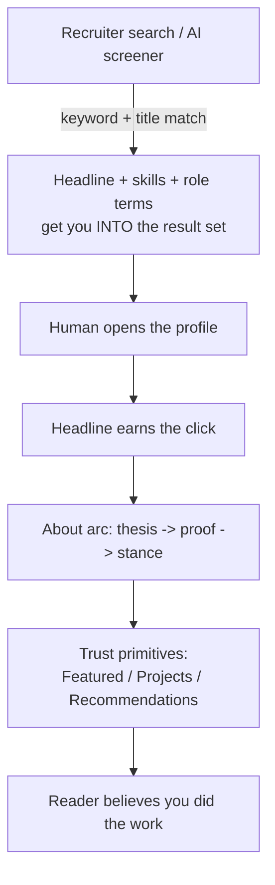

# Optimizing a LinkedIn Profile

Your LinkedIn profile has two audiences, and they read it in completely different ways. First comes the machine: recruiter search filters and, increasingly, AI screening assistants that decide whether you even appear in a result. Only if you clear that gate does a human ever read a word you wrote. Most people write only for the human and quietly stay invisible to the machine — a beautifully worded profile that no search ever surfaces. Think of it like a storefront on a street no one drives down: the window display doesn't matter if the map never lists the address. This guide covers both readers: the keyword discipline that gets you found, and the writing that makes a human keep reading once they arrive.

## The Short Version

- A profile is read by **machines first, humans second.** Optimize for both, in that order.
- The **headline** is your keyword surface and your click-decider — lead with the role terms people actually search, keep any wit to a short clause at the tail, and front-load it so it survives mobile truncation.
- The **About** section works as an arc: **thesis → proof → stance.** Open with what you do, back it with concrete shipped work, and close with a commitment signal.
- **Seed recruiter keywords** in plain language and echo your skill terms into your experience descriptions — search scans those too.
- **Skills:** 15–25 hard, job-description-language terms; pin your top 3; drop stale ones.
- Featured, Projects, and Recommendations are **trust primitives** — proof that you did the things you claim.

## How It Actually Works

### The two readers

Recruiters rarely browse. They search — filtering by title, seniority, function, skills, and location — and then read only the handful of profiles that surface. Layered on top, AI screening assistants now parse profiles semantically, matching the plain-language way a role is described against the plain-language way you describe yourself. Both readers care about *terms*: the exact words a recruiter types and a screener matches. Miss those terms and the best-written profile in the world never gets read.

The human reader arrives only after the machine passes you through. For them, the job flips: now it's about whether your headline earns a click and whether your About section reads like a real person who shipped real things. The rest of this guide handles each reader in turn.

### The headline formula

Your headline is the single most valuable text real estate you own. It feeds the keyword index that search matches against, it's the line a human uses to decide whether to click, and it's what AI screeners parse to place you. Three rules:

1. **Keyword-first.** Lead with the role terms someone would actually search — the plain job titles for the work you want, not a clever coinage. A headline made entirely of personality is invisible to search.
2. **Front-load for truncation.** Only the first ~68 characters reliably survive on mobile. Put your most important terms there; anything witty goes at the tail where truncation costs you nothing.
3. **One wit clause, maximum.** A single sharp phrase at the end makes you memorable to the human without diluting the keywords. More than one and you're back to writing only for the human.

**Invented example.** Instead of a pure-personality headline like *"Turning caffeine into shipped software"* (searchable for nothing), write:

> Backend Engineer · Distributed Systems & Payments · Building Northwind's checkout platform · ex-Meridian Labs

The role terms lead, the concrete work follows, and there's just enough specificity to earn a click — all within the first line a phone will show.

### The About arc: thesis → proof → stance

An About section that reads as a list of adjectives ("passionate, results-driven, collaborative") reads as AI and convinces no one. Structure it as an arc instead.

- **Thesis.** Open with one plain sentence about what you do and how you work. Not a scenic wind-up — the actual claim. "I build payment systems and I learn by shipping them."
- **Proof.** Back the thesis with receipts: concrete, named, shipped work. This is where you earn belief. "Last year I rewrote Atlas Robotics' billing service — cut reconciliation errors, survived a provider migration — and I've contributed a dozen merged fixes to an open-source scheduling library."
- **Stance.** Close with a commitment signal: a sentence that says where you're headed and why, which counters any read of you as a flight risk or a dabbler. "The independent stretch was deliberate — I went deep on the stack by building in it. What I want next is a team and a hard problem to point it all at."

The arc gives a human reader a reason to keep going and gives the machine a dense band of role-relevant terms in the proof section. Write the whole thing in your own voice — this is exactly the kind of prose where the [anti-slop tells](anti-slop-writing.md) matter most.

### Seeding recruiter keywords

Semantic search and AI screeners map you to roles stated in **plain language**, so state your target roles plainly somewhere in the profile — the everyday names of the jobs you want, not internal jargon or invented titles. A line like "Open to: Backend Engineer, Platform Engineer, Payments Engineer" is searchable filter data working for you.

Then **echo your skill terms into your experience descriptions.** Search doesn't only scan your skills list; it scans the words in your role descriptions too. If "distributed systems" and "Python" are skills you claim, they should also appear naturally in the bullets describing what you built. A skill that appears only in the list and never in the story reads as a keyword you tacked on.

### Skills: fewer, harder, ordered

- **15–25 skills, in job-description language.** Use the exact terms roles ask for. "Large Language Models (LLM)" if that's what postings say, not a personal shorthand.
- **Pin your top 3.** The pinned skills are the first a viewer sees — make them the terms most central to the roles you want.
- **Drop stale ones.** A skill for a tool nobody hires for anymore just dilutes the signal. Prune regularly.

### Trust primitives: Featured, Projects, Recommendations

Once search surfaces you and your writing earns a read, the last question in a reader's mind is *did they actually do this?* Three sections answer it with evidence:

- **Featured** — a small, curated set (three to five outperforms a long dump) of your strongest artifacts, linked directly: a repository, a case study, a well-received post. Link cards beat plain media because they carry a logo and a title.
- **Projects** — search-indexed, so give entries keyword-rich names and a short problem-to-outcome description each. This is where side work and open-source contributions earn their keywords.
- **Recommendations** — the trust primitive most people have zero of, and they're read at exactly the late stage where decisions get made. Ask a handful of former colleagues for two or three honest sentences each about specific work you did together; offer to write theirs in return. Specific and modest beats effusive and generic.

## Examples

**Headline, before and after.** Before: *"Ideas person | Lifelong learner | Let's connect!"* — searchable for nothing, and the exclamation mark does no work. After: *"Data Engineer · Streaming & ETL · Building Meridian's real-time pipeline · occasional writer on data plumbing"* — role terms first, concrete work, one light clause at the tail.

**About proof paragraph.** Weak: "I am a passionate engineer with a proven track record of delivering high-impact solutions." Strong: "I built the ingestion layer at Meridian Labs that now handles a few billion events a day, and I've written up two of the outages it survived. When something's undefined and messy, that's the work I reach for." The strong version names the system, offers a receipt, and states a preference — all things a generic draft can't produce.

**Skills ordering.** A backend candidate pins *Distributed Systems*, *Python*, and *PostgreSQL* — the three terms most central to their target roles — then lists another dozen (Kafka, gRPC, Kubernetes, observability, and so on) in job-description language, and drops a long-stale framework nobody hires for.

## FAQ

**Q: Should my LinkedIn read like my cover letter?**
Partly. The About section is prose and benefits from real voice, so the [anti-slop guidance](anti-slop-writing.md) applies. But the headline, skills, and role-term seeding are keyword-driven — closer to CV logic than cover-letter logic. Optimize each section for how it's actually read.

**Q: Isn't keyword-stuffing obvious and off-putting?**
Stuffing is. Seeding isn't. The goal is that the real terms for your real work appear in the natural places a search looks — headline, skills, and woven into genuine descriptions of what you built. If the words are true and placed naturally, a human reads them as substance, not spam.

**Q: How many Featured items should I have?**
Three to five, curated. A long list dilutes attention; a tight set of your strongest artifacts, each a direct link to proof, does more work.

**Q: What if I have no recommendations yet?**
Ask for a few. They're read at the final stages of hiring and most candidates have none, so a handful of specific, honest ones is an outsized advantage. Keep the ask small: two or three sentences about a specific piece of work, with an offer to reciprocate.

## Further Reading

- [Writing Without the AI Tells](anti-slop-writing.md) — for the About section, where distinctive voice earns the read
- [Building a Voice Corpus](voice-corpus-architecture.md) — how to make an assistant help you write the About section in your own voice
- [Writing Cover Letters That Don't Read as AI](cover-letter-writing.md) — the cover-letter counterpart, and why CV-style sections here follow the opposite rules
