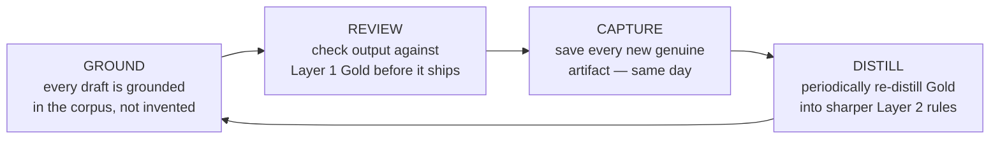

# Building a Voice Corpus

An AI assistant drafting "in your voice" has exactly one source of truth: whatever you've shown it. Show it nothing and you get the generic assistant register back: smooth and agreeable, and not you. A **voice corpus** fixes that. It's a small, organized library of things you actually wrote, kept where your tools can read it, so every draft calibrates against your real register instead of a statistical average of everyone's. Building one takes an afternoon. Keeping it honest takes a system, and the system is what this guide teaches: three layers, one flywheel, one firewall.

## The Short Version

- A voice corpus is a curated set of your **own real writing**, organized into three layers by how much you trust each one to define your voice.
- **Layer 1 (Gold)** is your unedited writing — the highest-weight calibration signal. **Layer 2 (Identity & Rules)** distills that into explicit voice rules. **Layer 3 (Background Facts)** grounds claims but never sets tone.
- The corpus improves through a flywheel: **Ground → Review → Capture → Distill.** The loop only closes when you actually capture new genuine writing, ideally the same day you produce it.
- One firewall keeps the whole thing from rotting: **never calibrate your voice on AI-drafted output.** That launders the assistant register back in and slowly erases you.

## How It Actually Works

### Three layers, ranked by trust

Not every document you've written deserves equal weight when an assistant is learning your voice. A raw voice memo you dictated is pure signal. A résumé bullet is a fact, not a voice sample. Sorting your material into three layers keeps the strong signal from getting diluted by the weak.

**Layer 1 — Gold: your pure, unedited voice.** These are the pieces you wrote (or dictated) yourself, with at most a grammar cleanup — a farewell note, a long unfiltered voice memo, a letter you rewrote entirely in your own words. This layer carries the highest calibration weight. When someone asks "what does it sound like when *you* write?", the answer lives here. Protect it fiercely: never let an assistant rewrite Gold. If it needs a fix, fix the grammar and nothing else.

**Layer 2 — Identity & Rules: the distilled voice.** These are the explicit, written-down rules you've extracted *from* Layer 1 — "uses parentheticals to undercut its own confidence," "ends flat instead of with a pitch," "prefers a concrete vignette to an adjective." Layer 2 is what you skim before writing when you don't have time to re-read all of Gold. It's downstream of Gold, and it's only as good as the Gold it was distilled from.

**Layer 3 — Background Facts: the ground truth.** Dates, job titles, project names, metrics, assessment results. This layer answers "is that claim true?" — never "does that sound like me?" Do not calibrate tone on it. A CV's phrasing is optimized for scanning, not for voice; treat it as a fact-checker, not a style guide.

### The flywheel

A voice corpus isn't a document you write once. It's a loop with four stages, and the whole thing only works if all four keep turning.

1. **Ground.** Every letter, answer, or post you generate starts from the corpus — the real Layer 1 samples and the Layer 2 rules — not from the assistant's imagination. Grounding is what keeps a draft in your register from the first line.
2. **Review.** Before anything is "ready," a second pass checks the output against Layer 1 Gold. Does it sound smoother or more eager than your real samples? If so, it's not done.
3. **Capture.** Every time you produce something genuine — a dictation, a letter you wrote yourself, an answer you rewrote in your own words — you add it to Layer 1 **the same day.** This is the stage everyone skips, and skipping it is the failure mode: a great new sample that never gets captured is invisible to the next draft.
4. **Distill.** Periodically — say, every few new Gold artifacts — re-read Layer 1 and sharpen the Layer 2 rules. This is what makes the system get *better* at your voice over time, not just accumulate more files.

The loop is closed only when Capture actually happens. Outputs become inputs — but only the genuine ones.

### The firewall: outputs are not inputs

Here's the single most important rule, and it's easy to get wrong. **Never calibrate your voice on AI-drafted output — not even output you lightly edited.**

The reasoning is a feedback loop. An assistant drafts something in a slightly flattened version of your voice. You tidy it and send it. If you then fold that piece back into Layer 1 as a "sample of how I write," you've just taught the system that the flattened version is the target. Do that a few times and each new draft calibrates against the last flattened one, and your real edges — the jaggedness, the deflating closers, the odd specific details — quietly wash out. The corpus gets blander every cycle, and you can't feel it happening because each step is small.

So the firewall is absolute: an artifact enters Layer 1 only if *you* wrote it, dictated it, or rewrote it substantially in your own words. An assistant-drafted letter you approved is an **output** — something to be judged against Gold, never a sample to calibrate on. When you're unsure which side of the line a piece falls on, keep it out.

### Capturing without friction

The corpus lives or dies on Capture, so make it cheap. At the end of any session where you wrote something real, ask: did I just produce a genuine artifact? If yes, save it, tag how much editing it got ("grammar-only" vs. "fully mine"), and drop it in the right layer. Voice memos are gold precisely because dictation bypasses the editing brain — you say things in your own rhythm. Store the corpus somewhere durable and portable (plain text under version control travels better than anything locked in an app), so it's available on every machine and to every assistant you point at it.

The starter template at [config/voice-corpus.example.md](../../config/voice-corpus.example.md) gives you empty slots for all three layers plus a capture checklist. Copy it, fill it in, and point your tools at it.

## Examples

**A Gold sample.** You dictate a five-minute voice memo about a project you owned end to end — what worked, what you'd do differently, the metric that turned out to be lying. It's rambling, self-correcting, honest about the parts that went badly. That's Layer 1: unpolished, high-signal, the truest picture of your voice. Save it same-day, grammar-only.

**A Layer 2 rule distilled from it.** Reading three memos like that, you notice you always ship a win with its cost attached in the same breath — "we hit the number, and honestly it barely mattered." You write that down as a rule: *every win carries its shadow in the same paragraph.* Now an assistant reviewing a draft can flag a win that arrives with no cost attached.

**A firewall catch.** An assistant drafts a cover letter that reads well. You send a lightly edited version. Tempting as it is to save that letter as a "voice sample," you don't — it's an output. Instead you save the two sentences you *rewrote from scratch*, because those are genuinely yours.

## FAQ

**Q: How much do I need before this is useful?**
Even three or four genuine Gold samples beat zero. The corpus compounds — start small and capture consistently rather than waiting for a perfect library.

**Q: Can I include writing an editor heavily reworked?**
Only if the words are still substantially yours. Heavy external editing pulls a piece toward a house style, which is a different voice than yours. When in doubt, keep it in Background as a fact source, not in Gold.

**Q: Why keep facts separate from voice?**
Because a CV bullet and a voice memo answer different questions. One tells you *what's true*; the other tells you *how you sound*. Mixing them means an assistant might imitate résumé phrasing — terse, keyword-stuffed — when you wanted your real register.

**Q: How often should I distill?**
Whenever a few new Gold artifacts have piled up, or whenever you notice the Layer 2 rules no longer capture something you clearly do. Distilling too often is wasted effort; never distilling means the rules drift out of date.

## Further Reading

- [Writing Without the AI Tells](anti-slop-writing.md) — the register gate at the top of the editing protocol depends on having a corpus to compare against
- [Writing Cover Letters That Don't Read as AI](cover-letter-writing.md) — where the corpus does its most valuable work
- [config/voice-corpus.example.md](../../config/voice-corpus.example.md) — the starter template for all three layers
