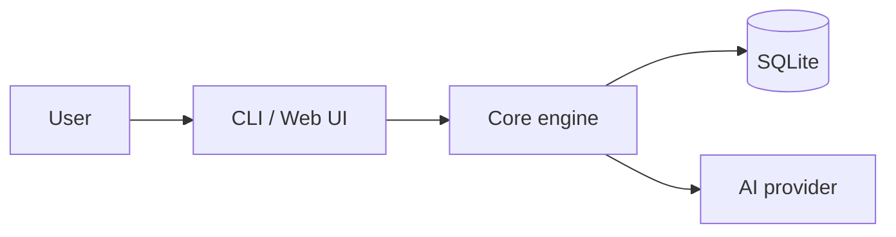

<!--
README template — copy this and rip out the comments as you fill in.
Order matters: visitor decides "is this for me?" within 5 seconds.
-->

<p align="center">
  <picture>
    <source media="(prefers-color-scheme: dark)" srcset="docs/logo-dark.svg">
    
  </picture>
</p>

<h1 align="center">ProjectName</h1>

<p align="center">
  <strong>One-sentence pitch — verb + thing + for whom.</strong><br>
  Two-line elaboration: the specific problem you solve and the specific user you solve it for.
</p>

<p align="center">
  <a href="https://github.com/OWNER/REPO/actions"></a>
  <a href="https://www.npmjs.com/package/PKG"></a>
  <a href="LICENSE"></a>
  <a href="https://discord.gg/INVITE"></a>
  <a href="https://scorecard.dev/viewer/?uri=github.com/OWNER/REPO"></a>
</p>

<p align="center">
  <!-- Hero artifact — pick ONE: GIF, screenshot, or asciinema cast. -->
  
</p>

---

## Quickstart

```bash
# One copy-pasteable command. <60 seconds to first useful output.
npx projectname init
```

That's it. Open the URL it prints.

## Why ProjectName

| | ProjectName | Alternative A | Alternative B |
|---|---|---|---|
| Self-hosted | ✅ | ❌ | ✅ |
| Zero-config start | ✅ | ❌ | ❌ |
| <Your wedge> | ✅ | ❌ | ❌ |
| Open source | ✅ AGPL-3.0 | Closed | ✅ MIT |

## Features

- **Feature one** — one-line benefit. 
- **Feature two** — one-line benefit.
- **Feature three** — one-line benefit.

## How it works



Read the [architecture deep-dive](./docs/architecture.md) for details.

## Used by

<p>
  
  &nbsp;
  
</p>

> "Quote from a real user with their name and role." — Jane Doe, Eng Lead at Co 1

## Roadmap

[Public roadmap →](https://github.com/OWNER/REPO/projects/1)

## Star history

<a href="https://star-history.com/#OWNER/REPO&Date">
  
</a>

## Community

- [Discord](https://discord.gg/INVITE) — chat
- [Discussions](https://github.com/OWNER/REPO/discussions) — questions, ideas
- [Twitter / X](https://x.com/HANDLE) — updates
- [Blog](https://yourproject.dev/blog) — engineering deep-dives

## Sponsor

If ProjectName saves you time, [sponsor on GitHub](https://github.com/sponsors/OWNER) — keeps the project going and unblocks features.

## Contributing

See [CONTRIBUTING.md](./CONTRIBUTING.md). Look for [`good first issue`](https://github.com/OWNER/REPO/labels/good%20first%20issue).

## License

[AGPL-3.0](./LICENSE) — see [LICENSE-RATIONALE.md](./docs/LICENSE-RATIONALE.md) for why.
